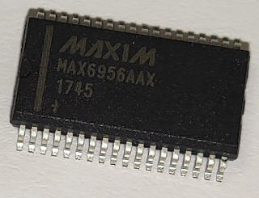

MAX6956 I/O Expander
====================

.. seo::
    :description: Instructions for setting up MAX6956 port expanders in ESPHome.
    :image: max6956.jpg
    :keywords: MAX6956

The MAX6956 component allows you to use MAX6956 I/O expanders
(`datasheet <https://datasheets.maximintegrated.com/en/ds/MAX6956.pdf>`__) in ESPHome. It uses :ref:`I²C Bus <i2c>` for communication.

The ``max6956`` exists in 2 versions 20 or 28 ports, depending on the packaging.
Once configured, you can use any of the 20 or 28 pins for your projects. Within ESPHome they emulate a real internal GPIO pin
and can therefore be used with many of ESPHome's components such as the GPIO binary sensor or GPIO switch. Interrupt-on-change for inputs is not possible.

Pins can also be individualy configured as led driver and used with Light components. Current value can be set globaly or for each pin, through 16 possible levels. Driving RGB
led requires 3 pins.

Any option accepting a :ref:`Pin Schema <config-pin_schema>` can theoretically be used.

Component/Hub
-------------

    MAX6956 I/O Expander.

The ``max6956`` is an :ref:`I²C Bus <i2c>` slave. Its address is configured using A0 and A1 hardware pins from 0x40 to 0x4F.

.. code-block:: yaml

    max6956:
      - id: max6956_1
        address: 0x40
        i2c_id: bus_a

Configuration variables:
************************

- **id** (**Required**, :ref:`config-id`): The id to use for this ``max6956`` component.
- **address** (*Optional*, int): The I²C address of the driver.
  Defaults to ``0x40``.
- **i2c_id** (*Optional*): The I²C Bus ID
  Defaults to ``false``
- **brightness_global** (*Optional*): Set the value of the current to be sink by all pins configured as led driver.
  Defaults to ``0``
- **brightness_mode** (*Optional*): Define if the current to be sink will be confgured globaly or per pin configured as led driver.
  Defaults to ``global``

Binary Sensor Example
---------------------

``max6956`` pins can be use as binary sensor. Individual pullup are supported.

.. code-block:: yaml

    # Example configuration
    binary_sensor:
      - platform: gpio
        name: "MaxIn Pin 4"
        id: In_4
        pin:
          max6956: max6956_1
          number: 4
          mode:
            input: true
            pullup: true
          inverted: False

Switch Example
--------------

``max6956`` pins can be use as switch.

.. code-block:: yaml

    # Example configuration
      switch:
        - platform: gpio
          name: "MaxIn Pin 8"
          id: In_8
          pin:
            max6956: max6956_1
            number: 8
            mode:
              output: true
            inverted: False

Led driver Example
------------------

``max6956`` can control a constant-current sink to drive leds, with 16 equal steps from 1.5mA to 24mA.

.. code-block:: yaml

    # Example configuration : pin as led driver, current globaly
    i2c:
      id: bus_a
      sda: GPIOXX
      scl: GPIOXX

    switch:
      - platform: template
        name: "Led"
        id: MaxOut4
        optimistic: true
        turn_on_action:
          - output.turn_on: maxOut_pin4
        turn_off_action:
          - output.turn_off: maxOut_pin4

    number:
      - platform: template
        name: "Global brightness"
        id: global_brightness
        optimistic: true
        min_value: 0
        max_value: 15
        initial_value: 1
        step: 1
        mode: slider
        on_value:
          - max6956.set_brightness_global:
              id: max6956_1
              brightness_global: !lambda return x;

    max6956:
      - id: max6956_1
        address: 0x40
        i2c_id: bus_a
        brightness_mode: global
        brightness_global: 5

    #output to use
    output:
      - platform: max6956
        pin: 4
        id: maxOut_pin4

    #led binded to output
    light:
      - platform: monochromatic
        id: Light_1
        output: maxOut_pin4

.. code-block:: yaml

    # Example configuration : pin as led driver, current managed individualy (RBG led)
    i2c:
      id: bus_a
      sda: GPIOXX
      scl: GPIOXX

    max6956:
      - id: max6956_1
        address: 0x40
        i2c_id: bus_a
        brightness_mode: segment

    switch:
      - platform: template
        name: "Led Red"
        id: MaxOut4
        optimistic: true
        turn_on_action:
          - output.turn_on: maxOut_pin4
        turn_off_action:
          - output.turn_off: maxOut_pin4

      - platform: template
        name: "Led Green"
        id: MaxOut5
        optimistic: true
        turn_on_action:
          - output.turn_on: maxOut_pin5
        turn_off_action:
          - output.turn_off: maxOut_pin5

      - platform: template
        name: "Led Blue"
        id: MaxOut6
        optimistic: true
        turn_on_action:
          - output.turn_on: maxOut_pin6
        turn_off_action:
          - output.turn_off: maxOut_pin6

    number:
      - platform: template
        name: "Number Red"
        id: number_LedRed
        optimistic: true
        min_value: 0
        max_value: 100
        initial_value: 10
        step: 1
        mode: slider
        on_value:
          - output.set_level:
              id: maxOut_pin4
              level: !lambda return x/100;

      - platform: template
        name: "Number Green"
        id: number_LedGreen
        optimistic: true
        min_value: 0
        max_value: 100
        initial_value: 10
        step: 1
        mode: slider
        on_value:
          - output.set_level:
              id: maxOut_pin5
              level: !lambda return x/100;

      - platform: template
        name: "Number Blue"
        id: number_LedBlue
        optimistic: true
        min_value: 0
        max_value: 100
        initial_value: 10
        step: 1
        mode: slider
        on_value:
          - output.set_level:
              id: maxOut_pin6
              level: !lambda return x/100;
    output:
      - platform: max6956
        pin: 4
        id: maxOut_pin4
      - platform: max6956
        pin: 5
        id: maxOut_pin5
      - platform: max6956
        pin: 6
        id: maxOut_pin6

    light:
      - platform: rgb
        id: Light_1
        default_transition_length: 0.1s
        gamma_correct: 1
        red: maxOut_pin4
        green: maxOut_pin5
        blue: maxOut_pin6

See Also
--------

- :ref:`i2c`
- :doc:`switch/gpio`
- :doc:`/components/binary_sensor/index`
- :doc:`binary_sensor/gpio`
- :doc:`light/binary`
- :doc:`light/rgb`
- :apiref:`max6956/max6956.h`
- :ghedit:`Edit`
