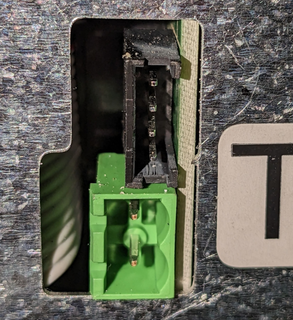
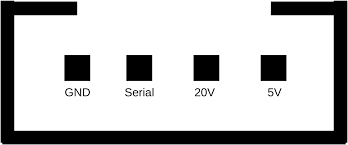
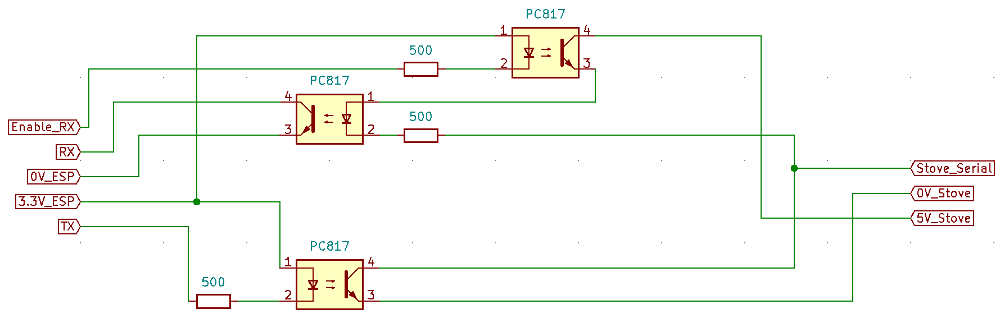

MicroNova based pellet stove
============================

.. seo::
    :description: Instructions for setting up a MicroNova board based pellet stove in ESPHome.

The MicroNova component allows you to integrate a pellet stove with a MicroNova board in ESPHome.
It uses :ref:`UART <uart>` for communication.

The :ref:`UART <uart>` must be configured with a baud rate 1200, 8 data bits, 2 stop bits, no parity, no flow control.

.. warning::

    MicroNova bords come in various flavours. This code is only tested on an ExtraFlame Ketty Evo 2.0 stove. The protocol is not
    documented but has been reverse engineerd by others. See the links below for all the info that helped me.
    The different sensors, buttons and stove switch may require specific **memory_location** and **memory_address** parameters that
    match your MicroNova specific board.

    Also, switching your stove on or off can behave different on the various MicroNova flavours.

    Use this component at your own risk.

Connecting your stove
---------------------

Most MicroNova based pellet stoves have a serial output. In most cases this output has 4 pins: GND, 5v, 20V and DATA.

You will have to build a simple circuit to interface with your stove. It is based on optocouplers for galvanic separation and logic
level shifting between 5v and 3V3.

    Optocoupler interface circuit (credit: philibertc)

See the references below for all the details about te circuit.

You can use the 5V output from the stove to power the ESP module, but you will have to put a voltage regulator in between to
get 3v3.

Component/Hub
-------------

.. code-block:: yaml

    micronova:
      enable_rx_pin: GPIOXX

Configuration variables:
~~~~~~~~~~~~~~~~~~~~~~~~

- **enable_rx_pin** (**Required**, :ref:`config-pin`): Output pin to be used to switch the line between RX and TX.
- **update_interval** (*Optional*, :ref:`config-time`): The interval that the sensors should be checked.
  Defaults to 60 seconds.

.. note::

    For all text sensors, sensors, numbers, buttons and switches hereafter most of the the default **memory_location** and **memory_address** parameters will work so you should
    not specify them. However your Micronova boad may require you to specify alternate values. So every text sensor, button,
    switch or number accepts these parameters:

    - **memory_location** (*Optional*): The memory location where the parameter must be read. For most stoves this is 0x00 for RAM
      or 0x20 for EPROM.
    - **memory_address** (*Optional*): The address where the parameter is stored.

Text Sensors
------------

.. code-block:: yaml

    text_sensor:
      - platform: micronova
        stove_state:
          name: Stove status

Configuration variables:
~~~~~~~~~~~~~~~~~~~~~~~~

- **stove_state** (*Optional*): The current stove state.
  All options from :ref:`Text Sensor <config-text_sensor>`.

Sensors
-------

.. code-block:: yaml

    sensor:
      - platform: micronova
        room_temperature:
          name: Room temperature
        fumes_temperature:
          name: Fumes temperature
        stove_power:
          name: Stove power level
        fan_speed:
          fan_rpm_offset: 240
          name: Fan RPM
        water_temperature:
          name: Water temperature
        water_pressure:
          name: Water pressure
        memory_address_sensor:
          memory_location: 0x20
          memory_address: 0x7d
          name: Custom Address sensor

Configuration variables:
~~~~~~~~~~~~~~~~~~~~~~~~

- **room_temperature** (*Optional*): Sensor that reads the stoves ambient room temperature.
  All options from :ref:`Sensor <config-sensor>`.
- **fumes_temperature** (*Optional*): Fumes temperature.
  All options from :ref:`Sensor <config-sensor>`.
- **stove_power** (*Optional*): Current stove power.
  All options from :ref:`Sensor <config-sensor>`.
- **fan_speed** (*Optional*): Current fan speed. The raw value from the stove is multiplied by 10 + ``fan_rpm_offset``.

  - **fan_rpm_offset** (*Optional*, integer): Offset the reported RPM value. Must be between 0 and 255. Defaults to 0.
  - All other options from :ref:`Sensor <config-sensor>`.
- **water_temperature** (*Optional*): Internal boiler water termperature.
  All options from :ref:`Sensor <config-sensor>`.
- **water_pressure** (*Optional*): Internal boiler water pressure.
  All options from :ref:`Sensor <config-sensor>`.
- **memory_address_sensor** (*Optional*): Can be any **memory_location** / **memory_address** you want to track. Usefull
  when you don't know where the parameter is for your stove is.
  All options from :ref:`Sensor <config-sensor>`.

Numbers
-------

.. code-block:: yaml

    number:
      - platform: micronova
        thermostat_temperature:
          name: Thermostat temperature
          step: 0.5
        power_level:
          name: Thermostat temperature

Configuration variables:
~~~~~~~~~~~~~~~~~~~~~~~~

- **thermostat_temperature** (*Optional*): Number that holds the current stove thermostat value.
   - **step** (*Optional*): Temperature step. This value is used to multiply/devide the raw value when setting/reading the **thermostat_temperature**
   - All other options from :ref:`Number <config-number>`.
- **power_level** (*Optional*): Number that sets/reads the requested stove power.
  All options from :ref:`Number <config-number>`.

.. note::

    Besides **memory_location** and **memory_address** you can specify a specific **memory_write_location** parameter.
    This parameter is a hex value for the **memory_location** where the new thermostat value must be written.

    - **memory_write_location** (*Optional*): The **memory_location** where to write the new thermostat value.

Buttons
-------

.. code-block:: yaml

    button:
      - platform: micronova
        custom_button:
          name: Custom button
          memory_location: 0x20
          memory_address: 0x7d
          memory_data: 0x08

Configuration variables:
~~~~~~~~~~~~~~~~~~~~~~~~

- **custom_button** (*Optional*): Write the hex value **memory_data** to a **memory_location** and **memory_address**
  All options from :ref:`Button <config-button>`.

.. note::

    Besides **memory_location** and **memory_address** you must specify a specific **memory_data** parameter.

    - **memory_data** (*Required*): The hex value to be written to the **memory_location** and **memory_address**.

Switches
--------

.. code-block:: yaml

    switch:
      - platform: micronova
        stove:
          name: Stove on/off switch

Configuration variables:
~~~~~~~~~~~~~~~~~~~~~~~~

- **stove** (*Optional*): Turn the stove on or off. This switch will also reflect the current stove state.
  If the **stove_state** is "Off" the switch will be off, in all other states, the switch wil be on.
  All options from :ref:`Switch <config-switch>`.

.. note::

    Besides **memory_location** and **memory_address** you can specify specific **memory_data_on** and **memory_data_off** parameters.
    These parameters contain the hex value to be written to the **memory_location** and **memory_address** when the switch
    turns on or off.

    - **memory_data_on** (*Optional*): The data to write when turning the switch on.
    - **memory_data_off** (*Optional*): The data to write when turning the switch off.

See Also
--------

- `ridiculouslab micronova <https://www.ridiculouslab.com/arguments/iot/stufa/micronova_en.php>`__
- `philibertc / micronova_controller  <https://github.com/philibertc/micronova_controller/>`__
- `eni23 / micronova-controller  <https://github.com/eni23/micronova-controller>`__
- :ghedit:`Edit`
