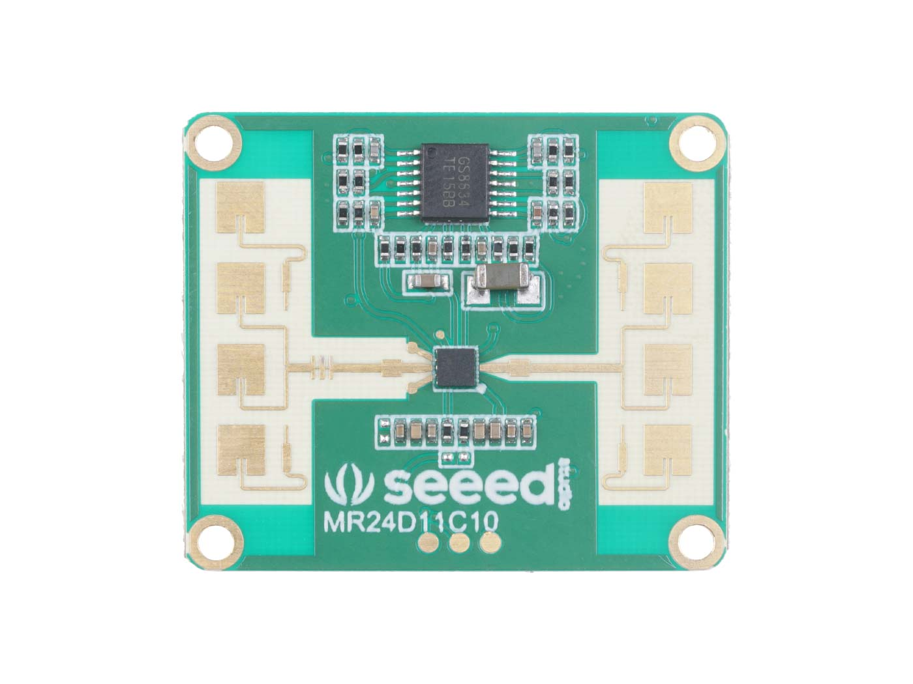
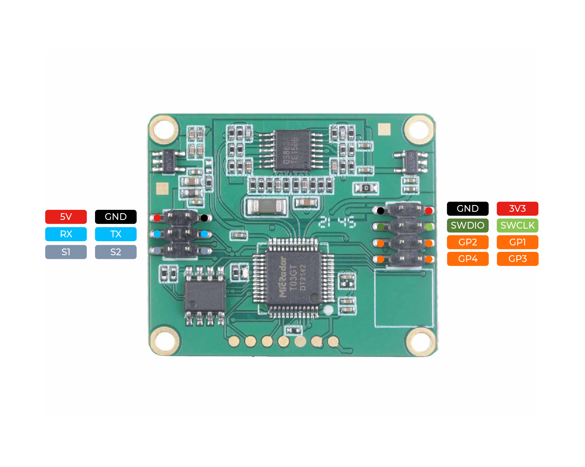

MR24HPB1 Human-Presence Sensor
==============================

.. seo::
    :description: Instructions for setting up a MR24HPB1 human-presence sensor with ESPHome
    :image: mr24hpb1.jpg
    :keywords: MR24HPB1

The ``mr24hpb1`` sensor platform allows you to use your MR24HPB1
(`datasheet <https://files.seeedstudio.com/wiki/mmWave-radar/Human_Presence_User_Manual.pdf>`__,
`seeedstudio`_) human-presence sensors with ESPHome. The :ref:`UART <uart>` component is
required to be set up in your configuration for this sensor to work.

    MR24HPB1 Human-Presence Sensor.

.. _seeedstudio: https://www.seeedstudio.com/24GHz-mmWave-Radar-Sensor-Human-Static-Presence-Module-p-5267.html

.. code-block:: yaml

    # UART is required for MR24HPB1
    uart:
      tx_pin: 17
      rx_pin: 16
      baud_rate: 9600

    # Example configuration entry
    mr24hpb1:
      threshold_gear: 7
      scene_setting: DEFAULT
      force_unoccupied: NONE
      environment_status:
        name: Environment Status
      occupancy:
        name: Occupancy
      movement:
        name: Movement
      movement_rate:
        name: Movement Rate
      movement_type:
        name: Movement Type
      device_id:
        name: Device ID
      software_version:
        name: Software version
      protocol_version: 
        name: Protocol Version
      hardware_version: 
        name: Hardware Version

Configuration variables:
------------------------

- **threshold_gear** (*Optional*): The threshold gear value. Valid range ``1`` - ``10``. Defaults to ``7``.

- **scene_setting** (*Optional*): The scene setting to use. One of ``DEFAULT``, ``AREA``, ``BATHROOM``, ``BEDROOM``, ``LIVING_ROOM``, ``OFFICE``, ``HOTEL``. Defaults to ``DEFAULT``.

- **force_unoccupied** (*Optional*): The force unoccupied setting. This is a feature not documented for the MR24HPB1 datasheet but for the MR24BSD1 (`datasheet <https://files.seeedstudio.com/wiki/mmWave-radar/MR24BSD1_User_Manual.pdf>`__), but does in fact work. See :ref:`Force Unoccupied Options <mr24hpb1-force-unoccupied-options>`.

- **environment_status** (*Optional*): The information for the environment status text sensor. See :ref:`Environment Status <mr24hpb1-environment-status>`.

  - **name** (**Required**, string): The name for the environment status sensor.
  - **id** (*Optional*, :ref:`config-id`): Set the ID of this sensor for use in lambdas.
  - All other options from :ref:`Text Sensor <config-text_sensor>`.

- **occupancy** (*Optional*): The information for the occupancy binary sensor.

  - **name** (**Required**, string): The name for the occupancy sensor.
  - **id** (*Optional*, :ref:`config-id`): Set the ID of this sensor for use in lambdas.
  - All other options from :ref:`Binary Sensor <config-binary_sensor>`.

- **movement** (*Optional*): The information for the movement binary sensor.

  - **name** (**Required**, string): The name for the movement sensor.
  - **id** (*Optional*, :ref:`config-id`): Set the ID of this sensor for use in lambdas.
  - All other options from :ref:`Binary Sensor <config-binary_sensor>`.

- **movement_rate** (*Optional*): The information for the movement rate sensor. See :ref:`Movement Rate <mr24hpb1-movement-rate>`.

  - **name** (**Required**, string): The name for the movement sensor.
  - **id** (*Optional*, :ref:`config-id`): Set the ID of this sensor for use in lambdas.
  - All other options from :ref:`Sensor <config-sensor>`.

- **movement_type** (*Optional*): The information for the movement type text sensor. See :ref:`Movement Type <mr24hpb1-movement-type>`.

  - **name** (**Required**, string): The name for the movement type sensor.
  - **id** (*Optional*, :ref:`config-id`): Set the ID of this sensor for use in lambdas.
  - All other options from :ref:`Text Sensor <config-text_sensor>`.

- **device_id** (*Optional*): The information for the device ID text sensor.

  - **name** (**Required**, string): The name for the device ID sensor.
  - **id** (*Optional*, :ref:`config-id`): Set the ID of this sensor for use in lambdas.
  - All other options from :ref:`Text Sensor <config-text_sensor>`.

- **software_version** (*Optional*): The information for the software version text sensor.

  - **name** (**Required**, string): The name for the software version sensor.
  - **id** (*Optional*, :ref:`config-id`): Set the ID of this sensor for use in lambdas.
  - All other options from :ref:`Text Sensor <config-text_sensor>`.

- **protocol_version** (*Optional*): The information for the protocol version text sensor.

  - **name** (**Required**, string): The name for the protocol version sensor.
  - **id** (*Optional*, :ref:`config-id`): Set the ID of this sensor for use in lambdas.
  - All other options from :ref:`Text Sensor <config-text_sensor>`.

- **hardware_version** (*Optional*): The information for the hardware version text sensor.

  - **name** (**Required**, string): The name for the hardware version sensor.
  - **id** (*Optional*, :ref:`config-id`): Set the ID of this sensor for use in lambdas.
  - All other options from :ref:`Text Sensor <config-text_sensor>`.

    Pins on the MR24HPB1. Only 5V, GND, RX, and TX need to be connected.

.. note::

    Although the MR24HPB1 features a 3.3V pin the radar only works when supplied with 5V on the 5V pin.

.. _mr24hpb1-force-unoccupied-options:

Force Unoccupied Options
------------------------

By default, the MR24HPB1 reports non-moving humans as ``STATIONARY``. This - for the MR24HPB1 undocumented - option seems to force the MR24HPB1 to switch to ``UNOCCUPIED`` after the set timeout even when a human is detected as ``STATIONARY``. This functionality essentially converts the MR24HPB1 into a motion sensor as only movements are detected and stationary humans do not trigger the sensor. The force unoccupied setting sets the timeout after which ``STATIONARY`` switches to ``UNOCCUPIED``. Possible force unoccupied values:

- ``NONE`` (default, work as presence sensor)
- ``10s``
- ``30s``
- ``1min``
- ``2min``
- ``5min``
- ``10min``
- ``30min``
- ``60min``

.. _mr24hpb1-environment-status:

Environment Status
------------------

.. list-table::
    :header-rows: 1
    :widths: 1 3

    * - Value
      - Meaning
    * - UNOCCUPIED
      - No human in radar field
    * - STATIONARY
      - Stationary human in radar field
    * - MOVING
      - Human movement in radar field

.. _mr24hpb1-movement-rate:

Movement Rate
-------------

Movement rate is reported as a percentage by the sensor. The table below is taken from the documentation. A movement rate of ``1`` results in the environment status ``STATIONARY``, greater than ``1`` in ``MOVING``.

.. list-table::
    :header-rows: 1
    :widths: 1 3 3

    * - Value
      - Movement
      - Meaning
    * - 1
      - Stationary
      - Only breathing without body movement
    * - 2 - 30
      - Micro-Movements
      - Only minor head or limb movements
    * - 32 - 60
      - Walking
      - Slower body movements
    * - 61 - 100
      - Running/close range large movements
      - Rapid body movements

.. _mr24hpb1-movement-type:

Movement Type
-------------

The MR24HPB1 reports different movement types listed in the table below. Documentation for this feature is limited and two additional undocumented values are reported by the sensor. Relying on the movement type data is not advised as the value sometimes changes rapidly with weak definition of the reported values, e.g. between ``FAR_AWAY`` and ``APPROACHING`` even tough the human is moving away from the sensor.

.. list-table::
    :header-rows: 1
    :widths: 1 3

    * - Value
      - Meaning
    * - NONE
      - No movement
    * - APPROACHING
      - Human approaching sensor
    * - FAR_AWAY
      - Human movement far away from sensor
    * - U1
      - Undocumented value
    * - U2
      - Undocumented value

See Also
--------

- :apiref:`mr24hpb1/mr24hpb1.h`
- :ghedit:`Edit`
