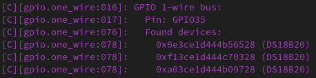

.. _one_wire:

1-Wire Bus
==========

.. seo::
    :description: Instructions for setting up a Dallas (Analog Devices) 1-Wire bus to communicate with 1-wire devices in ESPHome
    :image: one-wire.svg
    :keywords: Dallas, onewire, 1-wire

The ``one_wire`` component allows you to use supported 1-Wire devices in ESPHome.
The 1-Wire bus the devices are connected to should have an external pullup resistor of
about 4.7KΩ. For this, connect a resistor of *about* 4.7KΩ between ``3.3V``
and the data pin. Values ± 1KΩ will, in most cases, work fine as well,
if you don't have massively long wires.

GPIO
----

The ``gpio`` platform uses the CPU to generate the bus signals on a GPIO pin.

.. code-block:: yaml

    # Example configuration entry
    one_wire:
      - platform: gpio
        pin: GPIOXX

Configuration variables:
************************

- **pin** (**Required**, number): The pin the sensor bus is connected to. Please note that 1-wire is a bi-directional bus so it requires both input and output from the pin.
- **id** (*Optional*, :ref:`config-id`): Manually specify the ID used for code generation.  Required if you have multiple busses.

Getting Sensor IDs
******************

In order to find the addresses, simply start the firmware on your
device with a configured one_wire hub and observe the log output.
Note that you don't need to define the individual sensors just yet, as
the scanning will happen even with no sensors configured.
For example, you will see something like this:

See Also
--------

- :apiref:`one_wire/one_wire_bus.h`
- :ghedit:`Edit`
- `Guidelines for Reliable Long Line 1-Wire Networks <https://www.analog.com/en/technical-articles/guidelines-for-reliable-long-line-1wire-networks.html>`__
