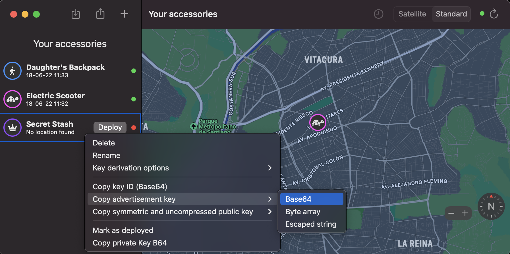
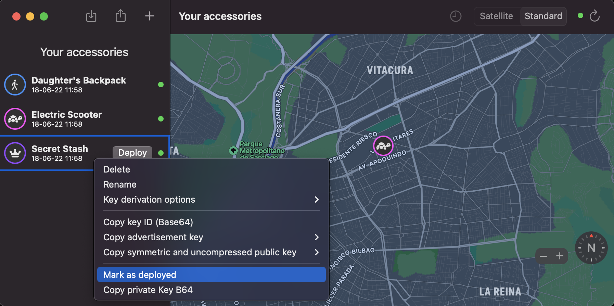

OpenHaystack
=================================

.. seo::
    :description: Instructions for setting up OpenHaystack using the BLE feature on ESP32s.
    :image: openhaystack.png

The ``openhaystack`` component creates a Bluetooth Low Energy Beacon with your ESP32 device.

`OpenHaystack <https://github.com/seemoo-lab/openhaystack>`__ is a framework for tracking
personal Bluetooth devices via Apple's massive Find My network. Use it to create your own
tracking tags that you can append to physical objects (keyrings, backpacks, etc).

.. code-block:: yaml

    # It is highly recommended to use secrets
    openhaystack:
      key: 'aHR0cHM6Ly93d3cuYmFycmVuZWNoZWEuY2wvIw=='

Configuration variables:
------------------------

- **key** (**Required**): Base64-encoded Advertisement Key from OpenHaystack.

Setting Up
----------

First, you'll need to set up a new accessory on `OpenHaystack <https://github.com/seemoo-lab/openhaystack#usage>`__.
Set up a proper name and icon for your device.

After customizing it, right-click on it, go into "Copy advertisement key" and click on "Base64":

The required key is now on your clipboard. Set it in your configuration file and flash your device.
Once you see the new device pinging back, you can "Mark as deployed" in OpenHaystack:

See Also
--------

- :doc:`esp32_ble_beacon`
- :doc:`esp32_ble_tracker`
- :doc:`binary_sensor/ble_presence`
- :apiref:`openhaystack/openhaystack.h`
- `OpenHaystack <https://github.com/seemoo-lab/openhaystack>`__ by `Secure Mobile Networking Lab <https://github.com/seemoo-lab>`__.
- :ghedit:`Edit`
