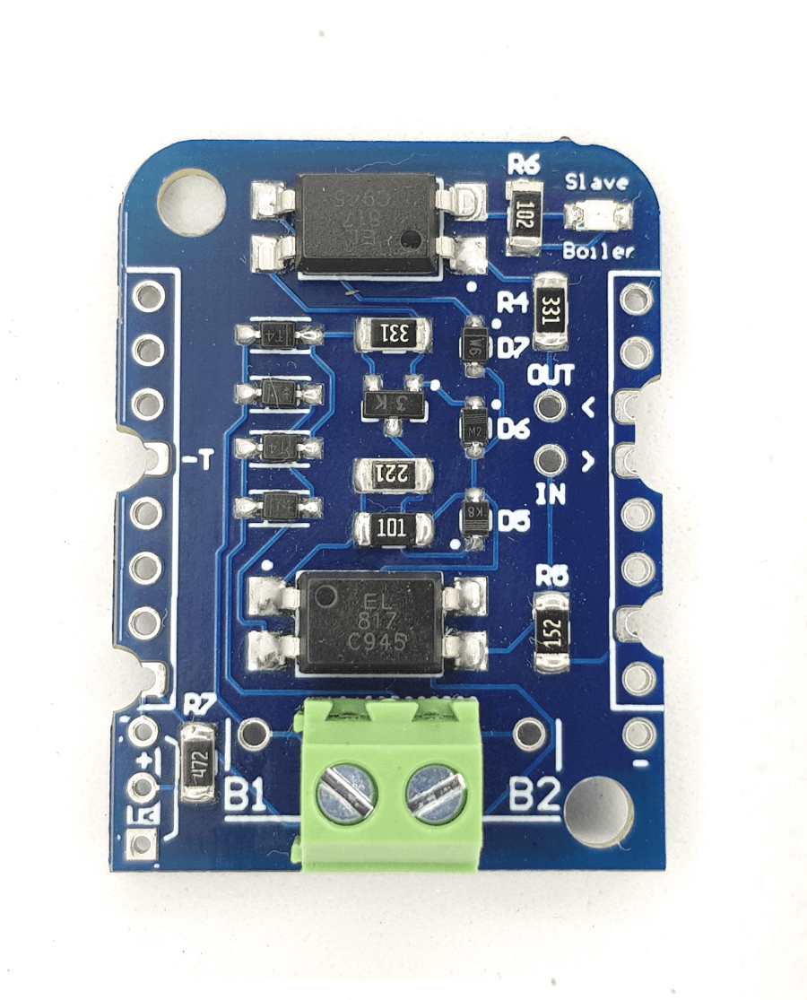

OpenTherm
=========

.. seo::
    :description: Instructions for setting up OpenTherm bridge in ESPHome.
    :image: ../components/images/opentherm-shield.png
    :keywords: OpenTherm

OpenTherm (OT) is a standard communications protocol used in central heating systems for the communication between a central heating appliances and a thermostatic controller. 
As a standard, OpenTherm is independent of any single manufacturer. A controller from manufacturer A can in principle be used to control a boiler from manufacturer B.

Since OpenTherm doesn't operate in a standard voltage range, special hardware is required. You can choose from several ready-made adapters or roll your own:

- `DIYLESS Master OpenTherm Shield <https://diyless.com/product/master-opentherm-shield>`__ 
- `Ihor Melnyk's OpenTherm Adapter <http://ihormelnyk.com/opentherm_adapter>`__ 
- `Jiří Praus' OpenTherm Gateway Arduino Shield <https://www.tindie.com/products/jiripraus/opentherm-gateway-arduino-shield/>`__ .

    DIYLESS Master OpenTherm Shield.

.. note::

    This component acts only as an OpenTherm master (i.e. a thermostat or controller) and not as a slave or gateway. You can no longer use your existing thermostat if you control your boiler through ESPHome with this component.

Quick glossary
--------------

- CH: Central Heating
- DHW: Domestic Hot Water

Usage
-----

Hub
***

First of all you need to define the OpenTherm hub in your configuration. Note that most OpenTherm adapters label ``in`` and ``out`` pins relative to themselves, and this component labels its ``in`` and ``out`` pins relative to ESP board. So usually your bridge's ``in`` pin becomes hub's ``out`` pin and vice versa.

.. code-block:: yaml

    opentherm:
      in_pin: 4
      out_pin: 5

Usage as a thermostat
*********************

The most important function for a thermostat is to set the boiler temperature setpoint. This component has three ways to provide this input: using a Home Assistant sensor from which the setpoint can be read, using a :doc:`/components/number/index`, or defining an output to which other components can write. For most users, the last option is the most useful one, as it can be combined with the :doc:`/components/climate/pid` component to create a thermostat that works as you would expect a thermostat to work. See :ref:`thermostat-pid-basic` for an example.

Numerical input
***************

There are three ways to set an input value:

- As an input sensor, defined in the hub configuration:
  
.. code-block:: yaml

    opentherm:
      t_set: setpoint_sensor

    sensor:
      - platform: homeassistant
        id: setpoint_sensor
        entity_id: sensor.boiler_setpoint

This can be useful if you have an external thermostat-like device that provides the setpoint as a sensor.

- As a number:
  
.. code-block:: yaml

    number:
      - platform: opentherm
        t_set:
          name: Boiler Setpoint

This is useful if you want full control over your boiler and want to manually set all values.

- As an output:
  
.. code-block:: yaml

    output:
      - platform: opentherm
      t_set:
        id: setpoint
  
This is especially useful in combination with the PID Climate component:

.. code-block:: yaml

    climate:
      - platform: pid
      heat_output: setpoint
      # ...

For the output and number variants, there are four more properties you can configure beyond those included in the output and number components by default:

- ``min_value`` (float): The minimum value. For a number this is the minimum value you are allowed to input. For an output this is the number that will be sent to the boiler when the output is at 0%.
- ``max_value`` (float): The maximum value. For a number this is the maximum value you are allowed to input. For an output this is the number that will be sent to the boiler when the output is at 100%.
- ``auto_max_value`` (boolean): Automatically configure the maximum value to a value reported by the boiler. Not available for all inputs.
- ``auto_min_value`` (boolean): Automatically configure the minimum value to a value reported by the boiler. Not available for all inputs.

The following inputs are available:

- ``t_set``: Control setpoint: temperature setpoint for the boiler's supply water (°C)
- ``t_set_ch2``: Control setpoint 2: temperature setpoint for the boiler's supply water on the second heating circuit (°C)  
- ``cooling_control``: Cooling control signal (%)  
- ``t_dhw_set``: Domestic hot water temperature setpoint (°C)  
- ``max_t_set``: Maximum allowable CH water setpoint (°C)  
- ``t_room_set``: Current room temperature setpoint (informational) (°C)  
- ``t_room_set_ch2``: Current room temperature setpoint on CH2 (informational) (°C)  
- ``t_room``: Current sensed room temperature (informational) (°C)

Switch
******

For five status codes, switches are available to toggle them manually. The same values can be set in the hub configuration, like so:

.. code-block:: yaml

    opentherm:
      ch_enable: true
      dhw_enable: true

This can be used to set the value without the need for a switch if you'd never want to toggle it after the initial configuration. 
The default values for these configuration options are listed below.

For enabling of central heating and cooling, the enable-flag is only sent to the boiler if the following conditions are met:
- the flag is set to true in the hub configuration,
- the switch is on, if it is configured,
- the setpoint or cooling control value is not 0, if it is configured.

For domestic hot water and outside temperature compensation, only the first two conditions are necessary.

The last point ensures that central heating is not enabled if no heating is requested as indicated by a setpoint of 0. If you use a number as the setpoint input and use a minimum value higher than 0, you NEED to use the ch_enable switch to turn off your central heating. In that case the flag will be set to true in the hub configuration, and setpoint is always larger than 0, so including a switch is the only way you can turn off central heating. (This also holds for cooling and CH2.)

The following switches are available:

- ``ch_enable``: Central Heating enabled  
- ``dhw_enable``: Domestic Hot Water enabled  
- ``cooling_enable``: Cooling enabled  
- ``otc_active``: Outside temperature compensation active  
- ``ch2_active``: Central Heating 2 active  

Binary sensor
*************

The component can report boiler status on several binary sensors. The *Status* sensors are updated in each message cycle, while the others are only set during initialization, as they are unlikely to change without restarting the boiler.

- ``fault_indication``: Status: Fault indication
- ``ch_active``: Status: Central Heating active
- ``dhw_active``: Status: Domestic Hot Water active
- ``flame_on``: Status: Flame on
- ``cooling_active``: Status: Cooling active
- ``ch2_active``: Status: Central Heating 2 active
- ``diagnostic_indication``: Status: Diagnostic event
- ``dhw_present``: Configuration: DHW present
- ``control_type_on_off``: Configuration: Control type is on/off
- ``cooling_supported``: Configuration: Cooling supported
- ``dhw_storage_tank``: Configuration: DHW storage tank
- ``master_pump_control_allowed``: Configuration: Master pump control allowed
- ``ch2_present``: Configuration: CH2 present
- ``dhw_setpoint_transfer_enabled``: Remote boiler parameters: DHW setpoint transfer enabled
- ``max_ch_setpoint_transfer_enabled``: Remote boiler parameters: CH maximum setpoint transfer enabled
- ``dhw_setpoint_rw``: Remote boiler parameters: DHW setpoint read/write
- ``max_ch_setpoint_rw``: Remote boiler parameters: CH maximum setpoint read/write

Sensor
******

The boiler can also report several numerical values, which are available through sensors. Your boiler may not support all of these values, in which case there won't be any value published to that sensor. The following sensors are available:

- ``rel_mod_level``: Relative modulation level (%)
- ``ch_pressure``: Water pressure in CH circuit (bar)
- ``dhw_flow_rate``: Water flow rate in DHW circuit (l/min)
- ``t_boiler``: Boiler water temperature (°C)
- ``t_dhw``: DHW temperature (°C)
- ``t_outside``: Outside temperature (°C)
- ``t_ret``: Return water temperature (°C)
- ``t_storage``: Solar storage temperature (°C)
- ``t_collector``: Solar collector temperature (°C)
- ``t_flow_ch2``: Flow water temperature CH2 circuit (°C)
- ``t_dhw2``: Domestic hot water temperature 2 (°C)
- ``t_exhaust``: Boiler exhaust temperature (°C)
- ``burner_starts``: Number of starts burner
- ``ch_pump_starts``: Number of starts CH pump
- ``dhw_pump_valve_starts``: Number of starts DHW pump/valve
- ``dhw_burner_starts``: Number of starts burner during DHW mode
- ``burner_operation_hours``: Number of hours that burner is in operation
- ``ch_pump_operation_hours``: Number of hours that CH pump has been running
- ``dhw_pump_valve_operation_hours``: Number of hours that DHW pump has been running or DHW valve has been opened
- ``dhw_burner_operation_hours``: Number of hours that burner is in operation during DHW mode
- ``t_dhw_set_ub``: Upper bound for adjustment of DHW setpoint (°C)
- ``t_dhw_set_lb``: Lower bound for adjustment of DHW setpoint (°C)
- ``max_t_set_ub``: Upper bound for adjustment of max CH setpoint (°C)
- ``max_t_set_lb``: Lower bound for adjustment of max CH setpoint (°C)
- ``t_dhw_set``: Domestic hot water temperature setpoint (°C)
- ``max_t_set``: Maximum allowable CH water setpoint (°C)

Examples
--------

Minimal example with numeric input
**********************************

.. code-block:: yaml

    # An extremely minimal configuration which only enables you to set the boiler's
    # water temperature setpoint as a number.

    esphome:
      name: thermostat-number-minimal

    esp8266:
      board: d1_mini

    logger:

    api:
    ota:
    wifi:
      ap:
        ssid: "Thermostat"
        password: "MySecretThemostat"

    opentherm:
      in_pin: 21
      out_pin: 26

    number:
      - platform: opentherm
        t_set:
          name: "Boiler Control setpoint"

.. _thermostat-pid-basic:

Basic PID thermostat
********************

.. code-block:: yaml

    # A basic thremostat for a boiler with a single central heating circuit and
    # domestic hot water. It reports the flame, CH and DHW status, similar to what
    # you would expect to see on a thermostat and also reports the internal boiler
    # temperatures and the current modulation level. The temperature is regulated
    # through a PID Climate controller and the current room temperature is retrieved
    # from a sensor in Home Asisstant.

    # This configuration should meet most needs and is the recommended starting
    # point if you just want a thermostat with an external temperature sensor.

    esphome:
      name: thermostat-pid-basic

    esp8266:
      board: d1_mini

    logger:

    api:
    ota:
    wifi:
      ap:
        ssid: "Thermostat"
        password: "MySecretThemostat"

    opentherm:
      in_pin: 21
      out_pin: 26
      ch_enable: true
      dhw_enable: true

    output:
      - platform: opentherm
        t_set:
          id: t_set
          min_value: 20
          max_value: 65
          zero_means_zero: true

    sensor:
      - platform: opentherm
        rel_mod_level:
          name: "Boiler Relative modulation level"
        t_boiler:
          name: "Boiler water temperature"
        t_ret:
          name: "Boiler Return water temperature"  

      - platform: homeassistant
        id: ch_room_temperature
        entity_id: sensor.temperature
        filters: 
          # Push room temperature every second to update PID parameters
          - heartbeat: 1s  

    binary_sensor:
      - platform: opentherm
        ch_active:
          name: "Boiler Central Heating active"
        dhw_active:
          name: "Boiler Domestic Hot Water active"
        flame_on:
          name: "Boiler Flame on"
        fault_indication:
          name: "Boiler Fault indication"
          entity_category: diagnostic
        diagnostic_indication:
          name: "Boiler Diagnostic event"
          entity_category: diagnostic

    switch:
      - platform: opentherm
        ch_enable:
          name: "Boiler Central Heating enabled"
          mode: restore_default_on

    climate:
      - platform: pid
        name: "Central heating"
        heat_output: t_set
        default_target_temperature: 20
        sensor: ch_room_temperature
        control_parameters: 
          kp: 0.4
          ki: 0.004

References
----------

This component was forked from Arthur Rump's ``esphome-opentherm`` component, which now seems to be abandoned. I replaced the underlying OpenTherm library with
code form Jiří Praus. I also did a lot of refactoring to bring the code closer to ESPHome coding standard.

- `Original Arthur Rump's repository <https://github.com/arthurrump/esphome-opentherm>`__
- `arduino-opentherm project by Jiří Praus <https://github.com/jpraus/arduino-opentherm>`__

There is also my blog post with more background details and reasoning for automating an OpenTherm boiler with ESPHome:

- `OpenTherm thermostat with ESPHome and Home Assistant <https://olegtarasov.me/opentherm-thermostat-esphome/>`__
