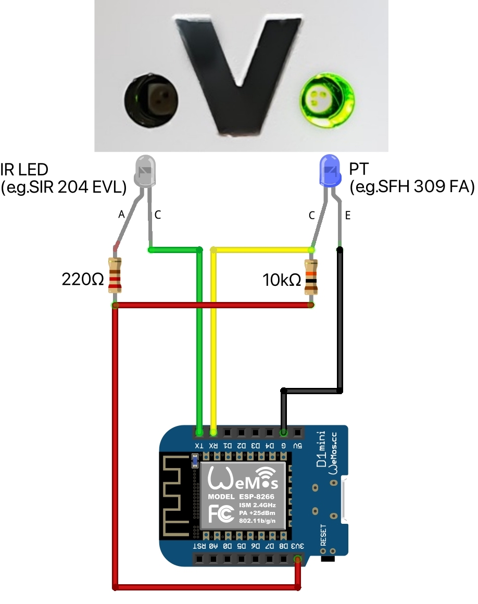

Viessmann Optolink
==================

.. seo::
    :description: Instructions for setting up an Viessmann® heating component via an Optolink adapter in ESPHome.
    :image: optolink.jpg

The ``optolink`` platform allows you to integrate Viessmann® heating component in ESPHome.

Using an adapter cable you can read parameters of the heating component and also partly change them. The simplest version of the adapter cable consists of an IR diode, a phototransistor and two resistors, connected to the serial port pins of the ESP.

    Viessmann® Optolink connection with adapter cable.

Once configured, you can add further :doc:`Sensors</components/sensor/index>`, :doc:`Binary Sensors</components/binary_sensor/index>` and :doc:`Text Sensors</components/text_sensor/index>` to monitor parameters of the heating component. Moreover, you can add :doc:`Switches</components/switch/index>`, :doc:`Numbers</components/number/index>` and :doc:`Selects</components/select/index>` to control the heating component.

.. note::

    The ``optolink`` platform is based on the great work of many people in the `OpenV project <https://github.com/openv/openv/wiki>`__ and the fantastic Arduino Library `VitoWiFi <https://github.com/bertmelis/VitoWiFi>`__ of Bert Melis.   

Overview
--------

Viessmann® calls the parameters of the heating component datapoints. Each datapoint consists of a 32-bit address, the number of bytes, and optionally, a value factor by which the read value must be divided. The datapoints supported by your heating component depend on the built-in Vitotronic controlling unit. `This page <https://github.com/openv/openv/wiki/Geräte>`__ on the OpenV Wiki shows the supported units, `this page <https://github.com/openv/openv/wiki/Adressen>`__ the supported datapoints for all units (only in German language). 

Configuration 
-------------

Platform configuration
***********************
.. code-block:: yaml

    # Example configuration entry
    optolink:
      protocol: P300
      device_info: Device Info
      state: Component state

Configuration variables:
~~~~~~~~~~~~~~~~~~~~~~~~
- **protocol** (**Required**, string): The protocol for communication (``KW`` or ``P300``, ``GWG`` is not supported). See `this page <https://github.com/openv/openv/wiki/Geräte>`__ 
- **rx_pin** (*Optional*, :ref:`Pin <config-pin>`, only ESP32): Receive pin (RX)
- **tx_pin** (*Optional*, :ref:`Pin <config-pin>`, only ESP32): Transmit pin (TX)
- **logger** (*Optional*, boolean): more detailled log output (:doc:`/components/logger` needed). See *Troubleshooting*. Defaults to 'false'.
- **device_info** (*Optional*, string): If set to a non-empty value, a :doc:`/components/text_sensor/index` with the variables name is created displaying information of your Vitotronic controlling unit. Defaults to an empty value.
- **state** (*Optional*, string): If set to a non-empty value, a :doc:`/components/text_sensor/index` with the internal state of the component is created. Defaults to an empty value. See *Troubleshooting*.

.. warning::

    The ``optolink`` platform uses UART0 for communication with the heating component. Don't mix it with other components that use UART0.
    Especially the :doc:`/components/logger` uses by default UART0 to write log messages to the serial port. If you plan to use the :doc:`/components/logger`, configure it to use another serial port. 

    .. code-block:: yaml

        logger:
          hardware_uart: UART1

    Or deactivate the logging to UART0 with a baudrate value of 0.

    .. code-block:: yaml

        logger:
          hardware_uart: UART0
          baud_rate: 0

Sensors
*******
.. code-block:: yaml

    # Example configuration entry
    sensor:
      - platform: optolink
        name: Boiler Temperature
        address: 0xA309
        bytes: 2
        div_ratio: 100
        unit_of_measurement: °C
        device_class: temperature

Configuration variables:
~~~~~~~~~~~~~~~~~~~~~~~~
- **address** (**Required**, hexadecimal): Address of datapoint
- **bytes** (**Required**, int): Number of bytes of datapoint
- **div_ratio** (*Optional*, int): Value factor of datapoint. Defaults to '1'.
- All other options from :doc:`/components/sensor/index`

Binary Sensors
**************
.. code-block:: yaml

    # Example configuration entry
    binary_sensor:
      - platform: optolink
        name: Disturbance
        address: 0x0A82

Configuration variables:
~~~~~~~~~~~~~~~~~~~~~~~~
- **address** (**Required**, hexadecimal): Address of datapoint
- All other options from :doc:`/components/binary_sensor/index`

Text Sensors
************
.. code-block:: yaml

    # Example configuration entry
    text_sensor:
      - platform: optolink
        name: Error history 1
        address: 0x7590
        bytes: 9
        raw: true

Configuration variables:
~~~~~~~~~~~~~~~~~~~~~~~~
- **address** (**Required**, hexadecimal): Address of datapoint
- **bytes** (**Required**, int): Number of bytes of datapoint
- **raw** (*Optional*, boolean): If set to true, the bytes read are considered as raw characters. If set to false the bytes are treated as a numerical value. Defaults to 'false'. 
- All other options from :doc:`/components/text_sensor/index`

Numbers
*******
.. code-block:: yaml

    # Example configuration entry
    number:
      - platform: optolink
        name: Room Temperature Setpoint
        unit_of_measurement: °C
        address: 0x2306
        bytes: 1
        min_value: 3
        max_value: 37
        step: 1
        mode: box
        icon: "mdi:home-thermometer"
        device_class: temperature

Configuration variables:
~~~~~~~~~~~~~~~~~~~~~~~~
- **address** (**Required**, hexadecimal): Address of datapoint
- **bytes** (**Required**, int): Number of bytes of datapoint
- **div_ratio** (**Required**, int): Value factor of datapoint. Defaults to '1'.
- **min_value** (**Required**, float): Minimum possible value (Currently no negative values)
- **max_value** (**Required**, float): Maximum possible value (Currently no negative values)
- **step** (**Required**, float): Increment size
- All other options from :doc:`/components/number/index`

Switches
********
.. code-block:: yaml

    # Example configuration entry
    switch:
      - platform: optolink
        name: Economy mode
        address: 0x2302
        icon: mdi:sprout-outline

Configuration variables:
~~~~~~~~~~~~~~~~~~~~~~~~
- **address** (**Required**, hexadecimal): Address of datapoint
- All other options from :doc:`/components/switch/index`

Selects
*******
.. code-block:: yaml

    # Example configuration entry
    select:
      - platform: optolink
        name: Operation mode
        address: 0x2323
        bytes: 1
        map:
          - "0 -> Off"
          - "1 -> Only hot water"
          - "2 -> Heating and hot water"

Configuration variables:
~~~~~~~~~~~~~~~~~~~~~~~~
- **address** (**Required**, hexadecimal): Address of datapoint
- **bytes** (**Required**, int): Number of bytes of datapoint
- **div_ratio** (*Optional*, int): Value factor of datapoint. Defaults to '1'.
- **map** (**Required**, map): Mapping of numerical value to human readable value.
- All other options from :doc:`/components/switch/index`

Troubleshooting
---------------
If you encounter problems, here are some hints.

IR-LED
******
The IR LED is working in a frequency band outside of your eye's perception. To see the LED sending signals watch the LED through your smartphones camera. This way the IR light is visible and you can check if the LED is working.

Too many sensors
****************
If you configure a large number of ``sensors``, ``numbers``, ``switches`` or ``selects`` you could run out of memory, especially on ESP8266 controllers. Try to avoid unnecesary components like the :doc:`/components/web_server`. The :doc:`/components/debug`, which unfortunately is itself a component with significant memory footprint, can help to check free memory.

Logging of communication
************************
If you configure the ``optolink`` platform with ``logger: true``, the communication with the heating component is written to the console - provided you have configured the :doc:`/components/logger` with level ``debug``.

Internal component state
************************
If something went wrong while initializing the component, it tries to write information to ``state`` Text sensor. See *Configuration*.

See Also
--------

- `OpenV project <https://github.com/openv/openv/wiki>`__ 
- `VitoWiFi <https://github.com/bertmelis/VitoWiFi>`__
- :ghedit:`Edit`
