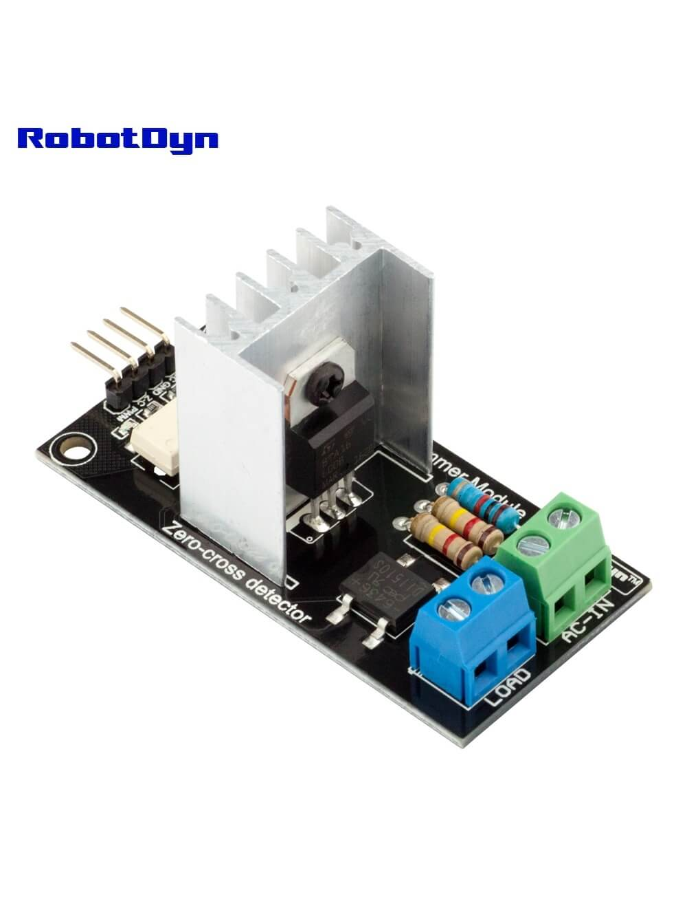

AC Dimmer Component
===================

.. seo::
    :description: Instructions for setting up AC Dimmer component in ESPHome.
    :image: ac_dimmer.svg

.. warning::

    This component has not been fully tested yet, if you are testing this component
    please share your experience with the dimmer hardware and light model and
    configuration here https://github.com/esphome/feature-requests/issues/278

    Thanks!

The ``ac_dimmer`` component allows you to connect a dimmable light or other load
which supports phase control dimming to your ESPHome project.

There are several already made boards which are compatible with this component, such as the
`RobotDyn dimmer <https://robotdyn.com/ac-light-dimmer-module-1-channel-3-3v-5v-logic-ac-50-60hz-220v-110v.html>`__.

    RobotDyn Module. Image by `RobotDyn`_

.. _RobotDyn: https://robotdyn.com/ac-light-dimmer-module-1-channel-3-3v-5v-logic-ac-50-60hz-220v-110v.html

.. code-block:: yaml

    # Example configuration entry
    output:
      - platform: ac_dimmer
        id: dimmer1
        gate_pin: GPIOXX
        zero_cross_pin:
          number: GPIOXX
          mode:
            input: true
          inverted: yes

    light:
      - platform: monochromatic
        output: dimmer1
        name: Dimmerized Light

Configuration variables:
------------------------

- **gate_pin** (**Required**, :ref:`config-pin`): The pin used to control the Triac or
  Mosfet.
- **zero_cross_pin** (**Required**, :ref:`config-pin`): The pin used to sense the AC
  Zero cross event, you can have several dimmers controlled with the same zero cross
  detector, in such case duplicate the ``zero_cross_pin`` config on each output.
- **method** (*Optional*): Set the method for dimming, can be:

  - ``leading pulse``: (default) a short pulse to trigger a triac.
  - ``leading``: gate pin driven high until the zero cross is detected
  - ``trailing``: gate pin driven high from zero cross until dim period, this method
    is suitable for mosfet dimmers only.

- **init_with_half_cycle** (*Optional*, boolean): Will send the first full half AC cycle
  Try to use this for dimmable LED lights, it might help turning on at low brightness
  levels. On Halogen lamps it might show at initial flicker. Defaults to ``false``.
- **id** (*Optional*, :ref:`config-id`): Manually specify the ID used for code generation.
- All other options from :ref:`Output <config-output>`.

Dimming lights with phase control can be tricky, the minimum level your light turns on
might be different from other lights, also the perceived light level might not correlate
to the percentage output set to the light, to try to minimize these behaviors you can
tweak the values ``min_power`` from this output component and also ``gamma_correct`` from
the monochromatic light.

See Also
--------

- :doc:`/components/output/index`
- :doc:`/components/light/monochromatic`
- :apiref:`ac_dimmer/ac_dimmer.h`
- :ghedit:`Edit`
