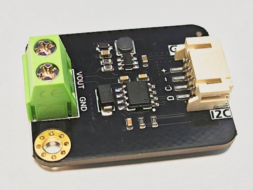

GP8211 Component
================

.. seo::
    :description: Instructions for setting up GP8211 outputs in ESPHome.
    :image: gp8211.jpg

The ``gp8211`` is a single-channel DAC output module. It requires an :doc:`/components/i2c` to be setup. The GP8211 has a fixed I²C address of `0x58`.

    GP8211 I2C 15-bit DAC Module (0-5V/10V)

Component/Hub
-------------

.. code-block:: yaml

    gp8211:
      id: my_gp8211
      voltage: 5V

Configuration variables:

- **id** (*Optional*, :ref:`config-id`): Manually specify the ID used for code generation.
- **voltage** (**Required**, voltage): The output voltage range of the DAC. Must be one of ``5V`` or ``10V``.

Output
------

.. code-block:: yaml

    output:
      - platform: gp8211
        id: my_gp8211_output
        gp8211_id: my_gp8211

Configuration variables:

- **id** (*Optional*, :ref:`config-id`): Manually specify the ID used for code generation.
- **gp8211_id** (*Optional*, :ref:`config-id`): The ID of the GP8211 component.
  Defaults to the only GP8211 component if there is only one.
- All other options from :ref:`config-output`.

See Also
--------

- :doc:`/components/output/esp32_dac`
- :doc:`/components/output/index`
- :ghedit:`Edit`