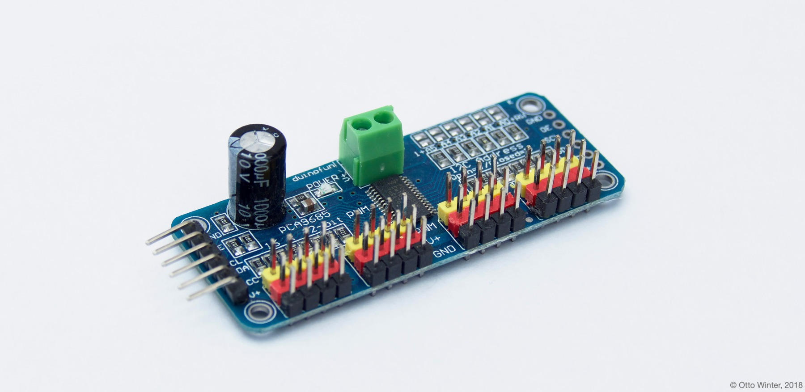

PCA9685
=======

.. seo::
    :description: Instructions for setting up PCA9685 LED PWM drivers.
    :image: pca9685.jpg
    :keywords: PCA9685

.. _pca9685-component:

Component/Hub
-------------

The PCA9685 component represents a PCA9685 12-bit PWM driver
(`datasheet <https://docs.espressif.com/projects/esp-idf/en/latest/api-reference/peripherals/ledc.html#configure-channel>`__,
`adafruit <https://www.adafruit.com/product/815>`__) in ESPHome. It
uses :ref:`I²C Bus <i2c>` for communication.

To use the channels of this components, you first need to setup the
global ``pca9685`` hub and give it an id, and then define the
:ref:`individual output channels <pca9685-output>`.

.. code-block:: yaml

    # Example configuration entry
    pca9685:
      frequency: 500
      id: 'pca9685_hub1'

    # Individual outputs
    output:
      - platform: pca9685
        pca9685_id: 'pca9685_hub1'
        channel: 0

Configuration variables:
************************

-  **frequency** (**Required**, float): The frequency to let the
   component drive all PWM outputs at. Must be in range from 24Hz to
   1525.88Hz.
-  **address** (*Optional*, int): The I²C address of the driver.
   Defaults to ``0x00``.
-  **id** (*Optional*, :ref:`config-id`): The id to use for
   this pca9685 component. Use this if you have multiple PCA9685s connected at the same time

.. _pca9685-output:

PCA9685 Output
--------------

The PCA9685 output component exposes a PCA9685 PWM channel of a global
:ref:`PCA9685 hub <pca9685-component>` as a float
output.

    PCA9685 16-Channel PWM Driver.

.. code-block:: yaml

    # Example configuration entry
    pca9685:
      - frequency: 500

    # Individual outputs
    output:
      - platform: pca9685
        id: 'pca9685_output1'
        channel: 0

Configuration variables:
************************

- **id** (**Required**, :ref:`config-id`): The id to use for this output component.
- **channel** (**Required**, int): Chose the channel of the PCA9685 of
  this output component. Must be in range from 0 to 15.
- **pca9685_id** (*Optional*, :ref:`config-id`): Manually specify the ID of the
  :ref:`PCA9685 hub <pca9685-component>`.
  Use this if you have multiple PCA9685s you want to use at the same time.
- All other options from :ref:`Output <config-output>`.

See Also
--------

- :doc:`/components/output/index`
- :doc:`/components/output/esp8266_pwm`
- :doc:`/components/output/ledc`
- :doc:`/components/light/monochromatic`
- :doc:`/components/fan/speed`
- :doc:`/components/power_supply`
- :apiref:`pca9685/pca9685_output.h`
- `PCA9685 Arduino Library <https://github.com/NachtRaveVL/PCA9685-Arduino>`__ by `@NachtRaveVL <https://github.com/NachtRaveVL>`__
- :ghedit:`Edit`
