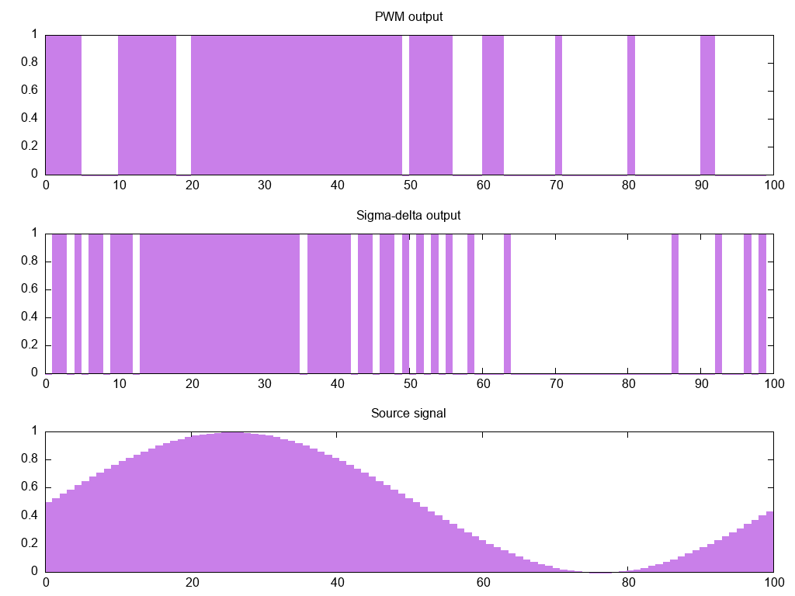

Sigma-Delta Output
==================

This integration uses `sigma-delta modulation <https://en.wikipedia.org/wiki/Delta-sigma_modulation>`__
to output a floating-point value on a binary output. Unlike with :doc:`/components/output/slow_pwm`,
it is possible to update the output value with each update cycle, not at the end of a long period.

If you choose to toggle the output at most once every 1 seconds and decide on a
PWM period of 10 seconds, for reasonably frequent updates, there are only 10
possible levels, while for higher precision a long update interval is needed,
restricting the update rate. A sigma-delta output can be updated during each cycle.

    Comparison between a PWM with a period of 10s and 1s steps and a sigma-delta output with 1s steps

.. code-block:: yaml

    # Example configuration entry
    output:
      - platform: sigma_delta_output
        update_interval: 60s
        output: heater_relay
        id: sd_heater_output

Configuration variables:

- **update_interval** (**Required**, :ref:`Time <config-time>`): The interval
  at which the output is recalculated.
- **output** (**Required**, :ref:`config-id`): The ID of an :doc:`/components/output/index`.
- All options from :ref:`Output <config-output>`.
