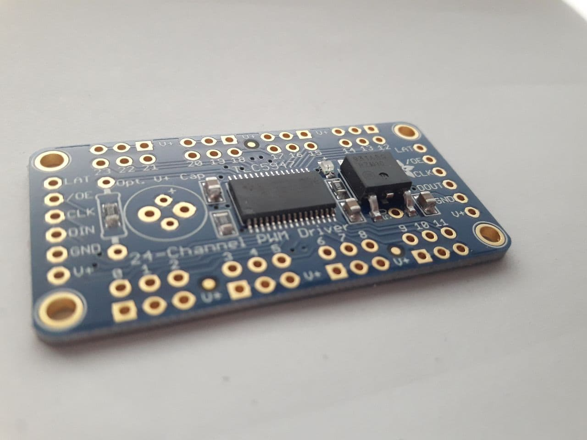

TLC5947 LED driver
==================

.. seo::
    :description: Instructions for setting up TLC5947 LED drivers in ESPHome.
    :image: tlc5947.jpg
    :keywords: tlc5947,

.. _tlc5947-component:

Component/Hub
-------------

    Adafruit's TLC5947 board

This component represents a chain of `TLC5947 24-Channel, 12-Bit PWM LED Drivers <https://www.ti.com/lit/ds/symlink/tlc5947.pdf>`_,
which is used e.g. on this `board from Adafruit <https://www.adafruit.com/product/1429>`_.

To use the channels of this components, you first need to setup the
global ``tlc5947`` hub and give it an id, and then define the
:ref:`individual output channels <tlc5947-output>`.

.. code-block:: yaml

    # Example configuration entry
    tlc5947:
      data_pin: GPIOXX
      clock_pin: GPIOXX
      lat_pin: GPIOXX

Configuration variables:
************************

-  **data_pin** (**Required**, :ref:`Pin Schema <config-pin_schema>`): The pin connected to DIN.
-  **clock_pin** (**Required**, :ref:`Pin Schema <config-pin_schema>`): The pin connected to CLK.
-  **lat_pin** (**Required**, :ref:`Pin Schema <config-pin_schema>`): The pin connected to LAT.
-  **oe_pin** (*Optional*, :ref:`Pin Schema <config-pin_schema>`): The pin connected to /OE (BLANK).
-  **num_chips** (*Optional*, int): Number of chips in the chain. Must be
   in range from 1 to 85. Defaults to 1.
-  **id** (*Optional*, :ref:`config-id`): The id to use for
   this ``tlc5947`` component. Use this if you have multiple TLC5947 chains
   connected at the same time.

.. _tlc5947-output:

Output
------

The tlc5947 output component exposes a tlc5947 channel of a global
:ref:`tlc5947-component` as a float output.

.. code-block:: yaml

    # Individual outputs
    output:
      - platform: tlc5947
        id: output_red
        channel: 0
      - platform: tlc5947
        id: output_green
        channel: 1
      - platform: tlc5947
        id: output_blue
        channel: 2

Configuration variables:
************************

- **id** (**Required**, :ref:`config-id`): The id to use for this output component.
- **channel** (**Required**, int): Chose the channel of the TLC5947 chain of
  this output component.
- **tlc5947_id** (*Optional*, :ref:`config-id`): Manually specify the ID of the
  :ref:`TLC5947-component`.
  Use this if you have multiple TLC5947 chains you want to use at the same time.
- All other options from :ref:`Output <config-output>`.

See Also
--------

- :doc:`/components/output/index`
- :doc:`/components/light/monochromatic`
- :doc:`/components/power_supply`
- :apiref:`tlc5947/tlc5947.h`
- :ghedit:`Edit`
