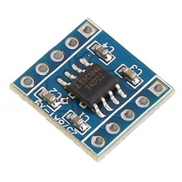

X9C Potentiometer Output
========================

.. seo::
    :description: Instructions for setting up a X9C digital potentiometer with ESPHome.
    :image: description.svg

The ``x9c`` output platform allows you to add an output that controls a `X9C digital potentiometer <https://www.renesas.com/us/en/document/dst/x9c102-x9c103-x9c104-x9c503-datasheet>`__.

    X9C digital potentiometer

The X9C family of digital potentiometers are available in different resistance values.

==================== =====================
``X9C102``           ``1kΩ``
-------------------- ---------------------
``X9C103``           ``10kΩ``
-------------------- ---------------------
``X9C503``           ``50kΩ``
-------------------- ---------------------
``X9C104``           ``100kΩ``
==================== =====================

All chips are controlled by a three wire interface and feature 100 possible wiper positions.

.. code-block:: yaml

    # Example configuration entry
    output:
      - platform: x9c
        id: x9c_pot
        cs_pin: GPIOXX
        inc_pin: GPIOXX
        ud_pin: GPIOXX
        initial_value: 0.5

Configuration variables:
------------------------

- **id** (**Required**, :ref:`config-id`): The id to use for this output component.
- **cs_pin** (**Required**, :ref:`Pin Schema <config-pin_schema>`): Chip Select pin
- **inc_pin** (**Required**, :ref:`Pin Schema <config-pin_schema>`): Increment pin
- **ud_pin** (**Required**, :ref:`Pin Schema <config-pin_schema>`): Up/Down pin
- **initial_value** (*Optional*, float): Manually specify the initial potentiometer value, between ``0.01`` and ``1.0``. Defaults to ``1.0``.
- All other options from :ref:`Output <config-output>`.

See Also
--------

- :doc:`/components/output/index`
- :apiref:`x9c/x9c.h`
- :ghedit:`Edit`
