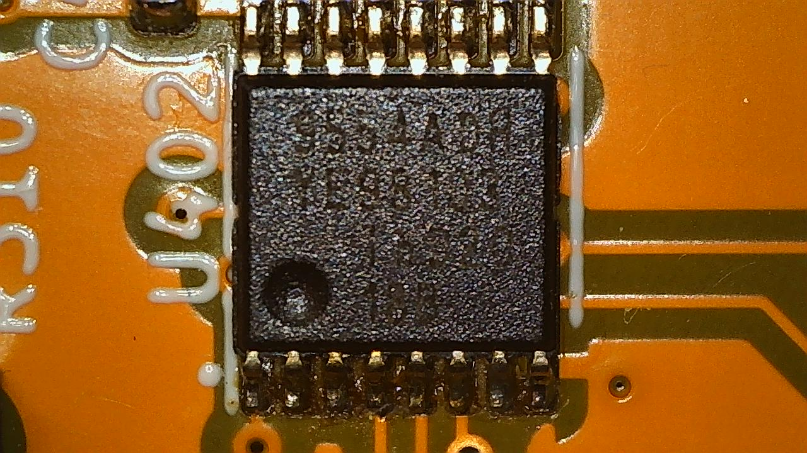

PCA9554 I/O Expander
====================

.. seo::
    :description: Instructions for setting up PCA9554, PCA9554A, PCA9536 digital port expanders in ESPHome.
    :image: ../images/pca9554a.jpg

The PCA9554 component allows you to use a variety of Texas Instrument I/O expanders in ESPHome using the
:ref:`I²C Bus <i2c>` for communication.

Devices tested as working with this component include **PCA9554**, **PCA9554A**, **PCA9536** and **PCA9535**.
Equivalent TI I/O expanders with the same command interface and up to 16 I/O pins such as the **TCA9554**
and **TCA9535** should also work.

    PCA9554A I/O Expander chip

Once configured, you can use any of the **16** (PCA9535), **8** (PCA9554, PCA9554A) or **4** (PCA9536) pins
within your projects. Within ESPHome they emulate a real internal GPIO pin
and can therefore be used with many of ESPHome's components such as the GPIO
binary sensor or GPIO switch.

.. note::

    The 7 bit I²C device address ranges are:

    - PCA9554 and PCA9535: ``0x20`` to ``0x27``
    - PCA9554A: ``0x38`` to ``0x3F``
    - PCA9536: ``0x41``

    For the PCA9535, PCA9554 and PCA9554A, the actual choice of the I²C device address depends on state of the 3 address pins.
    Please refer to the individual datasheets linked at the bottom of the page for further details to set the address.

    Up to eight PCA9535 or PCA9554 and an additional eight PCA9554A devices can reside on the same I²C bus.
    Please note that only one PCA9536 device is allowed per I²C bus due to its fixed address.

    The PCA9535 provides 16 bits of GPIOs (pin numbers 0-15).

    The PCA9554 and PCA9554A provide 8 bits of GPIOs (pin numbers 0-7).
    
    The PCA9536 provides 4 bits of GPIOs (pin numbers 0-3).

    Any option accepting a :ref:`Pin Schema <config-pin_schema>` can theoretically be used, but some more
    complicated components that do communication through this I/O expander will not work.

.. code-block:: yaml

    # Example configuration entry
    pca9554:
      - id: 'pca9554a_device'
        address: 0x38
      
    # Individual outputs
    switch:
      - platform: gpio
        name: "PCF9554A Pin #0"
        pin:
          pca9554: pca9554a_device
          # Use pin number 0
          number: 0
          # One of INPUT or OUTPUT
          mode:
            output: true
          inverted: false

Configuration variables:
************************

- **id** (**Required**, :ref:`config-id`): The id to use for this ``pca9554`` component.
- **address** (*Optional*, int): The I²C address of the driver.
  Defaults to ``0x20``.
- **pin_count** (*Optional*, int): The number of bits implemented in the expander. Defaults to 8. This should be set
  to 16 when using a PCA9535 and 4 when using a PCA95367.

.. note::

    A PCA9535 will not work (even on the lower 8 bits) unless the **pin_count** is set to 16.

Pin configuration variables:
****************************

- **pca9554** (**Required**, :ref:`config-id`): The id of the ``pca9554`` component of the pin.
- **number** (**Required**, int): The pin number.
- **inverted** (*Optional*, boolean): If all read and written values
  should be treated as inverted. Defaults to ``false``.
- **mode** (*Optional*, string): A pin mode to set for the pin at. One of ``INPUT`` or ``OUTPUT``.

See Also
--------

- :ref:`i2c`
- :doc:`switch/gpio`
- :doc:`binary_sensor/gpio`
- `PCA9554 datasheet <https://www.ti.com/lit/ds/symlink/pca9554.pdf>`__ 
- `PCA9554A datasheet <https://www.ti.com/lit/ds/symlink/pca9554a.pdf>`__ 
- `PCA9535 datasheet <https://www.ti.com/lit/ds/symlink/pca9535.pdf>`__
- `PCA9536 datasheet <https://www.ti.com/lit/ds/symlink/pca9536.pdf>`__
- :apiref:`pca9554/pca9554.h`
- :ghedit:`Edit`
