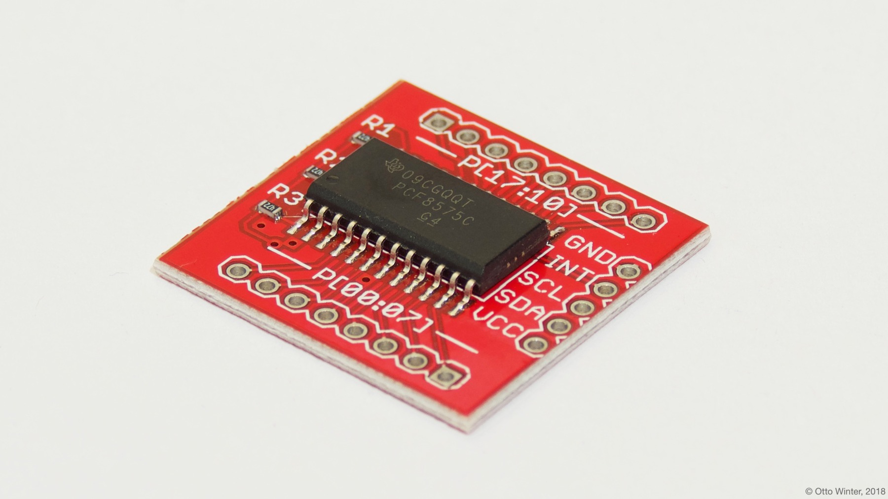

PCF8574 I/O Expander
====================

.. seo::
    :description: Instructions for setting up PCF8574 digital port expanders in ESPHome.
    :image: pcf8574.jpg

The PCF8574 component allows you to use PCF8574 or PCF8575 I/O expanders
(`datasheet <http://www.ti.com/lit/ds/symlink/pcf8574.pdf>`__,
`SparkFun`_) in ESPHome. It uses :ref:`I²C Bus <i2c>` for communication.

Once configured, you can use any of the 8 pins (PCF8574) or 16 pins (PCF8575) as
pins for your projects. Within ESPHome they emulate a real internal GPIO pin
and can therefore be used with many of ESPHome's components such as the GPIO
binary sensor or GPIO switch.

Any option accepting a :ref:`Pin Schema <config-pin_schema>` can theoretically be used, but some more
complicated components that do communication through this I/O expander will
not work.

    PCF8574 I/O Expander.

.. _SparkFun: https://www.sparkfun.com/products/retired/8130

.. code-block:: yaml

    # Example configuration entry
    pcf8574:
      - id: 'pcf8574_hub'
        address: 0x21
        pcf8575: false

    # Individual outputs
    switch:
      - platform: gpio
        name: "PCF8574 Pin #0"
        pin:
          pcf8574: pcf8574_hub
          # Use pin number 0
          number: 0
          # One of INPUT or OUTPUT
          mode:
            output: true
          inverted: false

Configuration variables:
************************

- **id** (**Required**, :ref:`config-id`): The id to use for this PCF8574 component.
- **address** (*Optional*, int): The I²C address of the driver.
  Defaults to ``0x21``.
- **pcf8575** (*Optional*, boolean): Whether this is a 16-pin PCF8575. Defaults to ``false``.

.. note::

    If you use PCF8575, pin numbers are from 0 to 15, not 0 to 7 and 10 to 17 as datasheet states!

Pin configuration variables:
****************************

- **pcf8574** (**Required**, :ref:`config-id`): The id of the PCF8574 component of the pin.
- **number** (**Required**, int): The pin number.
- **inverted** (*Optional*, boolean): If all read and written values
  should be treated as inverted. Defaults to ``false``.
- **mode** (*Optional*, string): A pin mode to set for the pin at. One of ``INPUT`` or ``OUTPUT``.

See Also
--------

- :ref:`i2c`
- :doc:`switch/gpio`
- :doc:`binary_sensor/gpio`
- `PCF8574 Arduino Library <https://github.com/skywodd/pcf8574_arduino_library>`__ by `Fabien Batteix <https://github.com/skywodd>`__
- :apiref:`pcf8574/pcf8574.h`
- :ghedit:`Edit`
