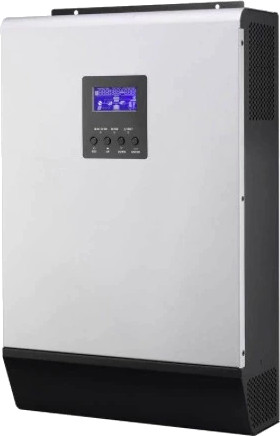

PipSolar PV Inverter
====================

.. seo::
    :description: Instructions for setting up PipSolar Compatible PV Inverter in ESPHome.
    :image: pipsolar.jpg

The PipSolar component allows you to integrate PIP-compatible Inverters in ESPHome.
It uses :ref:`UART <uart>` for communication.

Once configured, you can use sensors, binary sensors, switches and outputs as described below for your projects.

.. warning::

    All functionality is working fine on esp8266 and esp32 chips.
    If you configure a lot of the possible sensors etc. from below it could be that you run out of memory (on esp8266).
    If you configure more than one if this devices with nearly all sensors etc. you run in a stack-size issue. In this case you have to increase stack size.

    pip4048 compatible PV Inverter.

Overview
--------

You can connect a wide variety of PV Inverters as long as they provide a serial interface and talk the commands used (at least those you want to use).
A documentation about the communication protocol mostly supported can be found |here|_.

This component will poll the needed polling commands in a loop. If there is a command to send for controlling the inverter this command will be queued and fired as next after the current polling command ends.
There is a buffer to buffer up to 10 commands.

.. |here| replace:: ``here``
.. _here: https://github.com/jblance/mpp-solar/tree/master/docs

.. code-block:: yaml

    # Example configuration entry
    pipsolar:
      - id: inverter0

Configuration variables:
~~~~~~~~~~~~~~~~~~~~~~~~

- **id** (**Required**, :ref:`config-id`): The id to use for this pipsolar component.
- **uart_id** (*Optional*): The uart Bus ID

Sensor
------
.. code-block:: yaml

    # Example configuration entry
    sensor:
      - platform: pipsolar
        pipsolar_id: inverter0
        grid_rating_voltage:
          id: inverter0_grid_rating_voltage
          name: inverter0_grid_rating_voltage
        grid_rating_current:
          id: inverter0_grid_rating_current
          name: inverter0_grid_rating_current
        ac_output_apparent_power:
          id: inverter0_ac_output_apparent_power
          name: inverter0_ac_output_apparent_power
        ac_output_active_power:
          id: inverter0_ac_output_active_power
          name: inverter0_ac_output_active_power

Configuration variables:
~~~~~~~~~~~~~~~~~~~~~~~~
All sensors are normal sensors... so all sensor variables are working to.

- **grid_rating_voltage** (*Optional*): grid rating voltage
- **grid_rating_current** (*Optional*): grid rating current
- **ac_output_rating_voltage** (*Optional*): AC output rating voltage
- **ac_output_rating_frequency** (*Optional*): AC output rating frequency
- **ac_output_rating_current** (*Optional*): AC output rating current
- **ac_output_rating_apparent_power** (*Optional*): AC output rating apparent power
- **ac_output_rating_active_power** (*Optional*): AC output rating active power
- **battery_rating_voltage** (*Optional*): battery rating voltage
- **battery_recharge_voltage** (*Optional*): battery recharge voltage
- **battery_under_voltage** (*Optional*): battery under voltage
- **battery_bulk_voltage** (*Optional*): battery bulk voltage
- **battery_float_voltage** (*Optional*): battery float voltage
- **battery_type** (*Optional*): battery type
- **current_max_ac_charging_current** (*Optional*): current max ac charging current
- **current_max_charging_current** (*Optional*): current max charging current
- **input_voltage_range** (*Optional*): input voltage range
- **output_source_priority** (*Optional*): output source priority
- **charger_source_priority** (*Optional*): charger source priority
- **parallel_max_num** (*Optional*): parallel max num
- **machine_type** (*Optional*): machine type
- **topology** (*Optional*): topology
- **output_mode** (*Optional*): output mode
- **battery_redischarge_voltage** (*Optional*): battery re-discharge voltage
- **pv_ok_condition_for_parallel** (*Optional*): PV OK condition for parallel
- **pv_power_balance** (*Optional*): PV power balance mode

- **grid_voltage** (*Optional*): grid voltage
- **grid_frequency** (*Optional*): grid frequency
- **ac_output_voltage** (*Optional*): ac output voltage
- **ac_output_frequency** (*Optional*): ac output frequency
- **ac_output_apparent_power** (*Optional*): ac output apparent power
- **ac_output_active_power** (*Optional*): ac output active power
- **output_load_percent** (*Optional*): output load percentage
- **bus_voltage** (*Optional*): bus voltage
- **battery_voltage** (*Optional*): battery voltage
- **battery_charging_current** (*Optional*): battery charging current
- **battery_capacity_percent** (*Optional*): battery capacity percent
- **inverter_heat_sink_temperature** (*Optional*): inverter heatsink temperature
- **pv_input_current_for_battery** (*Optional*): pv input current for battery
- **pv_input_voltage** (*Optional*): pv input voltage
- **battery_voltage_scc** (*Optional*): battery voltage from scc
- **battery_discharge_current** (*Optional*): battery discharge current
- **battery_voltage_offset_for_fans_on** (*Optional*): battery voltage offset for fans on
- **eeprom_version** (*Optional*): eeprom version
- **pv_charging_power** (*Optional*): pc charging power

Binary Sensor
-------------

.. code-block:: yaml

    # Example configuration entry
    binary_sensor:
      - platform: pipsolar
        pipsolar_id: inverter0
        add_sbu_priority_version:
          id: inverter0_add_sbu_priority_version
          name: inverter0_add_sbu_priority_version
        configuration_status:
          id: inverter0_configuration_status
          name: inverter0_configuration_status

Configuration variables:
~~~~~~~~~~~~~~~~~~~~~~~~
All sensors are normal binary sensors... so all binary sensor variables are working to.

- **add_sbu_priority_version** (*Optional*): add sbu priority version
- **configuration_status** (*Optional*): configuration status
- **scc_firmware_version** (*Optional*): scc firmware version
- **load_status** (*Optional*): load status
- **battery_voltage_to_steady_while_charging** (*Optional*): battery voltage to steady while charging
- **charging_status** (*Optional*): charging status
- **scc_charging_status** (*Optional*): scc charging status
- **ac_charging_status** (*Optional*): ac charging status
- **charging_to_floating_mode** (*Optional*): charging to floating mode
- **switch_on** (*Optional*): switch on
- **dustproof_installed** (*Optional*): dustproof installed
- **silence_buzzer_open_buzzer** (*Optional*): silence buzzer open buzzer
- **overload_bypass_function** (*Optional*): overload bypass function
- **lcd_escape_to_default** (*Optional*): lcd escape to default
- **overload_restart_function** (*Optional*): overload restart function
- **over_temperature_restart_function** (*Optional*): over temperature restart function
- **backlight_on** (*Optional*): backlight on
- **alarm_on_when_primary_source_interrupt** (*Optional*): alarm on when primary source interrupt
- **fault_code_record** (*Optional*): fault code record
- **power_saving** (*Optional*): power saving

- **warnings_present** (*Optional*): warnings present
- **faults_present** (*Optional*): faults present
- **warning_power_loss** (*Optional*): warning power loss
- **fault_inverter_fault** (*Optional*): fault inverter fault
- **fault_bus_over** (*Optional*): fault bus over
- **fault_bus_under** (*Optional*): fault bus under
- **fault_bus_soft_fail** (*Optional*): fault bus soft fail
- **warning_line_fail** (*Optional*): warning line fail
- **fault_opvshort** (*Optional*): fault opvshort
- **fault_inverter_voltage_too_low** (*Optional*): fault inverter voltage too low
- **fault_inverter_voltage_too_high** (*Optional*): fault inverter voltage too high
- **warning_over_temperature** (*Optional*): warning over temperature
- **warning_fan_lock** (*Optional*): warning fan lock
- **warning_battery_voltage_high** (*Optional*): warning battery voltage high
- **warning_battery_low_alarm** (*Optional*): warning battery low alarm
- **warning_battery_under_shutdown** (*Optional*): warning battery under shutdown
- **warning_battery_derating** (*Optional*): warning battery derating
- **warning_over_load** (*Optional*): warning over load
- **warning_eeprom_failed** (*Optional*): warning eeprom failed
- **fault_inverter_over_current** (*Optional*): fault inverter over current
- **fault_inverter_soft_failed** (*Optional*): fault inverter soft failed
- **fault_self_test_failed** (*Optional*): fault_self_test_failed
- **fault_op_dc_voltage_over** (*Optional*): fault op dc voltage over
- **fault_battery_open** (*Optional*): fault battery open
- **fault_current_sensor_failed** (*Optional*): fault current sensor failed
- **fault_battery_short** (*Optional*): fault battery short
- **warning_power_limit** (*Optional*): warning power limit
- **warning_pv_voltage_high** (*Optional*): warning pv voltage high
- **fault_mppt_overload** (*Optional*): fault mppt overload
- **warning_mppt_overload** (*Optional*): warning mppt overload
- **warning_battery_too_low_to_charge** (*Optional*): warning battery too low to charge
- **fault_dc_dc_over_current** (*Optional*): fault dc dc over current
- **fault_code** (*Optional*): fault code
- **warnung_low_pv_energy** (*Optional*): warnung low pv energy
- **warning_high_ac_input_during_bus_soft_start** (*Optional*): warning high ac input during bus soft start
- **warning_battery_equalization** (*Optional*): warning battery equalization

Text Sensor
-----------

.. code-block:: yaml

    # Example configuration entry
    text_sensor:
      - platform: pipsolar
        pipsolar_id: inverter0
        device_mode:
          id: inverter0_device_mode
          name: inverter0_device_mode
        last_qpigs:
          id: inverter0_last_qpigs
          name: inverter0_last_qpigs
        last_qpiri:

Configuration variables:
~~~~~~~~~~~~~~~~~~~~~~~~
All sensors are normal text sensors... so all text sensor variables are working to.

- **device_mode** (*Optional*): device mode response
- **last_qpigs** (*Optional*): last qpigs reponse
- **last_qpiri** (*Optional*): last qpiri reponse
- **last_qmod** (*Optional*): last qmod reponse
- **last_qflag** (*Optional*): last qflag reponse
- **last_qpiws** (*Optional*): last qpiws reponse
- **last_qt** (*Optional*): last qt reponse
- **last_qmn** (*Optional*): last qmn reponse

Switch
------

Not all possible switches are exposed as they lead to the possibility to make serious damage. They should only be set at the physical device itself.

.. code-block:: yaml

    # Example configuration entry
    switch:
      - platform: pipsolar
        pipsolar_id: inverter0
        output_source_priority_utility:
          name: inverter0_output_source_priority_utility
        output_source_priority_solar:
          name: inverter0_output_source_priority_solar
        output_source_priority_battery:
          name: inverter0_output_source_priority_battery
        input_voltage_range:
          name: inverter0_input_voltage_range
        pv_ok_condition_for_parallel:
          name: inverter0_pv_ok_condition_for_parallel
        pv_power_balance:
          name: inverter0_pv_power_balance

Configuration variables:
~~~~~~~~~~~~~~~~~~~~~~~~
All sensors are normal text sensors... so all text sensor variables are working to.

- **output_source_priority_utility** (*Optional*): output source priority utility
- **output_source_priority_solar** (*Optional*): output source priority solar
- **output_source_priority_battery** (*Optional*): output source priority battery
- **input_voltage_range** (*Optional*): input voltage range
- **pv_ok_condition_for_parallel** (*Optional*): pv ok condition for parallel
- **pv_power_balance** (*Optional*): pv power balance

Output
------

Not all possible outputs are exposed as they lead to the possibility to make serious damage. They should only be set at the physical device itself.

.. code-block:: yaml

    # Example configuration entry
    output:
      - platform: pipsolar
        pipsolar_id: inverter0
        battery_recharge_voltage:
          id: inverter0_battery_recharge_voltage_out

Configuration variables:
~~~~~~~~~~~~~~~~~~~~~~~~
All sensors are normal text sensors... so all text sensor variables are working to.

- **battery_recharge_voltage** (*Optional*): battery recharge voltage;

  - **possible_values** (*Optional*, list): a list of possible values default: 44.0,45.0,46.0,47.0,48.0,49.0,50.0,51.0
- **battery_under_voltage** (*Optional*): battery under voltage;

  - **possible_values** (*Optional*, list): a list of possible values default: 40.0,40.1,42,43,44,45,46,47,48.0
- **battery_float_voltage** (*Optional*): battery float voltage;

  - **possible_values** (*Optional*, list): a list of possible values default: 48.0,49.0,50.0,51.0
- **battery_type** (*Optional*): battery type;

  - **possible_values** (*Optional*, list): a list of possible values default: 0,1,2
- **current_max_ac_charging_current** (*Optional*): current max ac charging current;

  - **possible_values** (*Optional*, list): a list of possible values default: 2,10,20
- **current_max_charging_current** (*Optional*): current max charging current;

  - **possible_values** (*Optional*, list): a list of possible values default: 10,20,30,40
- **output_source_priority** (*Optional*): output source priority;

  - **possible_values** (*Optional*, list): a list of possible values default: 0,1,2
- **charger_source_priority** (*Optional*): charger source priority;

  - **possible_values** (*Optional*, list): a list of possible values default: 0,1,2,3
- **battery_redischarge_voltage** (*Optional*): battery redischarge voltage;

  - **possible_values** (*Optional*, list): a list of possible values default: 00.0,48.0,49,50.0,51.0,52,53,54,55,56,57,58

.. _pipsolaroutput_set_level_action:

``output.pipsolar.set_level`` Action
------------------------------------

To use your outputs in :ref:`automations <automation>` or templates, you can use this action to set the
target level of the output.

.. code-block:: yaml

    on_...:
      then:
      - output.pipsolar.set_level:
          id: my_pipsolar_output
          level: 48.0

Configuration options:

- **id** (**Required**, :ref:`config-id`): The ID of the output.
- **value** (*Optional*, percentage, :ref:`templatable <config-templatable>`): The target level.

See Also
--------

- :ref:`uart`
- :ghedit:`Edit`
