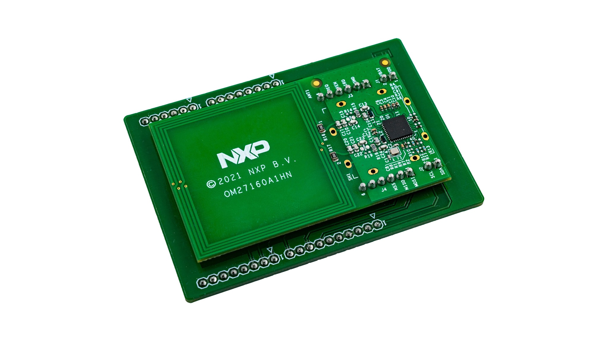

PN7160 NFC
==========

.. seo::
    :description: Instructions for setting up PN7160 NFC tag readers and tags in ESPHome
    :image: pn716x.jpg
    :keywords: PN7160, NFC, RFID

.. _pn7160-component:

Component/Hub
-------------

The ``pn7160`` component allows you to use PN7160 NFC controllers with ESPHome. This component is a global hub that
establishes a connection to the PN7160 via :ref:`SPI <spi>` or :ref:`I²C <i2c>`.

Within ESPHome, the PN7160 can be configured to use either the SPI **or** I²C protocol for data communication.
Note that there are different versions of the IC for each bus type, each with a different part number; in other
words, **the bus type cannot be changed by jumpers/switches as it is determed at the time of manufacture.**

You must determine which version of the IC you have and then configure the corresponding bus -- either the
:ref:`SPI bus <spi>` or the :ref:`I²C bus <i2c>`.

ESPHome supports both card/tag reading/writing as well as card/tag emulation with this component. By default,
only read/write mode is enabled; card/tag emulation is enabled only if the ``emulation_message`` configuration
variable is defined (see below). Regardless, reader/writer (polling) mode and card/tag emulation mode may be
independently enabled and disabled by using the corresponding :ref:`pn7160-actions` (see below).

In addition, the :doc:`binary_sensor/nfc` platform may be used to quickly and easily identify tags presented to the reader.

.. _pn7160-spi:

Over SPI
--------

The ``pn7160_spi`` component allows you to use :ref:`SPI-equipped <spi>` PN7160 NFC controllers with with ESPHome.

.. code-block:: yaml

    pn7160_spi:
      cs_pin: GPIOXX
      dwl_req_pin: GPIOXX
      irq_pin: GPIOXX
      ven_pin: GPIOXX
      wkup_req_pin: GPIOXX
      emulation_message: https://www.home-assistant.io/tag/pulse_ce
      tag_ttl: 1000ms

Configuration variables:
************************

- **cs_pin** (**Required**, :ref:`Pin Schema <config-pin_schema>`): The pin connected to the PN7160's ``NSS`` (chip
  select) line.
- **dwl_req_pin** (*Optional*, :ref:`Pin Schema <config-pin_schema>`): The pin connected to the PN7160's
  ``DWL_REQ`` line. Used to invoke the PN7160's firmware update mode; may be used in a future release.
- **irq_pin** (**Required**, :ref:`Pin Schema <config-pin_schema>`): The pin connected to the PN7160's ``IRQ`` line.
- **ven_pin** (**Required**, :ref:`Pin Schema <config-pin_schema>`): The pin connected to the PN7160's ``VEN`` line.
- **wkup_req_pin** (*Optional*, :ref:`Pin Schema <config-pin_schema>`): The pin connected to the PN7160's
  ``WKUP_REQ`` line. May be used to improve power management in a future release.
- **emulation_message** (*Optional*, string): When scanned by another NFC card/tag reader (such as a smartphone), this
  string is used as the content for an NDEF-formatted response. This allows the PN7160 to act as a tag in addition to a
  tag reader/writer.
- **tag_ttl** (*Optional*, :ref:`config-time`): The duration that must elapse after the PN7160 is no longer able to
  "see" a tag before it is considered to have been removed from the reader.
- **on_tag** (*Optional*, :ref:`Automation <automation>`): An automation to perform when a tag is first read. See
  :ref:`pn7160-on_tag`.
- **on_tag_removed** (*Optional*, :ref:`Automation <automation>`): An automation to perform after a tag is removed. See
  :ref:`pn7160-on_tag_removed`.
- **on_emulated_tag_scan** (*Optional*, :ref:`Automation <automation>`): An automation to perform when the PN7160 is
  scanned by another tag reader (such as a smartphone). See :ref:`pn7160-on_emulated_tag_scan`.
- **spi_id** (*Optional*, :ref:`config-id`): Manually specify the ID of the :ref:`SPI Component <spi>` if you want
  to use multiple SPI buses.
- **id** (*Optional*, :ref:`config-id`): Manually specify the ID for this component.

.. _pn7160-i2c:

Over I²C
--------

The ``pn7160_i2c`` component allows you to use :ref:`I²C-equipped <i2c>` PN7160 NFC controllers with ESPHome.

.. code-block:: yaml

    pn7160_i2c:
      dwl_req_pin: GPIOXX
      irq_pin: GPIOXX
      ven_pin: GPIOXX
      wkup_req_pin: GPIOXX
      emulation_message: https://www.home-assistant.io/tag/pulse_ce
      tag_ttl: 1000ms

Configuration variables:
************************

- **dwl_req_pin** (*Optional*, :ref:`Pin Schema <config-pin_schema>`): The pin connected to the PN7160's
  ``DWL_REQ`` line. Used to invoke the PN7160's firmware update mode; may be used in a future release.
- **irq_pin** (**Required**, :ref:`Pin Schema <config-pin_schema>`): The pin connected to the PN7160's ``IRQ`` line.
- **ven_pin** (**Required**, :ref:`Pin Schema <config-pin_schema>`): The pin connected to the PN7160's ``VEN`` line.
- **wkup_req_pin** (*Optional*, :ref:`Pin Schema <config-pin_schema>`): The pin connected to the PN7160's
  ``WKUP_REQ`` line. May be used to improve power management in a future release.
- **emulation_message** (*Optional*, string): When scanned by another NFC card/tag reader (such as a smartphone), this
  string is used as the content for an NDEF-formatted response. This allows the PN7160 to act as a tag in addition to a
  tag reader/writer.
- **tag_ttl** (*Optional*, :ref:`config-time`): The duration that must elapse after the PN7160 is no longer able to
  "see" a tag before it is considered to have been removed from the reader.
- **on_tag** (*Optional*, :ref:`Automation <automation>`): An automation to perform when a tag is first read. See
  :ref:`pn7160-on_tag`.
- **on_tag_removed** (*Optional*, :ref:`Automation <automation>`): An automation to perform after a tag is removed. See
  :ref:`pn7160-on_tag_removed`.
- **on_emulated_tag_scan** (*Optional*, :ref:`Automation <automation>`): An automation to perform when the PN7160 is
  scanned by another tag reader (such as a smartphone). See :ref:`pn7160-on_emulated_tag_scan`.
- **i2c_id** (*Optional*, :ref:`config-id`): Manually specify the ID of the :ref:`I²C Component <i2c>` if you need
  to use multiple I²C buses.
- **id** (*Optional*, :ref:`config-id`): Manually specify the ID for this component.

.. _pn7160-actions:

Actions
-------

.. _pn7160-set_clean_mode:

``tag.set_clean_mode`` Action
*****************************

Use this action to invoke "clean mode" -- the next tag presented to the PN7160 will be "cleaned", removing all data
from the tag.

.. code-block:: yaml

    on_...:
      then:
        - tag.set_clean_mode: my_pn7160_id

.. _pn7160-set_format_mode:

``tag.set_format_mode`` Action
******************************

Use this action to invoke "format mode" -- the next tag presented to the PN7160 will be "formatted", leaving only an
empty NDEF message structure on the tag.

.. code-block:: yaml

    on_...:
      then:
        - tag.set_format_mode: my_pn7160_id

.. _pn7160-set_read_mode:

``tag.set_read_mode`` Action
****************************

Use this action to invoke "read mode" -- the next tag presented to the PN7160 will be read. This is the default mode
that the component operates in.

.. code-block:: yaml

    on_...:
      then:
        - tag.set_read_mode: my_pn7160_id

.. _pn7160-set_write_message:

``tag.set_write_message`` Action
********************************

Use this action to set the NDEF message used for "write mode" (see below).

.. code-block:: yaml

    on_...:
      then:
        - tag.set_write_message:
            message: https://www.home-assistant.io/tag/pulse
            include_android_app_record: false

- **message** (**Required**, string, templatable): The string to include in the tag's first NDEF record; typically
  a URL as shown.
- **include_android_app_record** (*Optional*, boolean): Include a second NDEF record required for some Android
  operating systems. Defaults to ``true``.

.. _pn7160-set_write_mode:

``tag.set_write_mode`` Action
*****************************

Use this action to invoke "write mode" -- the next tag presented to the PN7160 will have its NDEF message set to the
message defined by the ``tag.set_write_message`` action (see above). **Note that a message must be set before this mode
may be invoked.**

.. code-block:: yaml

    on_...:
      then:
        - tag.set_write_mode: my_pn7160_id

.. _pn7160-set_emulation_message:

``tag.set_emulation_message`` Action
************************************

Use this action to set the NDEF message used for card (tag) emulation mode, when enabled (see below).

.. code-block:: yaml

    on_...:
      then:
        - tag.set_emulation_message:
            message: https://www.home-assistant.io/tag/pulse
            include_android_app_record: false

- **message** (**Required**, string, templatable): The string to include in the (emulated) tag's first NDEF record;
  typically a URL as shown.
- **include_android_app_record** (*Optional*, boolean): Include a second NDEF record required for some Android
  operating systems. Defaults to ``true``.

.. _pn7160-emulation_off:

``tag.emulation_off`` Action
****************************

Use this action to disable card (tag) emulation mode. The PN7160 will no longer respond to requests from other readers,
such as smartphones.

.. code-block:: yaml

    on_...:
      then:
        - tag.emulation_off: my_pn7160_id

.. _pn7160-emulation_on:

``tag.emulation_on`` Action
***************************

Use this action to enable card (tag) emulation mode. The PN7160 will respond to requests from other readers, such as
smartphones.

**Note:** when card/tag emulation is enabled, polling (detecting a nearby card/tag) frequency is decreased; this
typically results in slightly slower detection of cards/tags presented to the PN7160. This behavior is normal and should
be expected; it is the result of the PN7160 toggling between polling and listening modes to support both functions.

.. code-block:: yaml

    on_...:
      then:
        - tag.emulation_on: my_pn7160_id

.. _pn7160-polling_off:

``tag.polling_off`` Action
****************************

Use this action to disable card (tag) reading/writing. The PN7160 will no longer read or write cards/tags.

.. code-block:: yaml

    on_...:
      then:
        - tag.polling_off: my_pn7160_id

.. _pn7160-polling_on:

``tag.polling_on`` Action
***************************

Use this action to enable card (tag) reading/writing. The PN7160 will read or write cards/tags.

.. code-block:: yaml

    on_...:
      then:
        - tag.polling_on: my_pn7160_id

Triggers
--------

.. _pn7160-on_tag:

``on_tag`` Trigger
******************

This automation will be triggered immediately after the PN7160 module identifies a tag and reads its NDEF
message (if one is present).

The parameter ``x`` this trigger provides is of type ``std::string`` and is the tag UID in the format
``74-10-37-94``. The example configuration below will publish the tag ID on the MQTT topic ``pn7160/tag``.

See :ref:`pn7160-ndef_reading` below for how to use the second ``tag`` parameter that is provided to this trigger.

.. code-block:: yaml

    pn7160_...:
      # ...
      on_tag:
        then:
          - mqtt.publish:
              topic: pn7160/tag
              payload: !lambda 'return x;'

A tag scanned event can also be sent to the Home Assistant tag component
using :ref:`api-homeassistant_tag_scanned_action`.

.. code-block:: yaml

    pn7160_...:
      # ...
      on_tag:
        then:
          - homeassistant.tag_scanned: !lambda 'return x;'

You could also send the value to Home Assistant via a :doc:`template sensor </components/sensor/template>`:

.. code-block:: yaml

    pn7160_...:
      # ...
      on_tag:
        then:
        - text_sensor.template.publish:
            id: nfc_tag
            state: !lambda 'return x;'

    text_sensor:
      - platform: template
        name: "NFC Tag"
        id: nfc_tag

.. _pn7160-on_tag_removed:

``on_tag_removed`` Trigger
**************************

This automation will be triggered after the ``tag_ttl`` interval (see above) when the PN7160 no longer "sees" a
previously scanned tag.

The parameter ``x`` this trigger provides is of type ``std::string`` and is the removed tag UID in the format
``74-10-37-94``. The example configuration below will publish the removed tag ID on the MQTT topic ``pn7160/tag_removed``.

.. code-block:: yaml

    pn7160_...:
      # ...
      on_tag_removed:
        then:
          - mqtt.publish:
              topic: pn7160/tag_removed
              payload: !lambda 'return x;'

.. _pn7160-on_emulated_tag_scan:

``on_emulated_tag_scan`` Trigger
********************************

If card/tag emulation is enabled, this automation will be triggered when another reader (such as a smartphone) scans
the PN7160 and reads the NDEF message it responds with. No parameters are available to this action because data is only
sent *from* the PN7160 *to* the scanning device.

.. code-block:: yaml

    pn7160_...:
      # ...
      on_emulated_tag_scan:
        then:
          - rtttl.play: "alert:d=32,o=5,b=160:e6,p,e6,p,e6"

.. _pn7160-ndef:

NDEF
====

The PN7160 supports reading NDEF messages from and writing NDEF messages to cards/tags.

.. _pn7160-ndef_reading:

NDEF Reading
------------

Given an NFC tag formatted and written using the Home Assistant Companion App, the following example will send the tag
ID contained within its NDEF message to Home Assistant using the :ref:`api-homeassistant_tag_scanned_action`.
If no NDEF record is found with a tag ID, the tag's UID will be sent to Home Assistant, instead.

The ``tag`` variable is available to any actions that run within the ``on_tag`` and ``on_tag_removed`` triggers.

.. code-block:: yaml

    pn7160_...:
      # ...
      on_tag:
        then:
          - homeassistant.tag_scanned: !lambda "return tag.has_ha_tag_id() ? tag.get_ha_tag_id() : x;"

.. _pn7160-ndef_writing:

NDEF Writing
------------

The examples below illustrate how NDEF messages may be written to cards/tags via the PN7160. Note that a
:doc:`button </components/button/index>` is a great mechanism to use to trigger these actions.

The first example will write a simple, fixed NDEF message to a tag.

.. code-block:: yaml

    on_...
      then:
        - tag.set_write_message:
            message: https://www.home-assistant.io/tag/pulse
            include_android_app_record: false   # optional
        - tag.set_write_mode: my_pn7160_id

The next example can be used to write a (pseudo) random UUID to a tag in the same manner as the Home Assistant
Companion App.

.. code-block:: yaml

    on_...
      then:
        - tag.set_write_message:
            message: !lambda "return nfc::get_random_ha_tag_ndef();"
        - tag.set_write_mode: my_pn7160_id

See Also
--------

- :doc:`index`
- :doc:`binary_sensor/pn532`
- :doc:`binary_sensor/rc522`
- :doc:`binary_sensor/rdm6300`
- :apiref:`pn7160/pn7160.h`
- :ghedit:`Edit`
