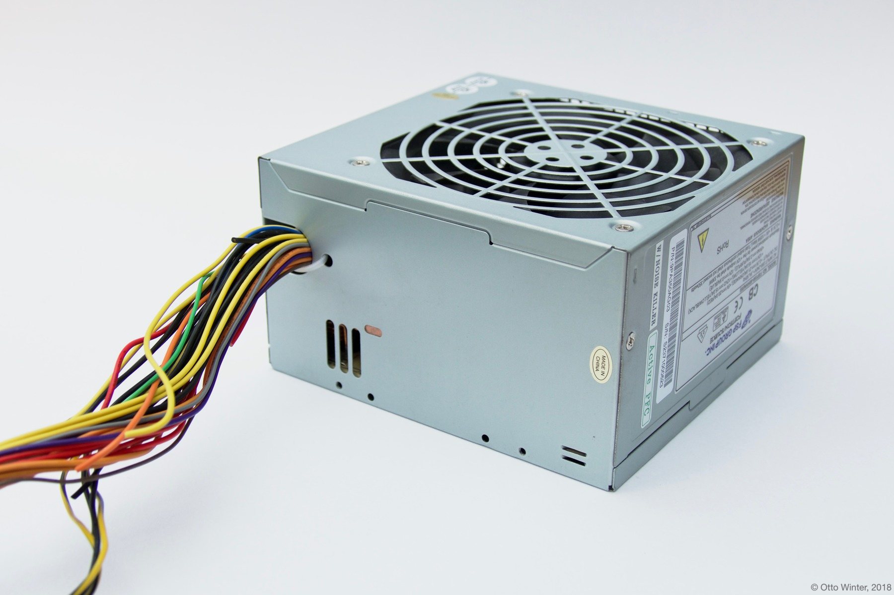

Power Supply Component
======================

.. esphome:component-definition::
   :alias: power-supply
   :category: core
   :friendly_name: Power Supply
   :toc_group: Core Components
   :toc_image: power.svg

.. seo::
    :description: Instructions for setting up power supplies which will automatically turn on together with outputs.
    :image: power.svg
    :keywords: power, ATX

The ``power_supply`` component allows you to have a high power mode for
certain outputs. For example, if you’re using an `ATX power
supply <https://en.wikipedia.org/wiki/ATX>`__ to power your LED strips,
you usually don’t want to have the power supply on all the time while
the output is not on. The power supply component can be attached to any
:ref:`Output Component <output>` and
will automatically switch on if any of the outputs are on. Furthermore,
it also has a cooldown time that keeps the power supply on for a while
after the last output has been disabled.

.. code-block:: yaml

    # Example configuration entry
    power_supply:
      - id: 'power_supply1'
        pin: 13

Configuration variables:
------------------------

- **id** (**Required**, :ref:`config-id`): The id of the
  power supply so that it can be used by the outputs.
- **pin** (**Required**, :ref:`Pin Schema <config-pin_schema>`): The
  GPIO pin to control the power supply on.
- **enable_time** (*Optional*, :ref:`config-time`): The time to
  that the power supply needs for startup. The output component will
  wait for this period of time after turning on the PSU and before
  switching the output on. Defaults to ``20ms``.
- **keep_on_time** (*Optional*, :ref:`config-time`): The time the
  power supply should be kept enabled after the last output that used
  it has been switch off. Defaults to ``10s``.

See the :ref:`output component base configuration <config-output>`
for information on how to apply the power supply for a specific output.

ATX Power Supplies
------------------

The power supply component will default to pulling the specified GPIO
pin up when high power mode is needed. Most ATX power supplies however
operate with an active-low configuration. Therefore their output needs
to be inverted.

.. code-block:: yaml

    power_supply:
      - id: 'atx_power_supply'
        pin:
          number: 13
          inverted: true

Then simply connect the green control wire from the ATX power supply to
your specified pin. It’s recommended to put a small resistor (about 1kΩ)
in between to protect the ESP board.

See Also
--------

- :doc:`output/index`
- :apiref:`power_supply/power_supply.h`
- :ghedit:`Edit`
