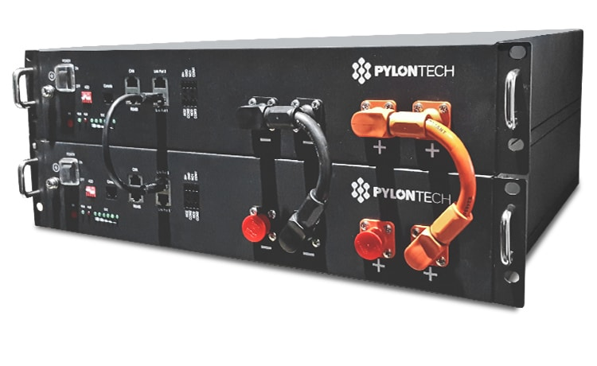
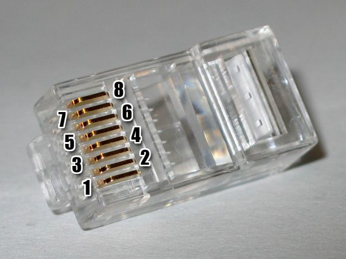

Pylontech Battery
=================

.. seo::
    :description: Instructions for setting up Pylontech Battery in ESPHome.
    :image: pylontech.jpg

The Pylontech component allows you to pull data from Pylontech Batteries into ESPHome.
It uses :ref:`UART <uart>` for communication.

Once configured, you can use sensors as described below for your projects.

    Pylontech Batteries

Hardware Setup
--------------

You can connect to Pylontech Batteries using the port labeled "Console".
Any connections via CAN or RS485 (e.g. to an inverter) are untouched and remain functional.

The console port offers a RS232 interface using a RJ10 or RJ45 connector.
The voltage levels are *not* TTL-compatible. A RS232 transceiver must be placed between the Batteries and the ESPHome device.
MAX3232-based transceivers have been tested and work well.

If you have multiple batteries you need to connect to the master battery's console port.

.. list-table:: Pylontech RJ45 Console Port (US2000C, US3000C)
    :header-rows: 1

    * - RJ45 Pin
      - Function
      - Connect to
    * - 3
      - Pylontech TX
      - ESPHome RX via transceiver
    * - 6
      - Pylontech RX
      - ESPHome TX via transceiver
    * - 8
      - GND
      - GND

    RJ45 pinout

.. list-table:: Pylontech RJ10 Console Pinout (US2000B)
    :header-rows: 1

    * - RJ410 Pin
      - Function
      - Connect to
    * - 2
      - Pylontech RX
      - ESPHome TX via transceiver
    * - 3
      - Pylontech TX
      - ESPHome RX via transceiver
    * - 4
      - GND
      - GND
      
Component/Hub
-------------

.. code-block:: yaml

    # Example configuration entry
    pylontech:

Configuration variables:
~~~~~~~~~~~~~~~~~~~~~~~~

- **id** (**Required**, :ref:`config-id`): The id to use for this Pylontech component.
- **uart_id** (*Optional*): The uart Bus ID
- **update_interval** (*Optional*, :ref:`config-time`): The interval to check the sensor. Defaults to ``60s``.

Sensor
------

All values are reported for every Pylontech battery individually.

.. code-block:: yaml

    # Example configuration entry
    sensor:
      - platform: pylontech
        battery: 1
        
        voltage:
          name: "Battery1 Voltage"
        current:
          name: "Battery1 Current"
        coulomb:
          name: "Battery1 State of Charge"

Configuration variables:
~~~~~~~~~~~~~~~~~~~~~~~~

- **pylontech_id** (*Optional*): Manually specify the ID of the pylontech instance if there are multiple.
- **battery** (**Required**): Which battery to monitor. 1 stands for the main battery, 2..6 for child batteries.
- **voltage** (*Optional*): Voltage of the battery. All options from :ref:`Sensor <config-sensor>`.
- **current** (*Optional*): Current flowing into the battery. Negative when discharging. All options from :ref:`Sensor <config-sensor>`.
- **coulomb** (*Optional*): State of Charge in percent. All options from :ref:`Sensor <config-sensor>`.
- **temperature** (*Optional*): Temperature. All options from :ref:`Sensor <config-sensor>`.
- **temperature_low** (*Optional*): Historic minimum temperature. All options from :ref:`Sensor <config-sensor>`.
- **temperature_high** (*Optional*): Historic maximum temperature. All options from :ref:`Sensor <config-sensor>`.
- **voltage_low** (*Optional*): Voltage of the lowest cell. All options from :ref:`Sensor <config-sensor>`.
- **voltage_high** (*Optional*): Voltage of the highest cell. All options from :ref:`Sensor <config-sensor>`.
- **mos_temperature** (*Optional*): Temperature of the mosfets. All options from :ref:`Sensor <config-sensor>`.

Text Sensor
-----------

.. code-block:: yaml

    # Example configuration entry
    text_sensor:
      - platform: pylontech
        pylontech_id: pylontech0
        battery: 1
        
        base_state:
          id: bat1_base_state
          name: "Battery1 Base State"

Configuration variables:
~~~~~~~~~~~~~~~~~~~~~~~~

- **pylontech_id** (**Optional**): Manually specify the ID of the pylontech instance if there are multiple.
- **battery** (**Required**): Which battery to monitor. 1 stands for the main battery, 2..6 for child batteries.
- **base_state** (*Optional*): Base state. Usually reads ``Dischg``, ``Charge`` or ``Idle``. All options from :ref:`Text Sensor <config-text_sensor>`.
- **voltage_state** (*Optional*): Voltage state. Usually reads ``Normal``. All options from :ref:`Text Sensor <config-text_sensor>`.
- **current_state** (*Optional*): Current state. Usually reads ``Normal``. All options from :ref:`Text Sensor <config-text_sensor>`.
- **temperature_state** (*Optional*): Temperature state. Usually reads ``Normal``. All options from :ref:`Text Sensor <config-text_sensor>`.

Energy Monitoring
-----------------

By combining :doc:`template sensors </components/sensor/template>` and :doc:`integration sensors </components/sensor/integration>`
one can monitor the energy flowing into and out of all batteries combined, ready for `Homeassistant Energy Monitoring <https://www.home-assistant.io/docs/energy/battery/>`__.

.. code-block:: yaml

    sensor:
      - platform: template
        id: pylontech_power
        name: "Pylontech power"
        unit_of_measurement: W
        lambda: |-
          auto pwr1 = id(bat1_voltage).state * id(bat1_current).state;
          auto pwr2 = id(bat2_voltage).state * id(bat2_current).state;
          auto pwr = pwr1 + pwr2;
          id(combined_charge_power).publish_state(max(pwr, 0.0f));
          id(combined_discharge_power).publish_state(max(-pwr, 0.0f));
          return pwr;
        update_interval: 5s
        device_class: power
        state_class: measurement
        
      - platform: template
        id: combined_charge_power
      
      - platform: template
        id: combined_discharge_power
      
      - platform: integration
        name: "Pylontech charging"
        sensor: combined_charge_power
        time_unit: h
        state_class: total_increasing
        device_class: energy
        unit_of_measurement: "Wh"

      - platform: integration
        name: "Pylontech discharging"
        sensor: combined_discharge_power
        time_unit: h
        state_class: total_increasing
        device_class: energy
        unit_of_measurement: "Wh"

See Also
--------

- `Pylontech-Battery-Monitoring <https://github.com/irekzielinski/Pylontech-Battery-Monitoring>`__
- `nodered-pylontech-console-reader <https://github.com/juanhaywood/nodered-pylontech-console-reader>`__
- :ref:`uart`
- :ghedit:`Edit`
