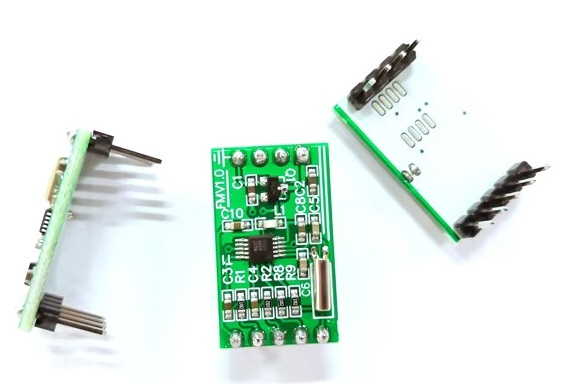
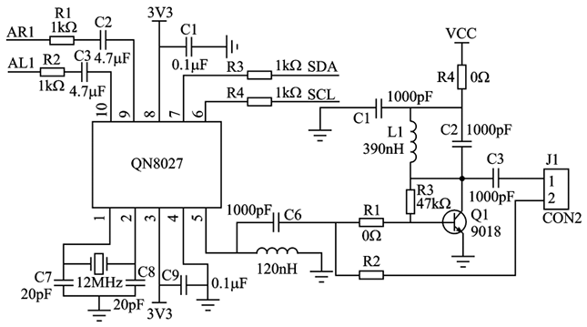

QN8027 FM Transmitter
=====================

.. seo::
    :description: Instructions for setting up QN8027 FM Transmitter
    :image: qn8027.jpg
    :keywords: qn8027

The QN8027 has an I²C interface, can transmit in the 76-108 MHz FM range and supports RDS. Every feature
from the datasheet is implemented and exposed through different components (sensor, switch, select, number, text). 

`Datasheet <https://github.com/gabest11/datasheet/blob/main/QN8027%20v1.10.pdf>`__

`Hardware Application Note <https://github.com/gabest11/datasheet/blob/main/QN8027%20Hardware%20Application%20Note%20v0.25.pdf>`__

Only a few developement boards are available, it is more common in commercial FM transmitters, mostly for cars. Some of them have hackable SCL/SDA test points.

    Example board (this one does not come with the amplifier circuit, range is about 1 meter)

    Wiring diagram

Example configuration
---------------------

.. code-block:: yaml

    i2c:
      sda: 10
      scl: 9
      scan: True
    
    i2s_audio:
      i2s_lrclk_pin: 4
      i2s_bclk_pin: 6
    
    media_player:
      - platform: i2s_audio
        name: "Media Player"
        dac_type: external
        i2s_dout_pin: 5
        mode: stereo
      
    qn8027:
      id: fm_transmitter
      frequency: 87.50 # 76-108MHz
      deviation: 74.82
      mute: False
      mono: False
      tx_enable: True
      tx_pilot: 9
      t1m_sel: 60s # Never, 58s, 59s, 60s
      priv_en: False
      pre_emphasis: 75us # 50us, 75us
      input_impedance: 20kOhm # 5kOhm, 10kOhm, 20kOhm, 40kOhm
      input_gain: 3 # 0dB - 5dB
      digital_gain: 0 # 0dB - 2dB
      power_target: 117.5
      xtal:
        source: CRYSTAL # CRYSTAL, DIGITAL_CLOCK, SINGLE_END_SIN_WAVE, DIFFERENTIAL_SIN_WAVE
        current: 100
        frequency: 24MHz # 12MHz, 24MHz
      rds:
        enable: True
        deviation: 2.1
        station: qn8027 # max 8 characters
        text: sample text # max 64 characters
      sensor:
        fsm:
          name: FSM Status # RESET, CALI, IDLE, TX_RSTB, PA_CALIB, TRANSMIT, PA_OFF
        aud_pk:
          name: Audio Peek
        chip_id:
          name: Chip ID
        reg30:
          name: Reg30

    number:
      - platform: qn8027
        frequency:
          id: fm_frequency
          name: Frequency
        deviation:
          name: Frequency Deviation
        tx_pilot:
          name: Tx Pilot
        input_gain:
          name: Input Gain
        digital_gain:
          name: Digital Gain
        power_target:
          name: Power Target
        xtal:
          current:
            name: Xtal Current
        rds:
          deviation:
            name: RDS Frequency Deviation
    
    switch:
      - platform: qn8027
        mute:
          name: Mute
        mono:
          name: Mono
        tx_enable:
          name: Tx Enable
        priv_en:
          name: Privacy Enable
        rds:
          enable:
            name: RDS Enable
    
    select:
      - platform: qn8027
        t1m_sel:
          name: PA off delay
        pre_emphasis:
          name: Pre-emphasis
        input_impedance:
          name: Input Impedance
        xtal:
          source:
            name: Xtal Source
          frequency:
            name: Xtal Frequency
    
    text:
      - platform: qn8027
        rds:
          station:
            name: RDS Station
          text:
            name: RDS Text
    
    api:
      services:
        - service: 'set_url'
          variables:
            url: string
          then:
            - media_player.play_media: !lambda 'return url.c_str();'
        - service: 'set_frequency'
          variables:
            x: float
          then:
            # few different ways to change frequency
            - number.set: # set frequency through the number component, this also shows up in Home Assistant UI
                id: fm_frequency
                value: !lambda 'return x;'
            - qn8027.set_frequency: # this is the elegant way to do scripting
                frequency: !lambda 'return x;'
            - lambda: !lambda 'id(fm_transmitter).set_frequency(x);' # this is the less elegant way, but any member of the c++ class is accessible
    
Configuration variables:
------------------------

- **frequency** (*Optional*, float): Between 76 and 108MHz. Step size is 0.05MHz.
- **deviation** (*Optional*, float): Between 0 and 147.9KHz. Step size is 0.58KHz.
- **mute** (*Optional*, bool): Mute audio if True.
- **mono** (*Optional*, bool): Mono audio if True.
- **tx_enable** (*Optional*, bool): Transmission enabled.
- **tx_pilot** (*Optional*, int): Between 7 and 15 (% of 75KHz).
- **t1m_sel** (*Optional*, enum): Turn transmission off after (Never, 58s, 59s, 60s) if there is no input.
- **priv_en** (*Optional*, bool): Enabled the privacy mode (audio scramble and RDS encryption).
- **pre_emphasis** (*Optional*, enum): Pre-emphasis time constant. (50us => Europe, Australia, 75us => USA, Japan)
- **input_impedance** (*Optional*, enum): Input impedance for both L/R channels. (5kOhm, 10kOhm, 20kOhm, 40kOhm)
- **input_gain** (*Optional*, int): Input buffer gain. (0dB - 5dB) 
- **digital_gain** (*Optional*, int): Digital buffer gain. (0dB - 2dB) 
- **power_target** (*Optional*, float): Output power target. Between 83.4dBuV and 117.5dBuV. Step size is 0.62dBuV.

XTAL configuration variables:
-----------------------------

- **source** (*Optional*, enum): Select the reference clock source. (CRYSTAL, DIGITAL_CLOCK, SINGLE_END_SIN_WAVE, DIFFERENTIAL_SIN_WAVE)
- **current** (*Optional*, float): Crystal oscillator current control. Between 0 and 400uA.
- **frequency** (*Optional*, enum): Crystal frequency. (12MHz, 24MHz)

RDS configuration variables:
----------------------------

- **enable** (*Optional*, bool): RDS enabled if True.
- **deviation** (*Optional*, float): Between 0 and 44.45KHz. Step size is 0.35KHz.
- **station** (*Optional*, string): Station name. Max 8 characters.
- **text** (*Optional*, string): Additional RDS text. Max 64 characters.

Diagnostic sensors:
-------------------

- **fsm** (*Optional*, text_sensor): Status sensor.
- **aud_pk** (*Optional*, float): Audio Peek sensor. Reported in mV.
- **chip_id** (*Optional*, text_sensor): The detected chip id sensor.

Advanced:
---------

- **reg30** (*Optional*, int): Sensor for an undocumented register.

.. note::

    Hardware Application Note: "To judge whether the inductor has covered the full span, reg30 can be used. Set the RF frequency of 76MHz and read the reg30 value, then set RF frequency of 108MHz and read reg30 value, if both two reg30 values are in range 0x1f~0x00, it means the inductor can cover the full span. Otherwise, it is necessary to change the inductor value to cover the full span"
