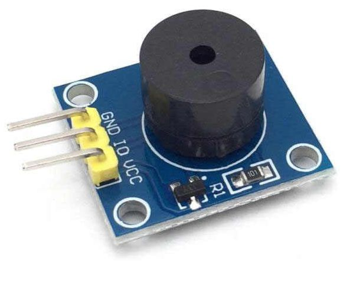

Rtttl Buzzer
============

.. seo::
    :description: Instructions for setting up a buzzer to play tones and rtttl songs with ESPHome.
                  **NEW:** Or play the song using the I2S speaker.
    :image: buzzer.jpg

The ``rtttl``, component allows you to easily connect a passive piezo buzzer to your microcontroller
and play monophonic songs. It accepts the Ring Tone Text Transfer Language, rtttl format (`Wikipedia
<https://en.wikipedia.org/wiki/Ring_Tone_Transfer_Language>`__) which allows to store simple melodies.

    Buzzer Module

Overview Using a passive buzzer
-------------------------------

It's important that your buzzer is a **passive** one, if it beeps when you feed it with 3.3V then it is not
a passive one and this library will not work properly.

The tone generator needs a PWM capable output to work with, currently only the
:doc:`ESP8266 Software PWM Output<output/esp8266_pwm>` and
:doc:`ESP32 LEDC Output <output/ledc>` are supported.

.. code-block:: yaml

    # Example configuration entry
    output:
      - platform: ...
        id: rtttl_out
        ...

    rtttl:
      output: rtttl_out
      id: my_rtttl
      gain: 60%

Overview Using the I2S speaker
------------------------------

The tone generator can instead be used with a :doc:`Speaker </components/speaker/index>` to output the audio.

.. code-block:: yaml

    # Example configuration entry
    speaker:
      - platform: ...
        id: my_speaker
        ...

    rtttl:
      speaker: my_speaker
      id: my_rtttl
      gain: 0.8

Configuration variables:
------------------------

- **output** (**Exclusive**, :ref:`config-id`): The id of the :ref:`float output <output>` to use for
  this buzzer.
- **speaker** (**Exclusive**, :ref:`config-id`): The id of the :ref:`speaker <i2s_audio>` to play the song on.
- **id** (*Optional*, :ref:`config-id`): Manually specify the ID used for code generation.
- **gain** (*Optional*, Percentage): With this value you can set the volume of the sound.
- **on_finished_playback** (*Optional*, :ref:`Automation <automation>`): An action to be
  performed when playback is finished.

Note: You can only use the **output** or **speaker** variable, not both at the same time.

``rtttl.play`` Action
---------------------

Plays an rtttl tone.

.. code-block:: yaml

    on_...:
      then:
        - rtttl.play: 'siren:d=8,o=5,b=100:d,e,d,e,d,e,d,e'

Configuration options:

- **rtttl** (**Required**, string, :ref:`templatable <config-templatable>`): The rtttl string.

You can find many rtttl strings online on the web, they must start with a name, then a colon: ``:`` symbol
and more codes of the song itself. Tip: you can try playing with the values of d=16,o=6,b=95 and make the
song play at a different pace or pitch, e.g. setting o=7 instead will cause the song to play on a higher pitch.

``rtttl.stop`` Action
---------------------

Stops playback.

.. code-block:: yaml

    on_...:
      then:
        - rtttl.stop

All actions
-----------

- **id** (*Optional*, :ref:`config-id`): Manually specify the ID of the rtttl if you have multiple components.

``rtttl.is_playing`` Condition
------------------------------

This Condition returns true while playback is active.

.. code-block:: yaml

    # In some trigger:
    on_...:
      if:
        condition:
          rtttl.is_playing
        then:
          logger.log: 'Playback is active!'

Common beeps
------------

You can do your own beep patterns too! Here's a short collection so you can just use right away or tweak them to your like:

.. code-block::

    two_short:d=4,o=5,b=100:16e6,16e6
    long:d=1,o=5,b=100:e6
    siren:d=8,o=5,b=100:d,e,d,e,d,e,d,e
    scale_up:d=32,o=5,b=100:c,c#,d#,e,f#,g#,a#,b
    star_wars:d=16,o=5,b=100:4e,4e,4e,8c,p,g,4e,8c,p,g,4e,4p,4b,4b,4b,8c6,p,g,4d#,8c,p,g,4e,8p
    mission_imp:d=16,o=6,b=95:32d,32d#,32d,32d#,32d,32d#,32d,32d#,32d,32d,32d#,32e,32f,32f#,32g,g,8p,g,8p,a#,p,c7,p,g,8p,g,8p,f,p,f#,p,g,8p,g,8p,a#,p,c7,p,g,8p,g,8p,f,p,f#,p,a#,g,2d,32p,a#,g,2c#,32p,a#,g,2c,a#5,8c,2p,32p,a#5,g5,2f#,32p,a#5,g5,2f,32p,a#5,g5,2e,d#,8d
    mario:d=4,o=5,b=100:16e6,16e6,32p,8e6,16c6,8e6,8g6,8p,8g,8p,8c6,16p,8g,16p,8e,16p,8a,8b,16a#,8a,16g.,16e6,16g6,8a6,16f6,8g6,8e6,16c6,16d6,8b,16p,8c6,16p,8g,16p,8e,16p,8a,8b,16a#,8a,16g.,16e6,16g6,8a6,16f6,8g6,8e6,16c6,16d6,8b,8p,16g6,16f#6,16f6,16d#6,16p,16e6,16p,16g#,16a,16c6,16p,16a,16c6,16d6,8p,16g6,16f#6,16f6,16d#6,16p,16e6,16p,16c7,16p,16c7,16c7,p,16g6,16f#6,16f6,16d#6,16p,16e6,16p,16g#,16a,16c6,16p,16a,16c6,16d6,8p,16d#6,8p,16d6,8p,16c6

Test setup
----------

With the following code you can quickly setup a node and use Home Assistant's service in the developer tools.
E.g. for calling ``rtttl.play`` select the service ``esphome.test_esp8266_rtttl_play`` and in service data enter

.. code-block:: yaml

    song_str: 'scale_up:d=32,o=5,b=100:c,c#,d#,e,f#,g#,a#,b'

Sample code
***********

.. code-block:: yaml

    esphome:
      name: test_esp8266

    esp8266:
      board: nodemcuv2

    wifi:
      ssid: !secret wifi_ssid
      password: !secret wifi_password

    output:
      - platform: esp8266_pwm
        pin: GPIOXX
        id: rtttl_out

    rtttl:
      output: rtttl_out
      on_finished_playback:
        - logger.log: 'Song ended!'

    api:
      services:
        - service: play_rtttl
          variables:
            song_str: string
          then:
            - rtttl.play:
                rtttl: !lambda 'return song_str;'

See Also
--------
- :doc:`/components/output/esp8266_pwm`
- :doc:`/components/output/ledc`
- :doc:`/components/speaker/index`
- :apiref:`rtttl/rtttl.h`
- :ghedit:`Edit`
