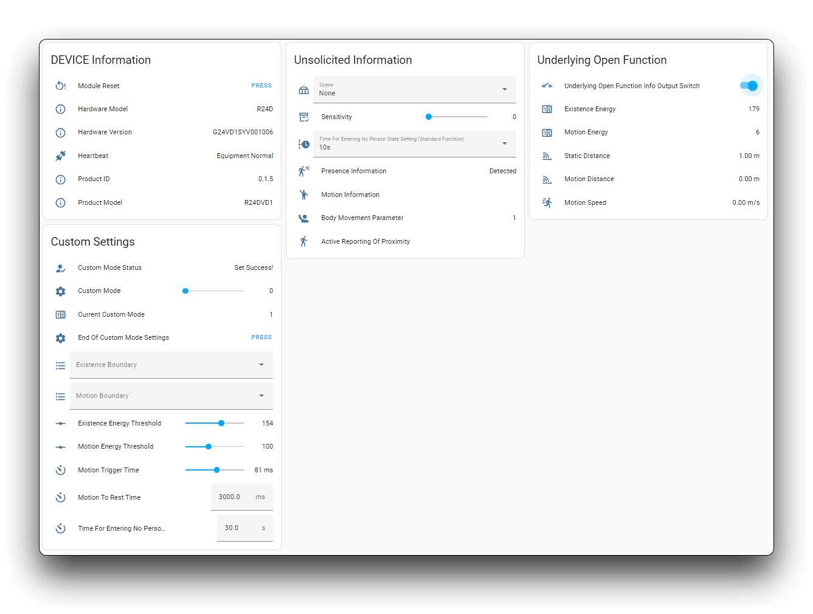

Seeed Studio MR24HPC1 mmWave (Kit)
==================================

.. seo::
    :description: Instructions for setting up MR24HPC1 mmWave (Kit).
    :image: seeed-mr24hpc1.jpg

Component/Hub
-------------

The ``seeed_mr24hpc1`` platform allows you to use Seeed Studio 24GHz mmWave Sensor -
Human Static Presence Module Lite (`Product Page <https://www.seeedstudio.com/24GHz-mmWave-Sensor-Human-Static-Presence-Module-Lite-p-5524.html>`__) and
Seeed Studio mmWave Human Detection Sensor Kit (`Product Page <https://www.seeedstudio.com/mmWave-Human-Detection-Sensor-Kit-p-5773.html>`__) with ESPHome.

The :ref:`UART <uart>` is required to be set up in your configuration for this sensor to work, ``parity`` and ``stop_bits`` **must be** respectively ``NONE`` and ``1``.
You can use the ESP32 software or hardware serial to use this MR24HPC1, its default baud rate is 115200.

.. figure:: images/seeed-mr24hpc1.jpg
    :align: center
    :width: 50.0%

    Seeed Studio 24GHz mmWave Sensor - Human Static Presence Module Lite

.. figure:: images/seeed-mr24hpc1-mmwave-kit.png
    :align: center
    :width: 50.0%

    Seeed Studio mmWave Human Detection Sensor Kit

.. code-block:: yaml

    # Example configuration entry
    seeed_mr24hpc1:

Configuration variables:
************************

- **uart_id** (*Optional*, :ref:`config-id`): Manually specify the ID of the :ref:`UART Component <uart>` if you want
  to use multiple UART buses.
- **id** (*Optional*, :ref:`config-id`): Manually specify the ID for this :doc:`seeed_mr24hpc1` component if you need multiple components.

Binary Sensor
-------------

The ``seeed_mr24hpc1`` binary sensor allows you to perform different measurements.

.. code-block:: yaml

    binary_sensor:
      - platform: seeed_mr24hpc1
        has_target:
          name: "Presence Information"

Configuration variables:
************************

- **has_target** (*Optional*): If true target detect either still or in movement.
  All options from :ref:`Binary Sensor <config-binary_sensor>`.

Sensor
------

The ``seeed_mr24hpc1`` sensor allows you to perform different measurements.

.. code-block:: yaml

    sensor:
      - platform: seeed_mr24hpc1
        custom_presence_of_detection:
          name: "Static Distance"
        movement_signs:
          name: "Body Movement Parameter"
        custom_motion_distance:
          name: "Motion Distance"
        custom_spatial_static_value:
          name: "Existence Energy"
        custom_spatial_motion_value:
          name: "Motion Energy"
        custom_motion_speed:
          name: "Motion Speed"
        custom_mode_num:
          name: "Current Custom Mode"

.. _seeed_mr24hpc1-spatial_static:

.. _seeed_mr24hpc1-spatial_mtion:

Configuration variables:
************************

- **custom_presence_of_detection** (*Optional*, float): Valid only for :ref:`underlying open functions <seeed_mr24hpc1-open_function>`.
  Radar detects human breath at a straight line distance, usually no more than 3 metres.
  All options from :ref:`Sensor <config-sensor>`.
- **movement_signs** (*Optional*, int): A value calculated by a built-in algorithm to determine if someone is moving in the current environment.
  When the value is 0, the radar determines that no one is present in the environment. When the value is 1,
  the radar determines that someone is present in the environment and is stationary.
  When the value is greater than 1, the radar determines that someone is present in the environment and is in motion.
  The larger the value, the stronger the motion.
  All options from :ref:`Sensor <config-sensor>`.
- **custom_motion_distance** (*Optional*, float): Valid only for :ref:`underlying open functions <seeed_mr24hpc1-open_function>`.
  Distance in meters of detected moving target.
  All options from :ref:`Sensor <config-sensor>`.
- **custom_spatial_static_value** (*Optional*, int): Valid only for :ref:`underlying open functions <seeed_mr24hpc1-open_function>`.
  Electromagnetic waves are present in the environment, with a low change in frequency when no one is present.
  The value of the overall space electromagnetic wave reflection weakly floating when there is someone breathing in the space (chest breathing micromotion).
  The output range for this value is 0-250.
  All options from :ref:`Sensor <config-sensor>`.
- **custom_spatial_motion_value** (*Optional*, int): Valid only for :ref:`underlying open functions <seeed_mr24hpc1-open_function>`.
  Motion amplitude values, different motion amplitudes cause different electromagnetic wave frequency changes.
  The output range for this value is 0-250.
  All options from :ref:`Sensor <config-sensor>`.
- **custom_motion_speed** (*Optional*, float): Valid only for :ref:`underlying open functions <seeed_mr24hpc1-open_function>`.
  The magnitude of the speed of the target movement is determined in real time. Approaching radar speed is positive, away is negative.
  When there is no movement speed, the value is 0, and the speed gear is in 0.5m/s increments.
  All options from :ref:`Sensor <config-sensor>`.
- **custom_mode_num** (*Optional*, int): The custom mode number that the radar is currently in. If it is not in custom mode, then the value is 0.
  All options from :ref:`Sensor <config-sensor>`.

.. _seeed_mr24hpc1-open_function:

.. _seeed_mr24hpc1-standard_mode:

Switch
------

The ``seeed_mr24hpc1`` switch allows you to control your device.

.. code-block:: yaml

    switch:
      - platform: seeed_mr24hpc1
        underlying_open_function:
          name: Underlying Open Function Info Output Switch

Configuration variables:
************************

- **underlying_open_function** (*Optional*): Enable/disable **underlying open function**. When this switch is off, it indicates that it is currently in **standard mode**.
  Defaults to off (standard mode). Turning on this feature allows you to observe more information about the environment and is recommended to use it
  again in complex environments where the basic functionality is not sufficient. When this function is turned on, the stationary/motion and approach/away judgement of
  the basic function will be disabled. Notice this requires more resources and is not recommended to be enabled when not necessary.
  All options from :ref:`Switch <config-switch>`.

Number
------

The ``seeed_mr24hpc1`` number allows you to control the configuration.

.. code-block:: yaml

    number:
      - platform: seeed_mr24hpc1
        sensitivity:
          name: "Sensitivity"
        custom_mode:
          name: "Custom Mode"
        existence_threshold:
          name: "Existence Energy Threshold"
        motion_threshold:
          name: "Motion Energy Threshold"
        motion_trigger:
          name: "Motion Trigger Time"
        motion_to_rest:
          name: "Motion To Rest Time"
        custom_unman_time:
          name: "Time For Entering No Person State (Custom Mode)"

.. _seeed_mr24hpc1-custom_mode:

Configuration variables:
************************

- **sensitivity** (*Optional*, int): Valid only in :ref:`standard mode <seeed_mr24hpc1-standard_mode>`. Used to adjust the sensitivity of the radar.
  The sensitivity setting adjusts the detection distance of the sensor for human body in static state.
  There are 3 levels for sensitivity setting, with the default level being sensitivity 3.
  All options from :ref:`Number <config-number>`.

.. list-table:: Sensitivity
    :widths: 25 25
    :header-rows: 1

    * - Sensitivity
      - Detection Radius (m)
    * - 1
      - 2.5m
    * - 2
      - 3m
    * - 3
      - 4m

- **custom_mode** (*Optional*, int): Settings and go to the Custom Mode option. Some of the function modules can only be set up in Custom Mode.
  There are four storage areas for custom modes. When you finish setting and click the Setup End button, the radar applies the custom mode options you have set.
  All options from :ref:`Number <config-number>`.
- **existence_threshold** (*Optional*, int): Valid only in :ref:`custom mode settings <seeed_mr24hpc1-custom_mode>`.
  This corresponds to :ref:`custom_spatial_static_value <seeed_mr24hpc1-spatial_static>`.
  When the value of ``custom_spatial_static_value`` is greater than the set value, the radar will judge that someone is stationary,
  otherwise it will judge that no one is.
  The default value is ``33``.
  All options from :ref:`Number <config-number>`.
- **motion_threshold** (*Optional*, int): Valid only in :ref:`custom mode settings <seeed_mr24hpc1-custom_mode>`.
  This corresponds to :ref:`custom_spatial_motion_value <seeed_mr24hpc1-spatial_mtion>`.
  When the value of ``custom_spatial_motion_value`` is greater than the set value, the radar will judge that someone is moving,
  otherwise it will judge that someone is stationary.
  The default value is ``4``.
  All options from :ref:`Number <config-number>`.
- **motion_trigger** (*Optional*, int): Valid only in :ref:`custom mode settings <seeed_mr24hpc1-custom_mode>`.
  Used for time accumulation of motion triggers, multiple judgement triggers to reduce false alarms.
  Can be used with ``motion_threshold`` and ``motion_boundary`` for performance limitation.
  The default value is ``150ms``.
  All options from :ref:`Number <config-number>`.
- **motion_to_rest** (*Optional*, int): Valid only in :ref:`custom mode settings <seeed_mr24hpc1-custom_mode>`.
  Sets the time for the radar to judge from body motion to body at rest.
  Can be used with ``existence_threshold`` and ``motion_threshold`` for performance limitation.
  The default value is ``3000ms``.
  All options from :ref:`Number <config-number>`.
- **custom_unman_time** (*Optional*, int): Valid only in :ref:`custom mode settings <seeed_mr24hpc1-custom_mode>`.
  Sets the time for the radar to judge from body presence to unoccupied state.
  Can be used with ``existence_threshold`` and ``existence_boundary`` for performance limitation.
  The default value is ``30s``.
  All options from :ref:`Number <config-number>`.

Button
------

The ``seeed_mr24hpc1`` button allows you to perform actions.

.. code-block:: yaml

    button:
      - platform: seeed_mr24hpc1
        restart:
          name: "Module Restart"
        custom_set_end:
          name: "End Of Custom Mode Settings"

Configuration variables:
************************

- **restart**: Restart the device. All options from :ref:`Button <config-button>`.
- **custom_set_end**: Valid only in :ref:`custom mode settings <seeed_mr24hpc1-custom_mode>`.
  This button is used to end the current custom mode setting and enable that custom mode.
  All options from :ref:`Button <config-button>`.

Text Sensor
-----------

The ``seeed_mr24hpc1`` text sensor allows you to get information about your device.

.. code-block:: yaml

    text_sensor:
      - platform: seeed_mr24hpc1
        heart_beat:
          name: "Heartbeat"
        product_model:
          name: "Product Model"
        product_id:
          name: "Product ID"
        hardware_model:
          name: "Hardware Model"
        hardware_version:
          name: "Hardware Version"
        keep_away:
          name: "Active Reporting Of Proximity"
        motion_status:
          name: "Motion Information"
        custom_mode_end:
          name: "Custom Mode Status"

Configuration variables:
************************

- **heart_beat** (*Optional*): Sensor operating status indicator.
  All options from :ref:`Text Sensor <config-text_sensor>`.
- **product_model** (*Optional*): The product model.
  All options from :ref:`Text Sensor <config-text_sensor>`.
- **product_id** (*Optional*): The product ID.
  All options from :ref:`Text Sensor <config-text_sensor>`.
- **hardware_model** (*Optional*): The hardware model.
  All options from :ref:`Text Sensor <config-text_sensor>`.
- **hardware_version** (*Optional*): The hardware version.
  All options from :ref:`Text Sensor <config-text_sensor>`.
- **keep_away** (*Optional*): Indicator for detecting objects approaching or moving away.
  All options from :ref:`Text Sensor <config-text_sensor>`.
- **motion_status** (*Optional*): An indicator that detects the movement or stationarity of an object.
  All options from :ref:`Text Sensor <config-text_sensor>`.
- **custom_mode_end** (*Optional*): Used to indicate whether or not the current radar is in a customised mode amongst the setup functions.
  There are three main statuses: "Not in custom mode", "Setup in progress..." and "Set Success!".
  All options from :ref:`Text Sensor <config-text_sensor>`.

Select
-----------

The ``seeed_mr24hpc1`` select allows you to control the configuration.

.. code-block:: yaml

    select:
      - platform: seeed_mr24hpc1
        scene_mode:
          name: "Scene"
        unman_time:
          name: "Time For Entering No Person State (Standard Function)"
        existence_boundary:
          name: "Existence Boundary"
        motion_boundary:
          name: "Motion Boundary"

Configuration variables:
************************

- **scene_mode**: Valid only in :ref:`standard mode <seeed_mr24hpc1-standard_mode>`. Used to select a preset scene in standard mode.
  The function of scene mode is to adjust the maximum detection range of the sensor to recognize human movements (Maximum detection distance of the sensor).
  There are 4 modes for scene mode, with the default mode being the living room mode. The detection range values for each scene mode are in the following table.
  All options from :ref:`Select <config-select>`.

.. list-table:: Scene mode
    :widths: 25 25
    :header-rows: 1

    * - Scene mode
      - Detection Radius (m)
    * - Living room
      - 4m - 4.5m
    * - Bedroom
      - 3.5m - 4m
    * - Bathroom
      - 2.5m - 3m
    * - Area detection
      - 3m - 3.5m

- **unman_time**: Valid only in :ref:`standard mode <seeed_mr24hpc1-standard_mode>`.
  Same as ``custom_unman_time``, but this setting is only valid in standard mode.
  All options from :ref:`Select <config-select>`.
- **existence_boundary**: Valid only in :ref:`custom mode settings <seeed_mr24hpc1-custom_mode>`.
  The distance to the farthest stationary target detected by the radar. Used to reduce radar false alarms. Reduces interference outside the detection range.
  The default value is ``5m``.
  All options from :ref:`Select <config-select>`.
- **motion_boundary**: Valid only in :ref:`custom mode settings <seeed_mr24hpc1-custom_mode>`.
  The distance to the furthest moving target detected by the radar. Used to reduce radar false alarms.
  Reduces the detection range of out-of-range doors, glass interference from moving objects outside the door.
  The default value is ``5m``.
  All options from :ref:`Select <config-select>`.

Home Assistant Card
-------------------

For a more intuitive view of the sensor data, you can use the customised card below.

.. code-block:: yaml

    - type: horizontal-stack
      cards:
        - type: entities
          entities:
            - entity: button.{$DEVICE}_module_restart
              name: Module Restart
            - entity: sensor.{$DEVICE}_hardware_model
              name: Hardware Model
            - entity: sensor.{$DEVICE}_hardware_version
              name: Hardware Version
            - entity: sensor.{$DEVICE}_heartbeat
              name: Heartbeat
            - entity: sensor.{$DEVICE}_product_id
              name: Product ID
            - entity: sensor.{$DEVICE}_product_model
              name: Product Model
          title: {$DEVICE} Information
    - type: vertical-stack
      cards:
        - type: entities
          entities:
            - entity: select.{$DEVICE}_scene
              name: Scene
            - entity: number.{$DEVICE}_sensitivity
              name: Sensitivity
            - entity: select.{$DEVICE}_time_for_entering_no_person_state_standard_function
              name: Time For Entering No Person State Setting (Standard Function)
            - entity: binary_sensor.{$DEVICE}_presence_information
              name: Presence Information
            - entity: sensor.{$DEVICE}_motion_information
              name: Motion Information
            - entity: sensor.{$DEVICE}_body_movement_parameter
              name: Body Movement Parameter
            - entity: sensor.{$DEVICE}_active_reporting_of_proximity
              name: Active Reporting Of Proximity
          title: Unsolicited Information
    - type: horizontal-stack
      cards:
        - type: entities
          entities:
            - entity: switch.{$DEVICE}_underlying_open_function_info_output_switch
              name: Underlying Open Function Info Output Switch
            - entity: sensor.{$DEVICE}_existence_energy
              name: Existence Energy
            - entity: sensor.{$DEVICE}_motion_energy
              name: Motion Energy
            - entity: sensor.{$DEVICE}_static_distance
              name: Static Distance
            - entity: sensor.{$DEVICE}_motion_distance
              name: Motion Distance
            - entity: sensor.{$DEVICE}_motion_speed
              name: Motion Speed
          title: Underlying Open Function
    - type: horizontal-stack
      cards:
        - type: entities
          entities:
            - entity: sensor.{$DEVICE}_custom_mode_status
              name: Custom Mode Status
            - entity: number.{$DEVICE}_custom_mode
              name: Custom Mode
            - entity: sensor.{$DEVICE}_current_custom_mode
              name: Current Custom Mode
            - entity: button.{$DEVICE}_end_of_custom_mode_settings
              name: End Of Custom Mode Settings
            - entity: select.{$DEVICE}_existence_boundary
              name: Existence Boundary
            - entity: select.{$DEVICE}_motion_boundary
              name: Motion Boundary
            - entity: number.{$DEVICE}_existence_energy_threshold
              name: Existence Energy Threshold
            - entity: number.{$DEVICE}_motion_energy_threshold
              name: Motion Energy Threshold
            - entity: number.{$DEVICE}_motion_trigger_time
              name: Motion Trigger Time
            - entity: number.{$DEVICE}_motion_to_rest_time
              name: Motion To Rest Time
            - entity: number.{$DEVICE}_time_for_entering_no_person_state_custom_mode
              name: Time For Entering No Person State (Custom Mode)
          title: Custom Settings

Then replace all instances of ``{$DEVICE}`` with your device name

The result:

See Also
--------

- `Official Using Documents for Seeed Studio 24GHz mmWave Sensor - Human Static Presence Module Lite <https://wiki.seeedstudio.com/Radar_MR24HPC1/>`_
- `Official Using Documents for Seeed Studio mmWave Human Detection Sensor Kit <https://wiki.seeedstudio.com/mmwave_human_detection_kit/>`_
- `Product Detail Page for Seeed Studio 24GHz mmWave Sensor - Human Static Presence Module Lite <https://www.seeedstudio.com/24GHz-mmWave-Sensor-Human-Static-Presence-Module-Lite-p-5524.html>`_
- `Product Detail Page for Seeed Studio mmWave Human Detection Sensor Kit <https://www.seeedstudio.com/mmWave-Human-Detection-Sensor-Kit-p-5773.html>`_
- `Source of inspiration for implementation <https://github.com/limengdu/mmwave-kit-external-components/>`_
- :apiref:`seeed_mr24hpc1/seeed_mr24hpc1.h`
- :ghedit:`Edit`
