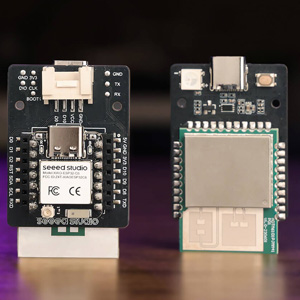

Seeed Studio MR60FDA2 60GHz mmWave Fall Detection Sensor Kit
==================================

.. seo::
    :description: Instructions for setting up Seeed Studio MR60FDA2 60GHz mmWave Fall Detection Sensor Kit.
    :image: seeed_mr60fda2.jpg

Component/Hub
-------------

The ``seeed_mr60fda2`` platform allows you to use Seeed Studio MR60FDA2 60GHz mmWave Fall Detection Sensor Kit with XIAO ESP32C6 (`Product Page <https://www.seeedstudio.com/MR60FDA2-60GHz-mmWave-Sensor-Fall-Detection-Module-p-5946.html>`__) with ESPHome.

The :ref:`UART <uart>` is required to be set up in your configuration for this sensor to work, ``parity`` and ``stop_bits`` **must be** respectively ``NONE`` and ``1``.
You can use the ESP32 software or hardware serial to use this MR60FDA2, its default baud rate is 115200.

    Seeed Studio MR60FDA2 60GHz mmWave Fall Detection Sensor Kit with XIAO ESP32C6

.. code-block:: yaml

    # Example configuration entry
    seeed_mr60fda2:

Configuration variables:
************************

- **uart_id** (*Optional*, :ref:`config-id`): Manually specify the ID of the :ref:`UART Component <uart>` if you want
  to use multiple UART buses.
- **id** (*Optional*, :ref:`config-id`): Manually specify the ID for this :doc:`seeed_mr60fda2` component if you need multiple components.

Binary Sensor
-------------

The ``seeed_mr60fda2`` binary sensor allows you to perform different measurements.

.. code-block:: yaml

    binary_sensor:
      - platform: seeed_mr60fda2
        people_exist:
          name: "Person Information"

Configuration variables:
************************

- **people_exist** (*Optional*): If true target detected, otherwise no target.
  All options from :ref:`Binary Sensor <config-binary_sensor>`.

Button
------

The ``seeed_mr60fda2`` button allows you to perform actions.

.. code-block:: yaml

    button:
      - platform: seeed_mr60fda2
        get_radar_parameters:
          name: "Get Radar Parameters"
        reset_radar:
          name: "Reset"

Configuration variables:
************************

- **reset_radar**: Restore all radar settings to factory parameters. All options from :ref:`Button <config-button>`.
- **get_radar_parameters**: Get all the current setup parameters of the radar.
  All options from :ref:`Button <config-button>`.

Text Sensor
-----------

The ``seeed_mr60fda2`` text sensor allows you to get information about your device.

.. code-block:: yaml

    text_sensor:
      - platform: seeed_mr60fda2
        is_fall:
          name: "Falling Information"

Configuration variables:
************************

- **is_fall** (*Optional*): Fall status indication.
  All options from :ref:`Text Sensor <config-text_sensor>`.

Select
-----------

The ``seeed_mr60fda2`` select allows you to control the configuration.

.. code-block:: yaml

    select:
      - platform: seeed_mr60fda2
        install_height:
          name: "Set Install Height"
        height_threshold:
          name: "Set Height Threshold"
        sensitivity:
          name: "Set Sensitivity"

Configuration variables:
************************

- **install_height**: Before using the MR60FDA2, please select the installation height of the radar according to the actual situation in order to obtain accurate identification results. The default is 3m.
  All options from :ref:`Select <config-select>`.
- **height_threshold**: To accurately distinguish between a person falling and sitting still in this area, you need to set the trigger height that triggers fall detection. This height refers to the distance between the person and the ground at the time of the fall. The default is 0.6m.
  All options from :ref:`Select <config-select>`.
- **sensitivity**: Fall sensitivity factor. Defaults to 1 with a range of 1-3, 3 = high and 1 = low.
  All options from :ref:`Select <config-select>`.

See Also
--------

- `Official Using Documents for Seeed Studio MR60FDA2 60GHz mmWave Fall Detection Sensor Kit with XIAO ESP32C6 <https://wiki.seeedstudio.com/getting_started_with_mr60fda2_mmwave_kit/>`_
- `Product Detail Page for Seeed Studio MR60FDA2 60GHz mmWave Fall Detection Sensor Kit with XIAO ESP32C6 <https://www.seeedstudio.com/MR60FDA2-60GHz-mmWave-Sensor-Fall-Detection-Module-p-5946.html>`_
- `Source of inspiration for implementation <https://github.com/limengdu/MR60FDA2_ESPHome_external_components>`_
- :apiref:`seeed_mr60fda2/seeed_mr60fda2.h`
- :ghedit:`Edit`
