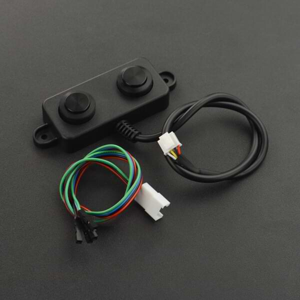

A02YYUW Waterproof Ultrasonic Sensor
====================================

.. seo::
    :description: Instructions for setting up A02YYUW waterproof ultrasonic distance sensor in ESPHome.
    :image: a02yyuw.jpg
    :keywords: ultrasonic, DFRobot, A02YYUW

This sensor allows you to use A02YYUW waterproof ultrasonic sensor by DFRobot 
(`datasheet <https://wiki.dfrobot.com/_A02YYUW_Waterproof_Ultrasonic_Sensor_SKU_SEN0311>`__)
with ESPHome to measure distances. This sensor can measure
ranges between 3 centimeters and 450 centimeters with a resolution of 1 milimeter.

Since this sensor reads multiple times per second, :ref:`sensor-filters` are highly recommended.

To use the sensor, first set up an :ref:`uart` with a baud rate of 9600 and connect the sensor to the specified pin.

    A02YYUW Waterproof Ultrasonic Distance Sensor.

.. code-block:: yaml

    # Example configuration entry
    sensor:
      - platform: "a02yyuw"
        name: "Distance"
 

Configuration variables:
------------------------

- **name** (**Required**, string): The name of the sensor.
- **uart_id** (*Optional*, :ref:`config-id`): The ID of the :ref:`UART bus <uart>` you wish to use for this sensor.
  Use this if you want to use multiple UART buses at once.
- All other options from :ref:`Sensor <config-sensor>`.

.. note::

    `PWM and RS485 <https://www.dypcn.com/uploads/A02-Datasheet.pdf>`__ versions of the A02YYUW are not supported by this component.

See Also
--------

- :ref:`sensor-filters`
- :ref:`uart`
- :apiref:`a02yyuw/a02yyuw.h`
- :ghedit:`Edit`
