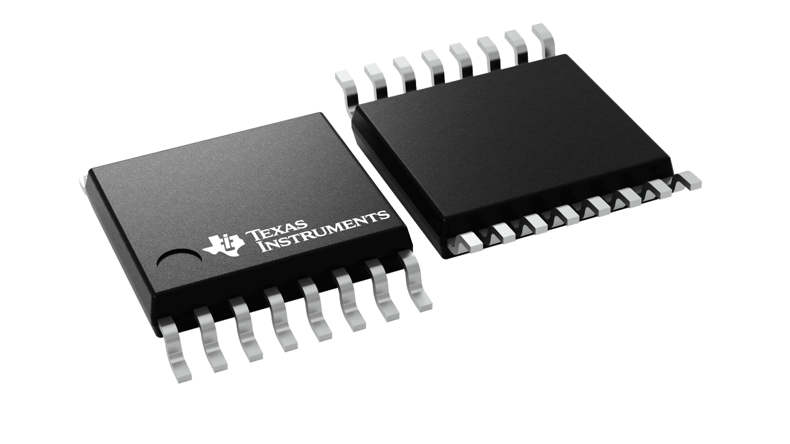

ADC128S102 8-Channel 12-Bit A/D Converter
==========================================

.. seo::
    :description: Instructions for setting up ADC128S102 12 Bit Analog to Digital Converter in ESPHome.
    :keywords: ADC128S102
    :image: adc128s102.png

The ADC128S102 is a low-power, eight-channel CMOS 12-bit analog-to-digital converter specified for conversion
throughput rates of 500 ksps to 1 MSPS. The converter is based on a successive-approximation register architecture
with an internal track-and-hold circuit.

.. _adc128s102-component:

Component/Hub
-------------

The ADC128S102 component allows you to use ADC128S102 8-Channel 12-Bit A/D Converter
(`datasheet <https://www.ti.com/lit/ds/symlink/adc128s102.pdf>`__,
`Texas Instruments <https://www.ti.com/product/ADC128S102>`__) in ESPHome.
It uses the :ref:`SPI Bus <spi>` for communication.

Once configured, you can use any of the 8 pins as
sensors for your projects.

.. code-block:: yaml

    # Example configuration entry
    adc128s102:
      cs_pin: GPIOXX
      id: my_adc

Configuration variables:
- **id** (**Required**, :ref:`config-id`): The id to use for this ADC128S102 component.
- **cs_pin** (**Required**, int): The SPI cable select pin to use

Sensor
------

The ``adc128s102`` sensor allows you to use your ADC128S102 12-Bit A/D Converter sensors with ESPHome.
First, setup a :ref:`ADC128S102 Hub <adc128s102-component>` for your ADC128S102 sensor and then use this
sensor platform to create individual sensors that will report the voltage to Home Assistant.

.. code-block:: yaml

    sensor:
      - platform: adc128s102           # Attached to pin 0 of the ADC128S102.
        update_interval: 1s
        adc128s102_id: my_adc
        id: freezer_temp_source
        channel: 0                     # ADC128S102 channel

Configuration variables:

- **adc128s102_id** (**Required**, :ref:`config-id`): The id of the parent ADC128S102 component.
- **channel** (**Required**, int): The channel of the ADC128S102 to use.
- **update_interval** (*Optional*, :ref:`config-time`): The interval to check the sensor. Defaults to ``60s``.

See Also
--------

- :ref:`spi`
- :apiref:`adc128s102/adc128s102.h`
- :ghedit:`Edit`
