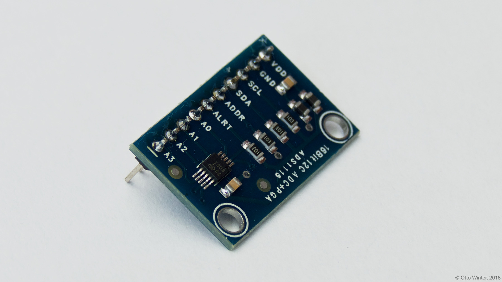

ADS1115 4-Channel 16-Bit A/D Converter
======================================

.. seo::
    :description: Instructions for setting up ADS1115/ADS1015 multiplexed analog voltage sensors.
    :image: ads1115.jpg
    :keywords: ADS1115 ADS1015

.. _ads1115-component:

Component/Hub
-------------

The ``ads1115`` domain creates a global hub so that you can later create
individual sensors using the :ref:`ADS1115 Sensor Platform <ads1115-sensor>`.
To use this hub, first setup the :ref:`I²C Bus <i2c>` and connect the sensor to the pins specified there.

    ADS1115 16-Bit ADC.

.. _Adafruit_ADS1115: https://www.adafruit.com/product/1085

.. _Adafruit_ADS1015: https://www.adafruit.com/product/1083

.. code-block:: yaml

    ads1115:
      - address: 0x48

Configuration variables:
************************

- **address** (**Required**, int): The i²c address of the sensor.
  See :ref:`I²C Addresses <ads1115_i2c_addresses>` for more information.
- **continuous_mode** (*Optional*, boolean): Set if the ADS1115 should continuously measure voltages or
  only measure them when an update is called. Please enable this for the :doc:`ct_clamp` component.
  Defaults to ``off``.
- **id** (*Optional*, :ref:`config-id`): Manually specify the ID for this ADS1115 Hub. Use this if you
  want to use multiple ADS1115 hubs at once.

.. _ads1115_i2c_addresses:

I²C Addresses
-------------

In order to allow multiple sensors to be connected to the same i²c bus,
the creators of this sensor hardware have included some options to
change the i²c address.

-  If the address pin is pulled to GND, the address is ``0x48`` (Default).
-  If the address pin is pulled to VCC, the address is ``0x49``.
-  If the address pin is tied to SDA, the address is ``0x4a``.
-  If the address pin is tied to SCL, the address is ``0x4B``.

.. _ads1115-sensor:

Sensor
------

The ``ads1115`` sensor allows you to use your ADS1115 sigma-delta ADC
sensors (`datasheet <http://www.ti.com/lit/ds/symlink/ads1115.pdf>`__, `Adafruit_ADS1115`_) or your ADS1015 sigma-delta ADC sensors (`datasheet <http://www.ti.com/lit/ds/symlink/ads1015.pdf>`__, `Adafruit_ADS1015`_) with ESPHome.
First, setup an :ref:`ADS1115 Hub <ads1115-component>` for your ADS1115 sensor and then use this
sensor platform to create individual sensors that will report the
voltage to Home Assistant.

.. _Adafruit: https://www.adafruit.com/product/1085

.. figure:: images/ads1115-ui.png
    :align: center
    :width: 80.0%

.. code-block:: yaml

    ads1115:
      - address: 0x48
    sensor:
      - platform: ads1115
        multiplexer: 'A0_GND'
        gain: 6.144
        name: "ADS1115 Channel A0-GND"

Configuration variables:
************************

-  **multiplexer** (**Required**): The multiplexer channel of this sensor. Effectively means between which pins you
   want to measure voltage.
-  **gain** (**Required**, float): The gain of this sensor.
-  **name** (**Required**, string): The name for this sensor.
-  **ads1115_id** (*Optional*, :ref:`config-id`): Manually specify the ID of the
   :ref:`ADS1115 Hub <ads1115-component>` you want to use this sensor.
-  **update_interval** (*Optional*, :ref:`config-time`): The interval
   to check the sensor. Defaults to ``60s``.
-  **id** (*Optional*, :ref:`config-id`): Manually specify the ID used for code generation.
-  **resolution** (*Optional*, string): the resolution of this sensor. Defaults to ``16 bits``.

  - ``16 bits``
  - ``12 bits``

Multiplexer and Gain
--------------------

.. note::

    As per (`datasheet <http://www.ti.com/lit/ds/symlink/ads1115.pdf>`__, `Adafruit`_) Section 7.3 Note 2:
    "No more than VDD + 0.3V must be applied to the analog inputs of the device."
    This means if you power the device with 3.3V, take care not to supply the 4 AIN pins with more than 3.6V.

The ADS1115 has a multiplexer that can be configured to measure voltage between several pin configurations. These are:

 - ``A0_A1`` (between Pin 0 and Pin 1)
 - ``A0_A3`` (between Pin 0 and Pin 3)
 - ``A1_A3`` (between Pin 1 and Pin 3)
 - ``A2_A3`` (between Pin 2 and Pin 3)
 - ``A0_GND`` (between Pin 0 and GND)
 - ``A1_GND`` (between Pin 1 and GND)
 - ``A2_GND`` (between Pin 2 and GND)
 - ``A3_GND`` (between Pin 3 and GND)

Additionally, the ADS1115 has a Programmable Gain Amplifier (PGA) that can help you measure voltages in different ranges, these are:

 - ``6.144`` (measures up to 6.144V)
 - ``4.096`` (measures up to 4.096V)
 - ``2.048`` (measures up to 2.048V)
 - ``1.024`` (measures up to 1.024V)
 - ``0.512`` (measures up to 0.512V)
 - ``0.256`` (measures up to 0.256V)

The ADS1115 can be used with defaults settings.
When using an ADS1015, the resolution has to be specified and should be defined to ``12_BITS``
(or equivalent notations like ``12 BITS`` or ``12 bits``).

See Also
--------

- :ref:`sensor-filters`
- :doc:`adc`
- :doc:`max6675`
- :apiref:`ads1115/ads1115.h`
- `i2cdevlib <https://github.com/jrowberg/i2cdevlib>`__ by `Jeff Rowberg <https://github.com/jrowberg>`__
- :ghedit:`Edit`
