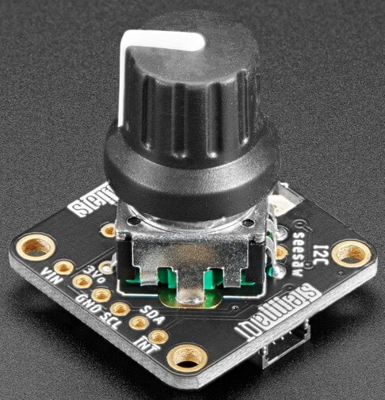

Adafruit I2C QT Rotary Encoder Board
====================================

.. seo::
    :description: Instructions for setting up the I²C rotary encoder board.
    :image: af4991.jpg

.. _af4991-component:

The ``af4991`` sensor platform allows you to use the `Adafruit I2C QT Rotary Encoder <https://learn.adafruit.com/adafruit-i2c-qt-rotary-encoder/overview>`__ board
with ESPHome. The I²C board takes care of any debouncing while also allowing the daisy-chaining of the encoder boards.
See `this Arduino article <https://playground.arduino.cc/Main/RotaryEncoders>`__ to gain
a better understanding of traditional rotary encoders.

    AF4991 I2C Rotary Encoder breakout board. Image by `Adafruit`_.

.. _Adafruit: https://learn.adafruit.com/adafruit-i2c-qt-rotary-encoder/overview

To use the Adafruit I²C QT Rotary Encoder board within ESPHome, you must have :ref:`I²C <i2c>`
setup in your configuration.

.. code-block:: yaml

    # Example configuration entry
    af4991:
      id: af4991_component
      address: 0x36

    sensor:
      - platform: af4991
        af4991_id: af4991_component
        name: "Rotary Encoder"

    # If your encoder has a built in push button, it can be used like this:
    binary_sensor:
      - platform: af4991
        af4991_id: af4991_component
        name: "Rotary Encoder Button"
        
Configuration variables:
------------------------

The configuration is made up of up to three parts: The board itself with it's I²C connection to that device,
a Sensor component, and a optional Binary Sensor component.

AF4991
******

- **address** (*Optional*, integer): The I²C address of the sensor. Defaults to ``0x36``.
- **id** (*Required*, :ref:`config-id`): Set the ID of the component.

Sensor
******

The ``af4991`` sensor allows extra configuration for how the rotary movement from the encoder is processed.

- **af4991_id** (**Required**, :ref:`config-id`): The ID of the Adafruit I²C QT Rotary Encoder board as defined above.
- **invert** (*Optional*, boolean): Inverts the output of the encoder. Allows the correcting of clockwise and anticlockwise triggers. Defaults to ``false``
- **min_value** (*Optional*, int): The minimum value the rotary encoder will go to, turning
  the knob further will not decrease the number any further. Defaults to no minimum.
- **max_value** (*Optional*, int): The maximum value the rotary encoder will go to, turning
  the knob further will not increase the number any further. Defaults to no maximum.
- **publish_initial_value** (*Optional*, boolean): Controls whether the value is published
  upon start of ESPHome. By default the value is only published when it changes, causing an
  "unknown" value at first. If you set this option to true, the value is published once after
  boot and when it changes. Defaults to ``false``.
- **clockwise_steps_before_trigger** (*Optional*, int): Number of steps required before triggering the `on_clockwise` automation trigger. Defaults to ``1``.
- **anticlockwise_steps_before_trigger** (*Optional*, int): Number of steps required before triggering the `on_anticlockwise` automation trigger. Defaults to ``1``.
- **on_clockwise** (*Optional*, :ref:`Automation <automation>`): Actions to be performed when
  the knob is turned clockwise. See :ref:`sensor-af4991-triggers`.
- **on_anticlockwise** (*Optional*, :ref:`Automation <automation>`): Actions to be performed when
  the knob is turned anticlockwise. See :ref:`sensor-af4991-triggers`.
- All other options from the :ref:`Sensor <config-sensor>` component.

Binary Sensor
*************

The ``af4991`` binary sensor for the rotary encoders built in switch must be defined otherwise it will not function. (Some encoders do not come with a switch built into the knob).

- **af4991_id** (**Required**, :ref:`config-id`): The ID of the Adafruit I²C QT Rotary Encoder board as defined above.
- **pin** (*Optional*, :ref:`config-pin`): This is opnly required if custom firmware is being used on the board, and the default pin has been changed. Defaults to ``24`` (this is on the I²C board itself).
- All other options from the Binary Sensor component.

.. _sensor-af4991-set_value_action:

``sensor.af4991.set_value`` Action
------------------------------------------

The internal state of the rotary encoder can be manually changed to any value with this action.
After executing this action, rotating the encoder further will increase/decrease the state relative
to the newly set internal value.

.. code-block:: yaml

    # Example configuration entry
    sensor:
      - platform: af4991
        id: af4991_component
        # ...

    # in some trigger
    on_...:
      - sensor.af4991.set_value:
          id: af4991_component
          value: 10

      # Templated
      - sensor.af4991.publish:
          id: af4991_component
          value: !lambda 'return -1;'

Configuration options:

- **id** (**Required**, :ref:`config-id`): The ID of the rotary encoder.
- **value** (**Required**, int, :ref:`templatable <config-templatable>`):
  The value to sets the internal counter to.

.. _sensor-af4991-triggers:

``on_clockwise`` and ``on_anticlockwise`` Triggers
--------------------------------------------------

With these configuration options, it is possible to run automations based on the direction
that the encoder has been turned, and not the value that it currently holds.
These triggers ignore the min and max values and will trigger on every ``n`` steps according to the
``clockwise_steps_before_trigger`` value and the ``anticlockwise_steps_before_trigger`` value.

.. code-block:: yaml

    on_clockwise:
      - logger.log: "Turned Clockwise"
    on_anticlockwise:
      - logger.log: "Turned Anticlockwise"

See Also
--------

- :ref:`sensor-filters`
- :doc:`template`
- :apiref:`af4991/af4991.h`
- `Adafruit Seesaw Library <https://github.com/adafruit/Adafruit_Seesaw>`__ by `Adafruit <https://github.com/adafruit>`__
- :ghedit:`Edit`
