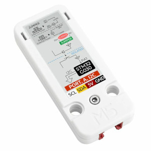

AIN4-20mA current analog measurement unit
=========================================

.. seo::
    :description: Instructions for setting up the AIN4-20mA current analog measurement unit.
    :image: ain4_20ma.jpg
    :keywords: current, 4-20mA, i2c

The AIN4-20mA current analog measurement unit sensor allows you to use sensors with a 4-20mA output to use with ESPHome.

    AIN4-20mA current analog measurement unit.
    (Credit: `M5Stack <https://docs.m5stack.com/en/unit/AIN4-20mA%20Unit>`__, image cropped and compressed)

.. _M5Stack: https://docs.m5stack.com/en/unit/AIN4-20mA%20Unit

The AIN4-20mA Unit is a highly capable single-channel 4~20mA current analog measurement unit. Powered by the STM32G030F6 main control chip, it communicates through i2c, ensuring efficient and reliable data transmission.
It can be used as base sensor for all sensors with a 4-20mA output.

To use the sensor, first set up an :ref:`I²C Bus <i2c>` and connect the sensor to the specified pins.

.. code-block:: yaml

    # Example configuration entry
    sensor:
      - platform: ain4_20ma
        name: "Current"
        update_interval: 60s

Configuration variables:
------------------------

- **address** (*Optional*, int): Manually specifiy the I²C address of the sensor. Defaults to ``0x55``.
- **update_interval** (*Optional*, :ref:`config-time`): The interval to check the sensor. Defaults to ``60s``.
- All other options from :ref:`Sensor <config-sensor>`.

See Also
--------

- :ref:`sensor-filters`
- :doc:`template`
- `AIN4-20mA Unit <https://docs.m5stack.com/en/unit/AIN4-20mA%20Unit>`__
- :ghedit:`Edit`
