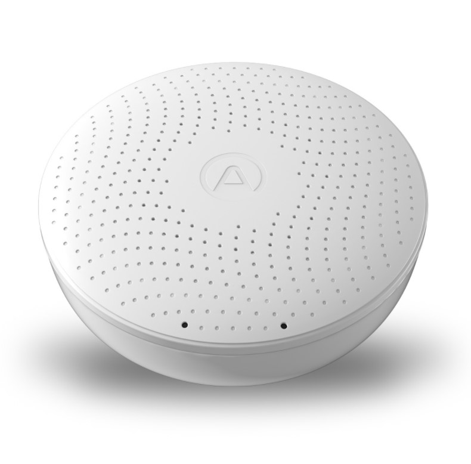
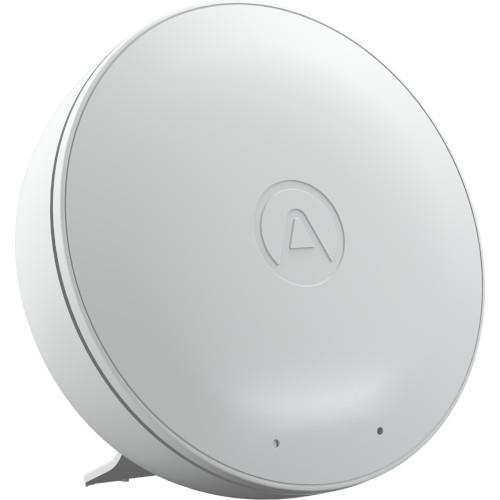

AirThings BLE Sensors
=====================

.. seo::
    :description: Instructions for setting up AirThings bluetooth-based sensors in ESPHome.
    :keywords: AirThings, BLE, Bluetooth, Wave Plus, Wave Mini

The ``airthings_wave_plus`` and ``airthings_wave_mini`` sensor platforms lets you track the output of AirThings Bluetooth Low Energy devices.

This component will track radon, airborne chemicals, CO2, temperature and humidity and others depending on the device sensors.

Device Discovery
-----------------

AirThings devices can be found using the ``airthings_ble`` ble scanner.

To find out your device's MAC address, add the following to your ESPHome configuration:

.. code-block:: yaml

    logger:
      level: DEBUG # Required for the tracker to show the device

    esp32_ble_tracker:
    airthings_ble:

The device will then listen for nearby devices, and display a message like this one:

.. code-block:: text

    [D][airthings_ble:019]:
    Found AirThings device Serial: 123456789 (MAC: 01:02:03:04:05:06)

Once the device is found, remove the ``airthings_ble`` device tracker from your configuration and take note of the device MAC address, and use it when configuring a sensor below.

Supported Devices
-----------------

Airthings Wave Plus Sensor
**************************

AirThings Wave Plus tracks radon (24h and long term), airborne chemicals, CO2, temperature, atmospheric pressure and humidity.

Configuration example:
**********************

.. code-block:: yaml

    sensor:
      - platform: airthings_wave_plus
        name: wave_plus
        ble_client_id: airthings01
        update_interval: 5min # default
        battery_update_interval: 24h # default
        temperature:
          name: "WavePlus Temperature"
        radon:
          name: "WavePlus Radon"
        radon_long_term:
          name: "WavePlus Radon Long Term"
        pressure:
          name: "WavePlus Pressure"
        humidity:
          name: "WavePlus Humidity"
        co2:
          name: "WavePlus CO2"
        tvoc:
          name: "WavePlus VOC"
        battery_voltage:
          name: "WavePlus Battery Voltage"

    ble_client:
      - mac_address: 01:02:03:04:05:06
        id: airthings01

    esp32_ble_tracker:

Airthings Wave Mini Sensor
**************************

AirThings Wave Mini tracks airborne chemicals, temperature, pressure and humidity.

Configuration example:

.. code-block:: yaml

    sensor:
      - platform: airthings_wave_mini
        ble_client_id: airthingsmini
        update_interval: 5min # default
        battery_update_interval: 24h # default
        temperature:
          name: "WaveMini Temperature"
        pressure:
          name: "WaveMini Pressure"
        humidity:
          name: "WaveMini Humidity"
        tvoc:
          name: "WaveMini VOC"
        battery_voltage:
          name: "WaveMini Battery Voltage"

    ble_client:
      - mac_address: 01:02:03:04:05:06
        id: airthingsmini

    esp32_ble_tracker:

.. note::

    The sensor uses active polling of devices every 5 minutes as per the device reported internal refresh timeout.

.. note::

    Battery-voltage reporting defaults to once every 24 hours in order
    to reduce BLE traffic (obtaining the battery voltage requires quite
    a few BLE commands/responses); if you wish to have it reported
    more frequently configure the ``battery_update_interval``. The main
    sensor ``update_interval`` controls the overall polling frequency
    so setting the interval for the battery voltage to a lower value
    will result in the battery voltage being reported once per polling
    interval.

Battery Level Reporting
***********************

If you wish to have the 'percentage of battery life remaining'
reported as a sensor, you can make use of the :ref:`copy-sensor` component.

The examples below are based on standard alkaline-chemistry batteries;
if you use other types of batteries you may need to adjust the
reference voltages to obtain a proper 0-100% scale. The voltage
references were chosen to closely match the 0-100% range displayed by
the AirThings mobile app.

.. code-block:: yaml

    sensor:
      - platform: airthings_wave_mini
        ble_client_id: airthingsmini
        battery_voltage:
          id: bv
          name: "WaveMini Battery Voltage"
      - platform: copy
        source_id: bv
        name: "WaveMini Battery Level"
        unit_of_measurement: "%"
        device_class: battery
        accuracy_decimals: 0
        filters:
          - calibrate_linear:
            - 2.7 -> 0
            - 4.5 -> 100

.. code-block:: yaml

    sensor:
      - platform: airthings_wave_plus
        ble_client_id: airthings01
        battery_voltage:
          id: bv
          name: "WavePlus Battery Voltage"
      - platform: copy
        source_id: bv
        name: "WavePlus Battery Level"
        unit_of_measurement: "%"
        device_class: battery
        accuracy_decimals: 0
        filters:
          - calibrate_linear:
            - 2.2 -> 0
            - 3.1 -> 100

See Also
--------

- :doc:`/components/esp32_ble_tracker`
- :ghedit:`Edit`
