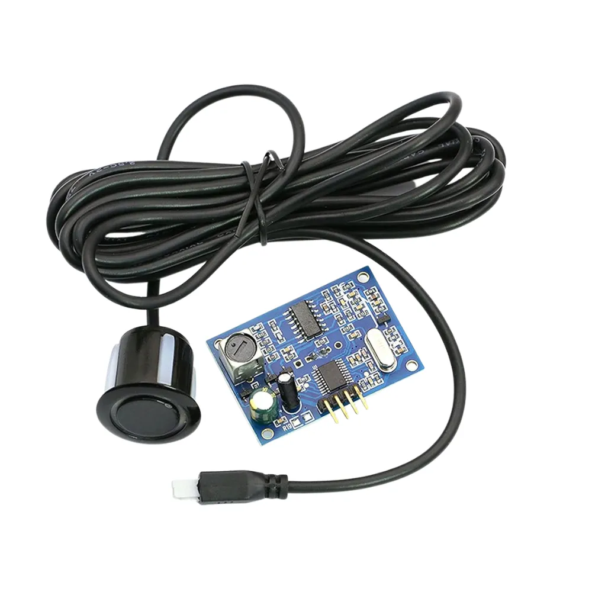

AJ-SR04M Waterproof Ultrasonic
==============================

.. seo::
    :description: Instructions for setting up AJ-SR04M ultrasonic distance measurement sensors in ESPHome.
    :image: ajsr04m.jpg
    :keywords: ultrasonic, ajsr04m, jsnsr04t

The ``ajsr04m`` component allows you to use the AJ-SR04M
(`datasheet <https://www.katranji.com/tocimages/files/406377-274587.pdf>`__)
ultrasonic sensor with ESPHome. It can detect objects up to 4.5 meters, has a beam angle of 45 degrees, and is accurate to 0.5cm.

This sensor platform expects that the sensor is configured to operate in
`automatic serial mode <https://tutorials.probots.co.in/communicating-with-a-waterproof-ultrasonic-sensor-aj-sr04m-jsn-sr04t/>`__,
which is triggered by applying a 120KΩ resistor across R19 on the control board. In this mode, the sensor will autonomously run
at 120Hz, caculate the distance itself, and report the final value over serial/UART.

    AJ-SR04M Ultrasonic Distance Sensor

.. code-block:: yaml

    # Example configuration entry
    uart:
      tx_pin: 19
      rx_pin: 33
      baud_rate: 9600

    sensor:
      - platform: ajsr04m
        distance:
          name: "Distance to Surface"
          filters:
            - throttle_average: 1s

Configuration variables:
------------------------

- **distance** (**Required**): The sensor to report the distance on.  All options from :ref:`Sensor <config-sensor>`.

Advanced options:

- **uart_id** (*Optional*, :ref:`config-id`): Manually specify the ID of the :ref:`UART Component <uart>` if you want
  to use multiple UART buses.
- **id** (*Optional*, :ref:`config-id`): Manually specify the ID used for code generation.

See Also
--------

- :ref:`sensor-filters`
- :apiref:`ajsr04m/ajsr04m.h`
- :ghedit:`Edit`
