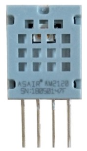

AM2120 Temperature+Humidity Sensor
==================================

.. seo::
    :description: Instructions for setting up AM2120 temperature and humidity sensors
    :image: am2120.jpg
    :keywords: am2120

The ``am2120`` Temperature+Humidity sensor allows you to use your AM2120
(`datasheet <https://www.micros.com.pl/mediaserver/UPAM2120_0004.pdf>`__) I²C-based sensor with ESPHome.

    AM2120 Temperature & Humidity Sensor.

.. figure:: images/temperature-humidity.png
    :align: center
    :width: 80.0%

.. note::

    Logs might include some warnings about receiving a NACK from the sensor.
    This is due to a wake call to the sensor which the sensor never acknowledges by design.

.. code-block:: yaml

    # Example configuration entry
    sensor:
      - platform: am2120
        temperature:
          name: "Living Room Temperature"
        humidity:
          name: "Living Room Humidity"
        update_interval: 60s

Configuration variables:
------------------------

- **temperature** (**Required**): The information for the temperature sensor.

  - **name** (**Required**, string): The name for the temperature sensor.
  - **id** (*Optional*, :ref:`config-id`): Set the ID of this sensor for use in lambdas.
  - All other options from :ref:`Sensor <config-sensor>`.

- **humidity** (**Required**): The information for the humidity sensor

  - **name** (**Required**, string): The name for the humidity sensor.
  - **id** (*Optional*, :ref:`config-id`): Set the ID of this sensor for use in lambdas.
  - All other options from :ref:`Sensor <config-sensor>`.

- **update_interval** (*Optional*, :ref:`config-time`): The interval to check the sensor. Defaults to ``60s``.

See Also
--------

- :ref:`sensor-filters`
- :doc:`absolute_humidity`
- :doc:`dht`
- :doc:`dht12`
- :doc:`hdc1080`
- :doc:`htu21d`
- :doc:`sht3xd`
- :apiref:`am2120/am2120.h`
- :ghedit:`Edit`
