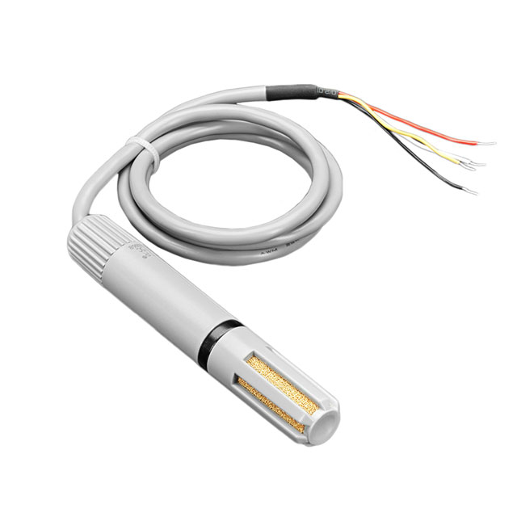

AM2315C Temperature+Humidity Sensor
===================================

.. seo::
    :description: Instructions for setting up AM2315C temperature and humidity sensors
    :image: am2315c.jpg
    :keywords: am2315c

The ``am2315c`` Temperature+Humidity sensor allows you to use your AM2315C
(`datasheet <https://cdn-shop.adafruit.com/product-files/5182/5182_AM2315C.pdf>`__) I²C-based sensor with ESPHome.

    AM2315C Temperature & Humidity Sensor.

.. figure:: images/temperature-humidity.png
    :align: center
    :width: 80.0%

.. code-block:: yaml

    # Example configuration entry
    sensor:
      - platform: am2315c
        temperature:
          name: "Living Room Temperature"
        humidity:
          name: "Living Room Humidity"

Configuration variables:
------------------------

- **temperature** (**Optional**): The temperature sensor.
  All options from :ref:`Sensor <config-sensor>`.

- **humidity** (**Optional**): The humidity sensor.
  All options from :ref:`Sensor <config-sensor>`.

- **update_interval** (*Optional*, :ref:`config-time`): The interval to check the sensor. Defaults to ``60s``.

See Also
--------

- :ref:`sensor-filters`
- :doc:`absolute_humidity`
- :doc:`dht`
- :doc:`dht12`
- :doc:`hdc1080`
- :doc:`htu21d`
- :apiref:`am2315c/am2315c.h`
- :ghedit:`Edit`
