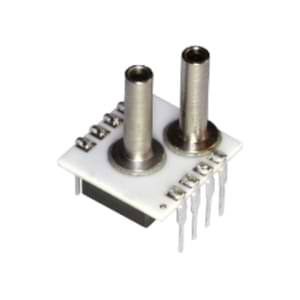

AMS5915 i²c Pressure / Temperature Sensor 
=========================================

.. seo::
    :description: Instructions for setting up AMS5915 sensors.
    :image: ams5915.jpg
    :keywords: AMS5915

Sensor Component
----------------

The ``ams5915`` component allows you to use AMS5915 pressure/temperature sensors with ESPHome. 

    AMS5915 Board Mount.

The AMS5915 requires an i²c bus.

.. code-block:: yaml

    i2c:

Configuration variables:
************************

- **address** (*Optional*, int): The i²c address of the sensor. Defaults to ``0x28``
- **model** (**Required**, string): The model / type of your AMS5915 sensor.
- All other options from :ref:`Sensor <config-sensor>`.

Example Configuration:
----------------------

.. code-block:: yaml

    # Example configuration entry
    sensor:      
      - platform: ams5915
        model: "AMS5915_1000_D_B"
        temperature:
          name: "ams5915 Temperature"
        pressure:
          name: "ams5915 Pressure"

Available Models/Types:
***********************
- AMS5915_0005_D
- AMS5915_0010_D 
- AMS5915_0005_D_B
- AMS5915_0010_D_B
- AMS5915_0020_D
- AMS5915_0050_D
- AMS5915_0100_D
- AMS5915_0020_D_B
- AMS5915_0050_D_B
- AMS5915_0100_D_B
- AMS5915_0200_D
- AMS5915_0350_D
- AMS5915_1000_D
- AMS5915_2000_D
- AMS5915_4000_D
- AMS5915_7000_D
- AMS5915_10000_D
- AMS5915_0200_D_B
- AMS5915_0350_D_B
- AMS5915_1000_D_B
- AMS5915_1000_A
- AMS5915_1200_B

See Also
--------

- :ref:`sensor-filters`
- :ghedit:`Edit`
