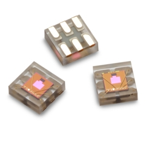

APDS9306 Sensor
===============

.. seo::
    :description: Instructions for setting up APDS9306 sensors.
    :image: apds9306.png

.. _apds9306-component:

Component
---------

The ``apds9306`` sensor component allows you to use APDS9306 ambient light sensors (`datasheet <https://docs.broadcom.com/doc/AV02-4755EN>`__, `Broadcom`_) with ESPHome.
The :ref:`I²C <i2c>` is required to be set up in your configuration for this sensor to work.

    Image by `Broadcom`_

.. code-block:: yaml

    # Example configuration entry
    sensor:
      - platform: apds9306
        name: "APDS9306 Light Level" # below are optional
        gain: 1
        bit_width: 18
        measurement_rate: 100ms
        update_interval: 60s

.. _Broadcom: https://www.broadcom.com/products/optical-sensors/ambient-light-photo-sensors/apds-9306-065

Configuration variables:
------------------------

The ``apds9306`` sensor allows you to use your :doc:`apds9306` to perform ambient light measurements.

- **address** (*Optional*, int): The I²C address of the sensor. Should be ``0x52`` according to datasheet ("Contact factory for other addressing options").
- **gain** (*Optional*, int): The gain of the ambient light sensor. One of 1, 3, 6, 9, 18. Defaults to ``1``.
- **bit\_width** (*Optional*, int): The bit width/resolution of the ambient light sensor. One of:

  - 20 - takes 400ms
  - 19 - takes 200ms
  - 18 - takes 100ms (``default``)
  - 17 - takes 50ms
  - 16 - takes 25ms
  - 13 - takes 3.125ms

- **measurement\_rate** (*Optional*, int): The measurement rate of the ambient light sensor in milliseconds. One of:

  - 25
  - 50
  - 100 (``default``);
  - 200
  - 500
  - 1000

- **update\_interval** (*Optional*, :ref:`config-time`): The interval at which the sensor reading will be updated. Defaults to ``60s``.
- All opther options from :ref:`Sensor <config-sensor>`.

See Also
--------

- :ref:`sensor-filters`
- :apiref:`apds9306/apds9306.h`
- :ghedit:`Edit`
