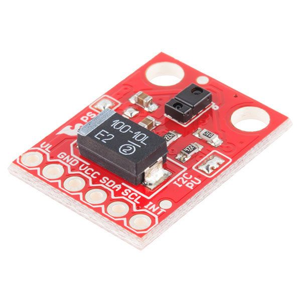

APDS9960 Sensor
===============

.. seo::
    :description: Instructions for setting up APDS9960 sensors.
    :image: apds9960.jpg

.. _apds9960-component:

Component/Hub
-------------

The ``apds9960`` sensor platform allows you to use your APDS9960 RGB and gesture sensors
(`datasheet <https://cdn.sparkfun.com/datasheets/Sensors/Proximity/apds9960.pdf>`__,
`SparkFun`_) with ESPHome.
The :ref:`I²C <i2c>` is
required to be set up in your configuration for this sensor to work.

    Image by `SparkFun`_.

.. code-block:: yaml

    # Example configuration entry
    apds9960:
      address: 0x39
      update_interval: 60s

    sensor:
      - platform: apds9960
        type: CLEAR
        name: "APDS9960 Clear Channel"

    binary_sensor:
      - platform: apds9960
        direction: UP
        name: "APDS960 Up Movement"
      # Repeat for each direction

.. _SparkFun: https://www.sparkfun.com/products/12787

Configuration variables:
------------------------

The configuration is made up of three parts: The central component, individual sensors,
and direction binary sensors.

Base Configuration:

- **address** (*Optional*, int): The I²C address of the sensor. Defaults to ``0x39``.
- **update_interval** (*Optional*, :ref:`config-time`): The interval
  to check the sensor. Defaults to ``60s``.
- **led_drive** (*Optional*, int): The LED drive level in mA. One of 100mA, 50mA, 25mA, 12.5mA. Defaults to ``100mA``.
- **proximity_gain** (*Optional*, int): The proximity gain level. One of 1x, 2x, 4x, 8x. Defaults to ``4x``.
- **ambient_light_gain** (*Optional*, int): The ambient light gain level. One of 1x, 4x, 16x, 64x. Defaults to ``4x``.
- **gesture_led_drive** (*Optional*, int): The gesture LED drive level in mA. One of 100mA, 50mA, 25mA, 12.5mA. Defaults to ``100mA``.
- **gesture_gain** (*Optional*, int): The proximity gain level. One of 1x, 2x, 4x, 8x. Defaults to ``4x``.
- **gesture_wait_time** (*Optional*, int): The gesture wait time in ms. One of 0ms, 2.8ms, 5.6ms, 8.4ms, 14ms, 22.4ms, 30.8ms, 39.2ms. Defaults to ``2.8ms``.

Sensor
------

The ``apds9960`` sensor allows you to use your :doc:`apds9960` to perform different
measurements.

Configuration variables:

- **name** (**Required**, string): The name for the sensor.
- **type** (**Required**, string): The type of sensor measurement. One of

  - ``CLEAR``
  - ``RED``
  - ``GREEN``
  - ``BLUE``
  - ``PROXIMITY``

- **id** (*Optional*, :ref:`config-id`): Set the ID of this sensor for use in lambdas.
- All other options from :ref:`Sensor <config-sensor>`.

Binary Sensor
-------------

The ``apds9960`` binary sensor allows you to use your :doc:`apds9960` to perform different
measurements.

Configuration variables:

- **name** (**Required**, string): The name for the binary sensor.
- **direction** (**Required**, string): The direction to measure. One of:

  - ``UP``
  - ``DOWN``
  - ``LEFT``
  - ``RIGHT``

- **id** (*Optional*, :ref:`config-id`): Manually specify the ID used for code generation.
- All other options from :ref:`Binary Sensor <config-binary_sensor>`.

Troubleshooting:
----------------

With some APDS9960 modules the VL pin needs to be supplied with 3.3V for gesture sensing to work.  The VL pin provides power for the infrared LED that is used to detect gestures.  There may be two pads on the module which, if shorted with a solder joint, cause the main VCC power pin to supply power for the infrared LED as well.  However, providing a separate power supply via the VL pin may help to isolate the rest of the circuit from noise created by pulsing the infrared LED at relatively high power.

See Also
--------

- :ref:`sensor-filters`
- :apiref:`apds9960/apds9960.h`
- :ghedit:`Edit`
