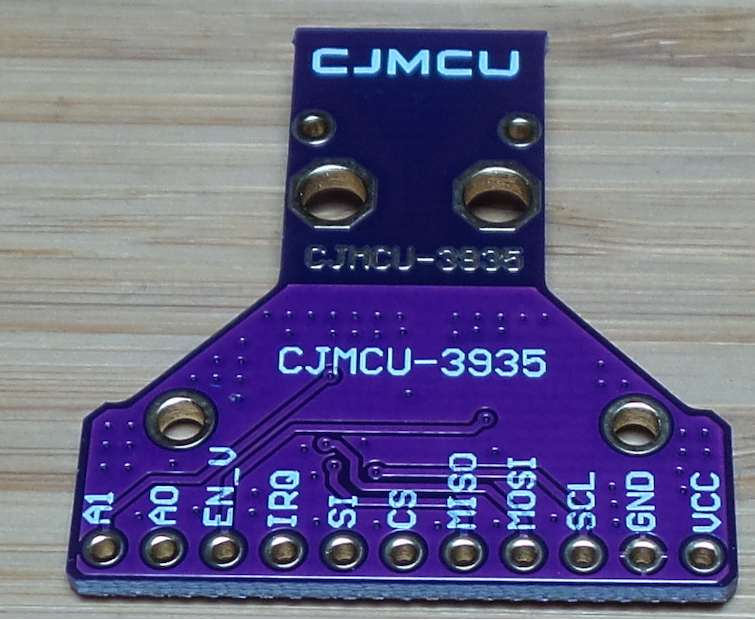

AMS AS3935 Franklin Lightning Sensor
====================================

.. seo::
    :description: Instructions for setting up AS3935 lightning sensor
    :image: as3935.jpg
    :keywords: as3935

The **AS3935** sensor platform allows you to use your AS3935 sensor
(`AliExpress`_, `AMS_AS3935`_)
in order to get notified when a thunderstorm is getting close.

The AS3935 can detect the presence of lightning activity and provide an estimation
on the distance to the head of the storm. The chip issues a notification through an interrupt
pin.

Component/Hub
-------------

The AS3935 can be configured to use either the SPI **or** I²C protocol for data communication.
First choose which communication method you want to use for the sensor, set the SI pin for the appropriate
level and set up the ESPHome component for the chosen communication method.

Module Pins
-----------

============  ===============================================================
 Module Pin   Description
============  ===============================================================
VCC/VDD       Positive supply voltage
GND           Ground
SCL           I²C clock bus or SPI clock bus (according to SI setting)
MOSI          I²C data bus or SPI data input bus (according to SI setting)
MISO          SPI data output bus
CS            Chip Select (active low)
SI            Select Interface (GND → SPI or VDD → I²C)
IRQ           Interrupt (out)
EN_V          Voltage Regulator Enable
A0            I²C address selection LSB
A1            I²C address selection MSB
============  ===============================================================

    AS3935 Lightning Sensor.

.. _AliExpress: https://de.aliexpress.com/af/as3935.html?SearchText=as3935
.. _AMS_AS3935: https://ams.com/as3935

Over SPI
--------

The ``as3935_spi`` sensor platform allows you to use your AS3935 sensor
(`AliExpress`_, `AMS_AS3935`_) in order to get notified when a thunderstorm is getting close.

.. code-block:: yaml

    # Example configuration for SPI
    as3935_spi:
      cs_pin: GPIOXX
      irq_pin: GPIOXX

Configuration variables:
************************

- **cs_pin** (**Required**, :ref:`Pin Schema <config-pin_schema>`): The chip select pin.
- **irq_pin** (**Required**, :ref:`config-pin`): The IRQ pin, which indicates if a lightning strike has been detected.
- **indoor** (*Optional*, boolean): Indicates if the sensor is used indoor. Defaults to ``true``.
- **noise_level** (*Optional*, int): Noise floor level is compared to known reference voltage.
  If this level is exceeded the chip will issue an interrupt to the IRQ pin, broadcasting that it can not
  operate properly due to noise (INT_NH). Defaults to ``2``.
- **spike_rejection** (*Optional*, int): Helps to differentiate between false events and actual lightning.
  Increasing this value increases robustness at the cost of sensitivity to distant events. Defaults to ``2``.
- **lightning_threshold** (*Optional*, int): The number of lightnings that must appear in a 15-minute time
  window before a lightning storm is detected.
  15 minutes is the window of time before the number of detected lightning events is reset.
  The number of lightning strikes can be set to 1,5,9, or 16. Defaults to ``1``.
- **mask_disturber** (*Optional*, boolean): This setting will return whether or not disturbers trigger
  the IRQ Pin. Defaults to ``false``.
- **div_ratio** (*Optional*, int): The antenna is designed to resonate at 500kHz and so can be tuned
  with the following setting. The accuracy of the antenna must be within 3.5 percent of that value for
  proper signal validation and distance estimation. Defaults to ``0``.
- **capacitance** (*Optional*, int): This setting will add capacitance to the series RLC antenna on the product
  to help tune its resonance. The datasheet specifies being within 3.5 percent of 500kHz to get optimal lightning
  detection and distance sensing. It's possible to add up to 120pF in steps of 8pF to the antenna. Defaults to ``0``.
- **watchdog_threshold** (*Optional*, int): Determines the threshold for events that trigger the IRQ pin.
  Defaults to ``2``.
- **tune_antenna** (*Optional*, boolean): Start sensor in antenna tuning mode. It will emit oscillator
  frequency to be read on the INT pin. Please follow AS3935 documentation. Note that while this mode is enabled,
  lightings will not be detected. It should be used for initial calibration only, in order to determine correct value of
  ``capacitance`` and/or ``div_ratio`` parameters.
  Defaults to ``False``.
- **calibration** (*Optional*, boolean): Enable/disable oscillator calibration on startup. It is recommended to perform
  antenna tuning procedure first and adjust parameters, so that RLC antenna resonance is tuned within optimal range.
  Defaults to ``True``.

Over I²C
--------

The ``as3935_i2c`` sensor platform allows you to use your AS3935 sensor
(`AliExpress`_, `AMS_AS3935`_) in order to get notified when a thunderstorm is getting close.

.. code-block:: yaml

    # Example configuration for I²C
    as3935_i2c:
      irq_pin: GPIOXX

Configuration variables:
************************

- **address** (*Optional*, int): Manually specify the I²C address of
  the sensor. Defaults to ``0x03`` (``A0`` and ``A1`` pins pulled high).
  The address is made up using the state of ``A0`` as bit 1 and the state of ``A1`` as bit 2, so a total of four addresses is possible.
- **irq_pin** (**Required**, :ref:`config-pin`): The IRQ pin, which indicates if a lightning strike has been detected.
- **indoor** (*Optional*, boolean): Indicates if the sensor is used indoor. Defaults to ``true``.
- **noise_level** (*Optional*, int): Noise floor level is compared to known reference voltage.
  If this level is exceeded the chip will issue an interrupt to the IRQ pin, broadcasting that it can not
  operate properly due to noise (INT_NH). Defaults to ``2``.
- **spike_rejection** (*Optional*, int): Helps to differentiate between false events and actual lightning.
  Increasing this value increases robustness at the cost of sensitivity to distant events. Defaults to ``2``.
- **lightning_threshold** (*Optional*, int): The number of lightnings that must appear in a 15-minute time
  window before a lightning storm is detected.
  15 minutes is the window of time before the number of detected lightning events is reset.
  The number of lightning strikes can be set to 1,5,9, or 16. Defaults to ``1``.
- **mask_disturber** (*Optional*, boolean): This setting will return whether or not disturbers trigger
  the IRQ Pin. Defaults to ``false``.
- **div_ratio** (*Optional*, int): The antenna is designed to resonate at 500kHz and so can be tuned
  with the following setting. The accuracy of the antenna must be within 3.5 percent of that value for
  proper signal validation and distance estimation. Defaults to ``0``.
- **capacitance** (*Optional*, int): This setting will add capacitance to the series RLC antenna on the product
  to help tune its resonance. The datasheet specifies being within 3.5 percent of 500kHz to get optimal lightning
  detection and distance sensing. It's possible to add up to 120pF in steps of 8pF to the antenna. Defaults to ``0``.
- **watchdog_threshold** (*Optional*, int): Determines the threshold for events that trigger the IRQ pin.
  Defaults to ``2``.
- **tune_antenna** (*Optional*, boolean): Start sensor in antenna tuning mode. It will emit oscillator
  frequency to be read on the INT pin. Please follow AS3935 documentation. Note that while this mode is enabled,
  lightings will not be detected. It should be used for initial calibration only, in order to determine correct value of
  ``capacitance`` and/or ``div_ratio`` parameters.
  Defaults to ``False``.
- **calibration** (*Optional*, boolean): Enable/disable oscillator calibration on startup. It is recommended to perform
  antenna tuning procedure first and adjust parameters, so that RLC antenna resonance is tuned within optimal range.
  Defaults to ``True``.

Sensor
------

A sensor platform to read lightning data

.. code-block:: yaml

    sensor:
      - platform: as3935
        lightning_energy:
          name: Lightning Energy
        distance:
          name: Distance Storm

Configuration variables:

- **lightning_energy** (*Optional*): Lightning energy value. According to the datasheet this is only a pure value that doesn't have any physical meaning.
  All options from :ref:`Sensor <config-sensor>`.

- **distance** (*Optional*): Distance in km to the front of the storm and not the distance to a lightning strike.
  All options from :ref:`Sensor <config-sensor>`.

Binary Sensor
-------------

Binary sensor that indicates if a lightning strike was detected.

.. code-block:: yaml

    # Example storm alert binary sensor
    binary_sensor:
      - platform: as3935
        name: Storm Alert

Configuration variables:

-  All options from :ref:`Binary Sensor <config-binary_sensor>`.

See Also
--------

- :ref:`sensor-filters`
- :apiref:`as3935/as3935.h`
- `AliExpress <https://de.aliexpress.com/af/as3935.html?SearchText=as3935>`__
- `Data Sheet <https://www.embeddedadventures.com/datasheets/AS3935_Datasheet_EN_v2.pdf>`__
- `Little Arduino Projects <https://github.com/tardate/LittleArduinoProjects/tree/master/playground/AS3935>`__
- `AMS AS3935 <https://ams.com/as3935>`__
- `SparkFun Library <https://github.com/sparkfun/SparkFun_AS3935_Lightning_Detector_Arduino_Library>`__
- :ghedit:`Edit`
