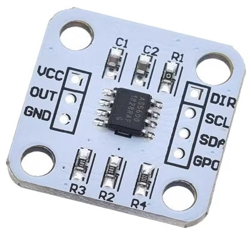
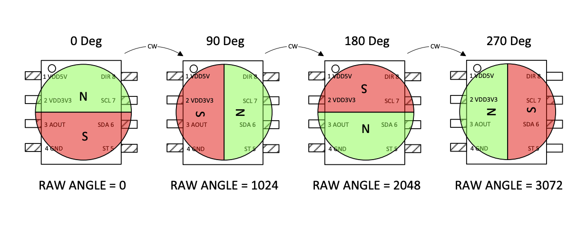
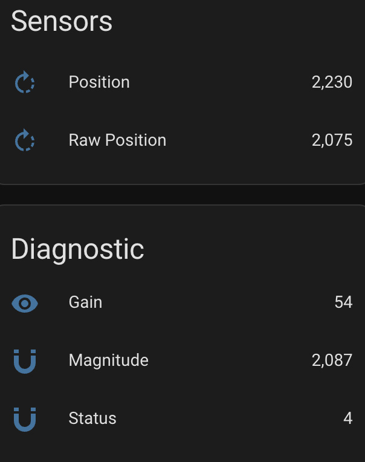
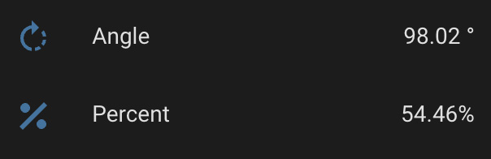

AS5600 12-Bit Magnetic Position Sensor
======================================

.. seo::
    :description: Instructions for setting up AS5600 magnetic position sensor / encoder.
    :image: as5600.jpg
    :keywords: AS5600 AS5600L

.. _as5600-component:

Component/Hub
-------------

The ``as5600`` sensor platform you to use your AS5600 (`datasheet <https://ams.com/documents/20143/36005/AS5600_DS000365_5-00.pdf/649ee61c-8f9a-20df-9e10-43173a3eb323>`__,
`AMS <https://ams.com/en/as5600>`__) or AS5600L (`datasheet <https://ams.com/documents/20143/36005/AS5600L_DS000545_3-00.pdf/7ade6878-7a32-2294-b88d-479d50fab6de>`__,
`AMS <https://ams.com/en/as5600l>`__) 12-bit magnetic position sensor with ESPHome. Individual sensors will be added
using the :ref:`AS5600 Sensor Platform <as5600-sensor>`. To use this hub, first setup
the :ref:`I²C Bus <i2c>` and connect the sensor to the pins specified there.

    AS5600 12-Bit Magnetic Position Sensor.

.. _AMS_AS5600: https://ams.com/en/as5600

.. _AMS_AS5600L: https://ams.com/en/as5600l

.. code-block:: yaml

    as5600:
      dir_pin: GPIOXX
      start_position: 0deg
      range: 180deg

Configuration variables:
************************

- **dir_pin** (*Optional*, int): The pin connected to the AS5600's direction pin.
  See :ref:`Direction <as5600_direction>` for more information.
- **direction** (*Optional*, string): The direction that the magnet should rotate to increase values.
  Used in combination with the **dir_pin**.

  - ``clockwise`` (default)
  - ``counterclockwise``
- **start_position** (*Optional*, int): The raw position that should be considered the start (i.e. ``0``).
  See :ref:`Position / Range <as5600_position_range>`.
- **end_position** (*Optional*, int): The raw position that should be considered the end (e.g. 180deg)
  of the allowable rotation range. Mutually exclusive with **range**. See :ref:`Position / Range <as5600_position_range>`.
- **range** (*Optional*, int): The allowable rotation range from the **start_position**. Mutually
  exclusive with **end_position**. See :ref:`Position / Range <as5600_position_range>`.
- **hysteresis** (*Optional*, string): See datasheet.

  - ``none`` (default)
  - ``lsb1``
  - ``lsb2``
  - ``lsb3``

- **power_mode** (*Optional*, string): The power mode to run the sensor. Note: When **watchdog** is enabled,
  it will switch the device to ``low3`` when there is not much change in position.

  - ``nominal`` (default)
  - ``low1``
  - ``low2``
  - ``low3``

- **watchdog** (*Optional*, boolean): Whether to enable the watchdog that puts the the chip in to
  low power mode 3. Check the datasheet for more information.
  Defaults to ``off``.
- **slow_filter** (*Optional*, string): See datasheet.

  - ``16x`` (default)
  - ``8x``
  - ``4x``
  - ``2x``

- **fast_filter** (*Optional*, string): See datasheet.

  - ``none`` (default)
  - ``lsb6``
  - ``lsb7``
  - ``lsb9``
  - ``lsb18``
  - ``lsb21``
  - ``lsb24``
  - ``lsb10``

- **address** (*Optional*, int): The i²c address of the sensor.
  See :ref:`I²C Addresses <as5600_i2c_addresses>` for more information.
- **id** (*Optional*, :ref:`config-id`): Manually specify the ID for this AS5600 Hub.
- All other options for I²C devices described at :ref:`I²C Bus <i2c>`.

.. _as5600_direction:

Direction
---------

The AS5600 has ``direction`` pin that controls which rotation direction will cause the position value to **increase**.
This pin should be pulled low for clockwise, and pulled high for counterclockwise. If left floating, you are likely
to encounter erratic behavior.

If you would like the ESP controller to pull that pin high or low, you may configure the ``dir_pin`` and optionally, the
``direction`` option to have the ESP controller pull the pin high or low.

.. _as5600_position_range:

Position / Range
----------------

Position and range may be configured as one of the following:

- a value between ``-4095`` and ``4095``
- an angle between ``-360deg`` and ``360deg``
- a percentage between ``-100%`` and ``100%``

.. note::

    Negative position values will be normalized to their respective positive position (e.g. -90deg would translate to 270deg).

The AS5600 reports 2 position values. The value for both types of position values will always be a whole number between 0 and 4095.

A "raw" position value is not filtered, scaled, etc. So a value of `0` is always when the north end of the magnet is at the top of
the chip, 2048 is always when the north end of the magnet is as the bottom of the chip, etc.

The regular/scaled position is filtered and scaled based on the sensor configuration (e.g. ``start_position``, ``end_position``, ``range``, etc).
For example, let's say we have the following component config:

.. code-block:: yaml

    as5600:
      start_position: 90deg
      range: 180deg
      direction: clockwise
      dir_pin: GPIOXX

- If the magnet north was at the right side of the chip (i.e. 1024 / 90deg raw position), the scaled position would report a value of ``0``.
- If the magnet north was at the bottom of the chip (i.e. 2048 / 180deg raw position), the scaled position would report a value of ``2048``.
- If the magnet north was at the left of the chip (i.e. 3096 / 270deg raw position), the scaled position would report a value of ``4095``.
- If the magnet north was at the top of the chipe (i.e. 0 / 0deg raw position), the scaled position would be out of range (which also has
  it's own caveats discussed below).

.. note::

    You may specify an ``end_position`` that is less than the ``start_position``. When doing so, the allowable range will start at the
    ``start_position`` and continue through to the highest position value (i.e. ``4095``) and then continue from ``0`` until it reaches
    the ``end_position``.

.. warning::

    The datasheet calls out that the minimum angle that can be configured (start and end position, or start and range) it 18 degrees.
    Configuring anything less than that may yield un-expected results.

.. _as5600_i2c_addresses:

I²C Addresses
-------------

The AS5600 address is not configurable and must be ``0x36``. However, if using an AS5600L,
the default address should be ``0x40`` and it is configurable.

.. _as5600-sensor:

Sensor
------

The ``as5600`` sensor allows you to publish the angle/position measurement from your AS5600 with ESPHome.
First, setup an :ref:`AS5600 Hub <as5600-component>` for your AS5600 sensor and then use this
sensor platform to create individual sensors that will report the position to Home Assistant.

.. code-block:: yaml

    as5600:
      dir_pin: GPIOXX

    sensor:
      - platform: as5600
        name: Position
        raw_position:
            name: Raw Position
        gain:
            name: Gain
        magnitude:
            name: Magnitude
        status:
            name: Status

.. _as5600-sensor-config:

Configuration variables:
************************

- **out_of_range_mode** (*Optional*, string): How to treat out of range values. Only applicable if configured
  for a range less than 360 degrees. Defaults to ``min_max``. See :ref:`Out of Range Mode <as5600-out-of-range-mode>`.
- **as5600_id** (*Optional*, :ref:`config-id`): Manually specify the ID of the
  :ref:`AS5600 Hub <as5600-component>` you want to use this sensor.
- **update_interval** (*Optional*, :ref:`config-time`): The interval
  to check the sensor. Defaults to ``60s``.
- **raw_position** (*Optional*): Reports the raw (un-scaled, un-filtered) position of the magnet.

  - All other options from :ref:`Sensor <config-sensor>`.
- **gain** (*Optional*): Information about the automatic gain control. Typically for diagnostic purposes.
  The datasheet says this will be between 0-255 when powered by 5v and between 0-128 when powered by 3.3v.
  Ideally the value should be close to the middle of the respective range.

  - All other options from :ref:`Sensor <config-sensor>`.
- **magnitude** (*Optional*): Information about the detected magnitude. Typically for diagnostic purposes.
  The expected scale does not appear to be defined in the datasheet, however, AMS provides a
  `user guide <https://ams.com/documents/20143/36005/Position%20Sensors_UG000359_1-00.pdf/65a99825-c115-f2f0-9167-6efad8e27c20>`__
  which contains pictures that show it as a scale between ``0`` and ``3000``. Typically this value is seen somewhere
  in the neighborhood of ``2100`` for a well positioned magnet.

  - All other options from :ref:`Sensor <config-sensor>`.
- **status** (*Optional*): Information about the magnet status. Typically for diagnostic purposes.
  See :ref:`Magnet Status <as5600-magnet-status>`

  - All other options from :ref:`Sensor <config-sensor>`.
- All other options from :ref:`Sensor <config-sensor>`.

.. _as5600-out-of-range-mode:

Out of Range Mode
*****************

- ``min_max`` (default)
- ``nan``

When using a range less that 360deg, there would be a range of raw values that would be considered "out of range". By default (``min_max`` mode), the AS5600
splits that range in half and reports ``0`` while in the half of the "out-of-range" range closest to the ``start_position`` and it reports
``4095`` while in the half of the "out-of-range" range closest to the ``end_position`` / end of the ``range``. Alternatively, you may set to ``nan``
mode where the sensor will publish ``NAN`` (i.e. "Unknown") when the position falls outside the narrowed range.

.. _as5600-magnet-status:

Magnet Status
*************

The magnet status should report one of the following values:

- ``2`` indicates that no magnet was detected.
- ``4`` indicates that the magnet was detected and has good reading.
- ``5`` indicates that the magnet was detected, but is too strong. Measurements may appear to be stuck if the magnet is too strong.
- ``6`` indicates that the magnet was detected, but is too weak. Measurements may still be possible in this state.

.. _as5600-converting-position:

Converting Position
*******************

You may desire the position to be converted from the native ``0`` thru ``4095`` to degrees, or perhaps a percentage of the allowable range.
Here are some examples to make that happen:

.. code-block:: yaml

    as5600:
      id: my_as5600
    sensor:
      - platform: as5600
        update_interval: 1s
        name: Angle
        unit_of_measurement: '°'
        accuracy_decimals: 2
        icon: mdi:rotate-right
        filters:
          - delta: 1
          - lambda: 'return x * as5600::RAW_TO_DEGREES * id(my_as5600).get_range_scale();'

.. code-block:: yaml

    as5600:
      id: my_as5600
    sensor:
      - platform: as5600
        update_interval: 1s
        name: Percent
        unit_of_measurement: '%'
        accuracy_decimals: 2
        icon: mdi:rotate-right
        filters:
          - delta: 1
          - lambda: 'return (x / as5600::POSITION_COUNT) * 100;'

See Also
--------

- :ref:`i2c`
- :ref:`sensor-filters`
- :apiref:`as5600/as5600.h`
- :ghedit:`Edit`
