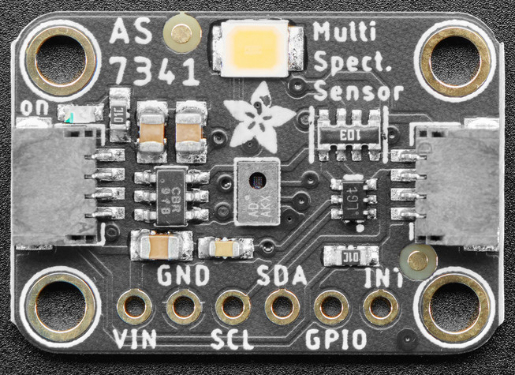

AS7341 Spectral Color Sensor
============================

.. seo::
    :description: Instructions for setting up AS7341 spectral color sensor.
    :image: as7341.jpg
    :keywords: AS7341

The ``as7341`` sensor platform allows you to use your AS7341 spectral color sensor
(`datasheet <https://ams.com/documents/20143/36005/AS7341_DS000504_3-00.pdf/5eca1f59-46e2-6fc5-daf5-d71ad90c9b2b>`__,
`Adafruit`_) with ESPHome. The :ref:`I²C Bus <i2c>` is required to be set up in
your configuration for this sensor to work.

    AS7341 Spectral Color Sensor

.. _Adafruit: https://www.adafruit.com/product/4698

.. code-block:: yaml

    # Example configuration entry
    sensor:
    - platform: as7341
      f1:
        name: "415nm"
      f2:
        name: "445nm"
      f3:
        name: "480nm"
      f4:
        name: "515nm"
      f5:
        name: "555nm"
      f6:
        name: "590nm"
      f7:
        name: "630nm"
      f8:
        name: "680nm"
      clear:
        name: "Clear"
      nir:
        name: "NIR"

Configuration variables
-----------------------

- **f1** (*Optional*): The reading for the 415nm channel. All options from :ref:`Sensor <config-sensor>`.
- **f2** (*Optional*): The reading for the 445nm channel. All options from :ref:`Sensor <config-sensor>`.
- **f3** (*Optional*): The reading for the 480nm channel. All options from :ref:`Sensor <config-sensor>`.
- **f4** (*Optional*): The reading for the 515nm channel. All options from :ref:`Sensor <config-sensor>`.
- **f5** (*Optional*): The reading for the 555nm channel. All options from :ref:`Sensor <config-sensor>`.
- **f6** (*Optional*): The reading for the 590nm channel. All options from :ref:`Sensor <config-sensor>`.
- **f7** (*Optional*): The reading for the 630nm channel. All options from :ref:`Sensor <config-sensor>`.
- **f8** (*Optional*): The reading for the 680nm channel. All options from :ref:`Sensor <config-sensor>`.
- **clear** (*Optional*): The reading for the clear channel. All options from :ref:`Sensor <config-sensor>`.
- **nir** (*Optional*): The reading for the NIR (near-infrared) channel. All options from :ref:`Sensor <config-sensor>`.
- **gain** (*Optional*): The gain used by the device. A higher gain may be more suitable for lower-light environments. Must be one of:

  - ``X0.5``
  - ``X1``
  - ``X2``
  - ``X4``
  - ``X8`` (*default*)
  - ``X16``
  - ``X32``
  - ``X64``
  - ``X128``
  - ``X256``
  - ``X512``

- **astep** (*Optional*): The number of integration steps. Default is ``599``. Must be between ``0`` and ``65534``.
- **atime** (*Optional*): The integration time per step in increments of 2.78µs. Default is ``29``. Must be between ``0`` and ``255``.
- All other options for I²C devices described at :ref:`I²C Bus <i2c>`.

Integration time
----------------

The integration time determines how long a channel measurement takes and depends on ``ATIME`` and ``ASTEP``. The formula for the total integration time is:

.. math::

    \text{t} = \text{(ATIME + 1)} \times \text{(ASTEP + 1)} \times \text{2.78µS}

See Also
--------

- :ref:`sensor-filters`
- `Adafruit_AS7341 <https://github.com/adafruit/Adafruit_AS7341>`__
- `SparkFun_AS7341X_Arduino_Library <https://github.com/sparkfun/SparkFun_AS7341X_Arduino_Library>`__
- :apiref:`as7341/as7341.h`
- :ghedit:`Edit`
