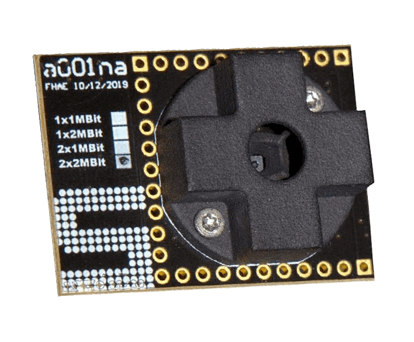
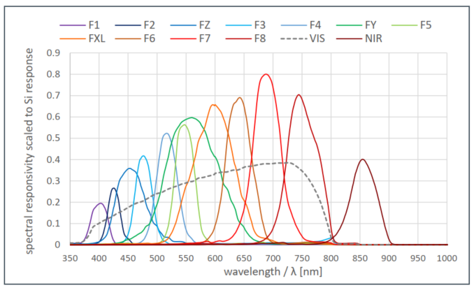

AS7343 Spectral Color Sensor
============================

.. seo::
    :description: Instructions for setting up AS7343 spectral color sensor.
    :image: as7343.jpg
    :keywords: AS7343

The ``as7343`` sensor platform allows you to use your AS7343 spectral color sensor
with ESPHome. The :ref:`I²C Bus <i2c>` is required to be set up in your configuration 
for this sensor to work.

    AS7343 Spectral Color Sensor

    AS7343 Sensor Spectral Response

Simple Configuration
---------------------

.. code-block:: yaml

    # Example configuration entry
    sensor:
      - platform: as7343
        f1: 405nm
        f2: 425nm
        fz: 450nm
        f3: 475nm
        f4: 515nm
        fy: 555nm
        f5: 550nm
        fxl: 600nm
        f6: 640nm
        f7: 690nm
        f8: 745nm
        nir: 855nm
        clear: Clear

Configuration variables
-----------------------
- **gain** (*Optional*): The gain used by the device. A higher gain may be more suitable for lower-light environments. Must be one of:

  - ``X0.5``
  - ``X1``
  - ``X2``
  - ``X4``
  - ``X8`` (*default*)
  - ``X16``
  - ``X32``
  - ``X64``
  - ``X128``
  - ``X256``
  - ``X512``

- **astep** (*Optional*): The number of integration steps. Default is ``599``. Must be between ``0`` and ``65534``.
- **atime** (*Optional*): The integration time per step in increments of 2.78µs. Default is ``29``. Must be between ``0`` and ``255``.
- All other options for I²C devices described at :ref:`I²C Bus <i2c>`. Defaul I²C address of the sensor is ``0x39``.

Sensors
^^^^^^^
Device offers number of sensors for different wavelengths. Any subset of these sensors can be used. 

- **f1** (*Optional*): The reading for the 405nm channel.
- **f2** (*Optional*): The reading for the 425nm channel.
- **fz** (*Optional*): The reading for the 450nm channel.
- **f3** (*Optional*): The reading for the 475nm channel.
- **f4** (*Optional*): The reading for the 515nm channel.
- **fy** (*Optional*): The reading for the 555nm channel.
- **f5** (*Optional*): The reading for the 550nm channel.
- **fxl** (*Optional*): The reading for the 600nm channel.
- **f6** (*Optional*): The reading for the 640nm channel.
- **f7** (*Optional*): The reading for the 690nm channel.
- **f8** (*Optional*): The reading for the 745nm channel.
- **nir** (*Optional*): The reading for the 855nm channel.
- **clear** (*Optional*): The reading for the Clear channel.

Sensors can be put into configuration yaml in shorthand form as shown in the example above.
However, if you need to configure other options like filters or others from 
:ref:`Sensor <config-sensor>` you might use the long form:

.. code-block:: yaml

    # Example configuration entry  - long form
    sensor:
      - platform: as7343
        f1: 
          name: 405nm
          # other standard Sensor options go here, 
          # like `filters` for example:
          filters: 
          # ....

Integration time
----------------

The integration time determines how long a channel measurement takes and depends on ``ATIME`` and ``ASTEP``. The formula for the total integration time is:

.. math::

    \text{t} = \text{(ATIME + 1)} \times \text{(ASTEP + 1)} \times \text{2.78µS}

See Also
--------

- :ref:`sensor-filters`
- `Adafruit_AS7343 <https://github.com/adafruit/Adafruit_AS7343>`__
- `SparkFun_AS7343X_Arduino_Library <https://github.com/sparkfun/SparkFun_AS7343X_Arduino_Library>`__
- :apiref:`as7343/as7343.h`
- :ghedit:`Edit`
