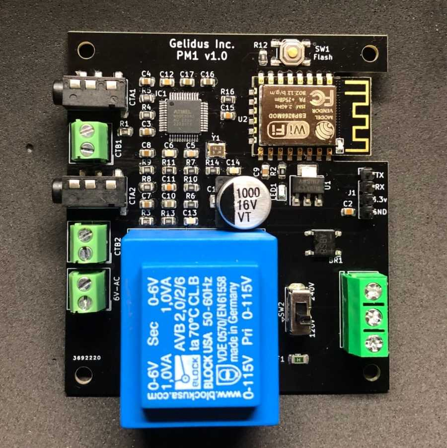

Gelidus PM1 Power Sensor
========================

.. seo::
    :description: Guide for setting up the Gelidus Research PM1 ATM90E32 based power metering sensor.
    :image: atm90e32-pm1.jpg
    :keywords: ATM90E32, Gelidus Research, Split Single Phase Power Meter, WIFI, Mains

The PM1 board integrates an ESP12F WIFI module and is powered via AC Mains using an integrated isolation transformer.

The PM1 uses the ATM90E32 IC and is configured to measure single split phase AC lines and up to 2 AC voltages.
The default configuration isolates a single AC voltage to the chip. An optional AC isolation transfomer
can be used to monitor both AC line voltages.

The (`Gelidus Split Single Phase Power Meter <https://www.gelidus.ca/product/esphome-power-meter-1/>`__) is ideal for most home power distributions in North America.

    Gelidus Research Split Single Phase Power Meter.

Calibration
-----------

This sensor is pre calibrated for the SCT013-100-50ma current transformers and the integrated AC mains isolation transformer.
Note: The PM1 and two 100A/50ma SCT013's fit well for any 200A service.

Current
^^^^^^^

Current calibration for the **Split Single Phase Energy Meter** using **gain_pga** at ``2X``:
   - 100A/50mA SCT-013:

If you obtained a 100A/50mA SCT-013 from Gelidus Research the CT will be marked with a PM1 tested calibration value.
A typical current_cal for the 100A/50ma SCT013 is ~14480.

There are some variables in the manufacturing of CT's, if the highest level precision is desired then the current should be calculated
and adjusted and the use of an option AC line transfomer is nessesary.

Formula: Amps Measured / Amps Reported * current_cal value in the running yaml file = adjusted value to use. 
This also applies to AC voltages, however it should not be required.

Active Energy
^^^^^^^^^^^^^

The ATM90E32 chip has a high-precision built-in ability to count the amount of consumed energy on a per-current transformer basis.
For each current transformer both the Forward and Reverse active energy is counted in watt-hours.
Forward Active Energy is used to count consumed energy, whereas Reverse Active Energy is used to count exported energy
(e.g. with solar pv installations).
The counters are reset every time a given active energy value is read from the ATM90E32 chip.

**Example:**

.. code-block:: yaml

    sensor:
      - platform: atm90e32
        cs_pin: 5
        phase_a:
          forward_active_energy:
            name: ${disp_name} ct1 FAWattHours
            id: ct1FAWattHours
            state_topic: ${disp_name}/ct1/forward_active_energy
          reverse_active_energy:
            name: ${disp_name} ct1 RAWattHours
            id: ct1RAWattHours
            state_topic: ${disp_name}/ct1/reverse_active_energy

Default config
-------------------

.. code-block:: yaml

  web_server:
    port: 80

  spi:
    clk_pin: 14
    miso_pin: 12
    mosi_pin: 13

  substitutions:
  # Change the disp_name to something you want
    disp_name: PM1
  # Interval of how often the power is updated
    update_time: 15s
  # Current transformer calibrations:
  # 100A/50mA SCT-013: 14480
    current_cal: '14480'
  # Integrated isolation transformer voltage calibration
    voltage_cal: '4425'

  sensor:

    - platform: wifi_signal
      name: ${disp_name} WiFi Signal
      update_interval: 15s

    - platform: atm90e32
      cs_pin: 5
      phase_a:
        voltage:
          name: ${disp_name} Volts
          accuracy_decimals: 1
        current:
          name: ${disp_name} CT1 Amps
          id: "ct1Amps"
        power:
          name: ${disp_name} CT1 Watts
          accuracy_decimals: 1
          id: "ct1Watts"
        gain_voltage: ${voltage_cal}
        gain_ct: ${current_cal}
      phase_c:
        current:
          name: ${disp_name} CT2 Amps
          id: "ct2Amps"
        power:
          name: ${disp_name} CT2 Watts
          accuracy_decimals: 1
          id: "ct2Watts"
        gain_voltage: ${voltage_cal}
        gain_ct: ${current_cal}
      frequency:
        name: ${disp_name} Freq
      line_frequency: 60Hz
      gain_pga: 2x
      chip_temperature:
        name: ${disp_name} IC Temperature
      update_interval: ${update_time}
    - platform: template
      name: ${disp_name} Total Amps
      id: "totalAmps"
      lambda: return id(ct1Amps).state + id(ct2Amps).state;
      accuracy_decimals: 2
      unit_of_measurement: A
      update_interval: ${update_time}
      device_class: current
    - platform: template
      name: ${disp_name} Total Watts
      id: "totalWatts"
      lambda: return id(ct1Watts).state + id(ct2Watts).state;
      accuracy_decimals: 0
      unit_of_measurement: W
      device_class: power
      update_interval: ${update_time}

    - platform: total_daily_energy
      name: ${disp_name} Total kWh
      power_id: totalWatts
      filters:
        - multiply: 0.001
      unit_of_measurement: kWh
      device_class: energy
      state_class: total_increasing
  time:
    - platform: sntp
      id: sntp_time
      servers: pool.ntp.org

  switch:
    - platform: restart
      name: ${disp_name} Restart

See Also
--------

- :ref:`sensor-filters`
- :apiref:`atm90e32/atm90e32.h`
- :ghedit:`Edit`
