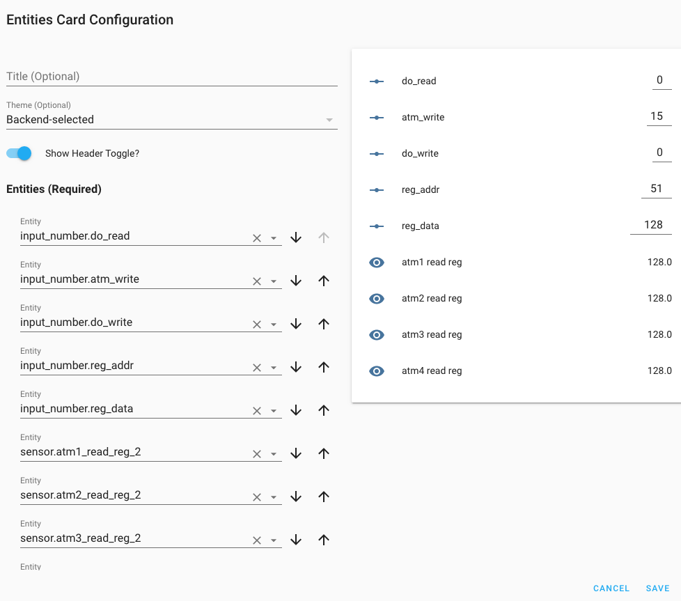

ATM90E32 Power Sensor
=====================

.. seo::
    :description: Instructions for setting up ATM90E32 energy metering sensors
    :image: atm90e32.png
    :keywords: ATM90E32, CircuitSetup, Split Single Phase Real Time Whole House Energy Meter, Expandable 6 Channel ESP32 Energy Meter Main Board

The ``atm90e32`` sensor platform allows you to use your ATM90E32 voltage/current and power sensors
(`datasheet <http://ww1.microchip.com/downloads/en/devicedoc/Atmel-46003-SE-M90E32AS-Datasheet.pdf>`__) sensors with
ESPHome. This sensor is commonly found in CircuitSetup 2 and 6 channel energy meters.

Communication with the device is done via an :ref:`SPI bus <spi>`, so you need to have an ``spi:`` entry in your configuration
with both ``mosi_pin`` and ``miso_pin`` set.

The atm90e32 IC can measure up to three AC voltages although typically only one
voltage measurement would be used for the mains electricity phase of a
household. Three current measurements are read via CT clamps.

The `CircuitSetup 2-Channel Energy Monitor <https://circuitsetup.us/index.php/product/split-single-phase-real-time-whole-house-energy-meter-v1-2/>`__ can read 2 current channels and one voltage channel.

.. figure:: images/atm90e32-cs-2chan-full.jpg
    :align: center
    :width: 50.0%

    CircuitSetup Split Single Phase Real Time Whole House Energy Meter.

The `CircuitSetup 6-Channel Energy Monitor <https://circuitsetup.us/index.php/product/expandable-6-channel-esp32-energy-meter/>`__ can read 6 current channels and 2 voltage channels at a time, this board has two atm90e32 ICs and requires two sensors to be configured in ESPHome.

.. figure:: images/atm90e32-cs-6chan-full.jpg
    :align: center
    :width: 50.0%

    CircuitSetup Expandable 6 Channel ESP32 Energy Meter Main Board.

.. code-block:: yaml

    # Example configuration entry
    spi:
      clk_pin: 18
      miso_pin: 19
      mosi_pin: 23

    sensor:
      - platform: atm90e32
        cs_pin: 5
	write:
        phase_a:
          voltage:
            name: "EMON Line Voltage A"
          current:
            name: "EMON CT1 Current"
          power:
            name: "EMON Active Power CT1"
          gain_voltage: 41820
          gain_ct: 25498
        phase_b:
          current:
            name: "EMON CT2 Current"
          power:
            name: "EMON Active Power CT2"
          gain_voltage: 41820
          gain_ct: 25498
        frequency:
          name: "EMON Line Frequency"
        line_frequency: 50Hz
        gain_pga: 2X
        update_interval: 60s

Configuration variables:
------------------------

- **cs_pin** (**Required**, :ref:`Pin Schema <config-pin_schema>`): The pin CS is connected to.
- **line_frequency** (**Required**, string): The AC line frequency of the supply voltage. One of ``50Hz``, ``60Hz``.
- **phase_a** (*Optional*): The configuration options for the 1st phase.

  - **voltage** (*Optional*): Use the voltage value of this phase in V (RMS).
    All options from :ref:`Sensor <config-sensor>`.
  - **current** (*Optional*): Use the current value of this phase in amperes. All options from
    :ref:`Sensor <config-sensor>`.
  - **power** (*Optional*): Use the power value on this phase in watts. All options from
    :ref:`Sensor <config-sensor>`.
  - **gain_voltage** (*Optional*, int): Voltage gain to scale the low voltage AC power pack to household mains feed.
    Defaults to ``41820``.
  - **gain_ct** (*Optional*, int): CT clamp calibration for this phase.
    Defaults to ``25498``.

- **phase_b** (*Optional*): The configuration options for the 2nd phase. Same options as 1st phase.
- **phase_c** (*Optional*): The configuration options for the 3rd phase. Same options as 1st phase.
- **gain_pga** (*Optional*, string): The gain for the CT clamp, ``2X`` for 100A, ``4X`` for 100A - 200A. One of ``1X``, ``2X``, ``4X``.
  Defaults to ``2X`` which is suitable for the popular SCT-013-000 clamp.
- **update_interval** (*Optional*, :ref:`config-time`): The interval to check the sensor. Defaults to ``60s``.
- **spi_id** (*Optional*, :ref:`config-id`): Manually specify the ID of the :ref:`SPI Component <spi>` if you want
  to use multiple SPI buses.
- **write** (*Optional*): Addition register writes to Atm90e32 registers during setup (becarefull read the datasheet). Followed by one or more addr/data pairs. This option to used to access advantage feature or to debug.
  - **addr** (**Required** with **write**, int): address of register. Note that yaml integers can be writing in hexidecimal form starting with 0x.
  - **data** (**Required** with **write**, int): data to write to register. Note that yaml integers can be writing in hexidecimal form starting with 0x.

Calibration
-----------

This sensor needs calibration to show correct values. The default gain configuration is set to use the `SCT-013-000 <https://amzn.to/2E0KVvo>`__
current transformers, and the `Jameco Reliapro 9v AC transformer <https://amzn.to/2XcWJjI>`__. 
A load which uses a known amount of current can be used to calibrate. For for a more accurate calibration use a
`Kill-A-Watt <https://amzn.to/2TXT7jx>`__ meter or similar, mains voltages can fluctuate depending on grid load.

Voltage
^^^^^^^

Use the expected mains voltage for your region 110V/230V or plug in the Kill-A-Watt and select voltage. See what 
value the ATM90E32 sensor reports for voltage. To adjust the sensor use the calculation:

``New gain_voltage = (your voltage reading / ESPHome voltage reading) * existing gain_voltage value``

Update **gain_voltage** for all phases in your ESPHome yaml, recompile and upload. Repeat as necessary.

Current
^^^^^^^

Switch on the current load and see what value the ATM90E32 sensor reports for
current on the selected phase. Using the known or measured current adjust the
sensor using calculation:

``New gain_ct = (your current reading / ESPHome current reading) * existing gain_ct value``

Update **gain_ct** for the phase in your ESPHome yaml, recompile and upload. Repeat as necessary.

It is possible that the two identical CT current sensors will have different
**gain_ct** numbers due to variances in manufacturing although it will be
small. The current calibration can be done once and used on all sensors or
repeated for each one.

Additional Examples
-------------------

.. code-block:: yaml

    # Example CircuitSetup 6-channel entry
    spi:
      clk_pin: 18
      miso_pin: 19
      mosi_pin: 23
    sensor:
      - platform: atm90e32
        cs_pin: 5
        phase_a:
          voltage:
            name: "EMON Line Voltage A"
          current:
            name: "EMON CT1 Current"
          power:
            name: "EMON Active Power CT1"
          gain_voltage: 47660
          gain_ct: 12577
        phase_b:
          current:
            name: "EMON CT2 Current"
          power:
            name: "EMON Active Power CT2"
          gain_voltage: 47660
          gain_ct: 12577
        phase_c:
          current:
            name: "EMON CT3 Current"
          power:
            name: "EMON Active Power CT3"
          gain_voltage: 47660
          gain_ct: 12577
        frequency:
          name: "EMON Line Frequency"
        line_frequency: 50Hz
        gain_pga: 2X
        update_interval: 60s
      - platform: atm90e32
        cs_pin: 4
        phase_a:
          current:
            name: "EMON CT4 Current"
          power:
            name: "EMON Active Power CT4"
          gain_voltage: 47660
          gain_ct: 12577
        phase_b:
          current:
            name: "EMON CT5 Current"
          power:
            name: "EMON Active Power CT5"
          gain_voltage: 47660
          gain_ct: 12577
        phase_c:
          current:
            name: "EMON CT6 Current"
          power:
            name: "EMON Active Power CT6"
          gain_voltage: 47660
          gain_ct: 12577
        line_frequency: 50Hz
        gain_pga: 2X
        update_interval: 60s

Register Write for Setup
------------------------

The setup for this may not work for everyone/ever country, or you may want to fine tune calibration, so if you can understand the datasheet for the atm90e32 you have the ability to admend the default setup.  It's unlikely you can destroy the device, but playing with internal setup registers may have undesired effects.

.. code-block:: yaml

    # Example configuration entry with register overrides
    sensor:
      - platform: atm90e32
        cs_pin: 5
	write:
        # set input mux to all use the same voltage, no need to bridge jumpers
        - addr: 0x02
          data: 0x0444
	# set internal 50Hz,3P4W,sum all phases.  This will overwite line_frequency
        - addr: 0x33
          data: 0x087

For debugging
------------
Getting into the depths of this component, it is possible to create a register read and write interface with Home Assistant. One technique follows.
In Home Assistance config add the following input_number:

.. code-block:: yaml
input_number:
  do_read:
    name: do_read
    initial: 0
    min: 0
    max: 1
    mode: box
  reg_addr:
    name: reg_addr
    initial: 0
    min: 0
    max: 0xFF
    mode: box
  do_write:
    name: do_write
    initial: 0
    min: 0
    max: 1
    mode: box
  atm_write:
    name: atm_write
    initial: 0
    min: 0
    max: 0xF
    mode: box
  reg_data:
    name: reg_data
    initial: 0
    min: 0
    max: 0xFFFF
    step: 1
    mode: box

- **reg_addr** address for register access
- **reg_data** data for register writes
- **atm_write** bit mask for with atm90e32 is written. All 0xF with write 4 platform, 0x1 with only write the first one.
- **do_read** do the read of **reg_addr**
- **do_write** do the write of **reg_addr** with **reg_data** to all atm90e32 selected in **atm_write**

The following code is added to esphome yaml configuration for this device

.. code-block:: yaml
   # register eddress for reading or writing
  - platform:  homeassistant
    name: Read Address
    entity_id: input_number.reg_addr
    id: rr_addr
   # data to write
  - platform:  homeassistant
    name: Write Data
    entity_id: input_number.reg_data
    id: wr_data
    # bit wise number to select atm90e32
  - platform:  homeassistant
    name: ATM Sel
    entity_id: input_number.atm_write
    id: wr_atm

    # flag to do read when set to 1
  - platform:  homeassistant
    name: Read
    entity_id: input_number.do_read
    id: rr_do
    on_value_range:
      above: 0.5
      then:
        # reset flag so only read once
      - homeassistant.service:
          service: input_number.set_value 
          data:
            entity_id: input_number.do_read
            value: '0'
            # call the read function for each atm90 and set a local sensor to the return vale
      - lambda: |-
          atm90e32::ATM90E32Component *comp[4] = {id(atm1),id(atm2),id(atm3),id(atm4)};
          template_::TemplateSensor *rr[4] = {id(atm1rr),id(atm2rr),id(atm3rr),id(atm4rr)}; ;
          int addr;
          int data;
          addr = id(rr_addr).state;
          ESP_LOGI("main", "rr_do The address is 0x%x (%d)", addr, addr);
          for( auto i = 0; i < 4; i++ ) {
             data = id(comp[i]).read16(addr);
             ESP_LOGI("main","atm%d 0x%04x %d",i+1, data, data);
             id(rr[i]).publish_state(data);
          }

    # flag to do write when set to 1
  - platform:  homeassistant
    name: write
    entity_id: input_number.do_write
    id: wr_do
    on_value_range:
      above: 0.5
      then:
        # reset flag so only read once
      - homeassistant.service:
          service: input_number.set_value 
          data:
            entity_id: input_number.do_write
            value: '0'
            # call the write function for each atm90 with a set bit in the wr_atm state
            # enable/disable configuration before/after the write
      - lambda: |-
          atm90e32::ATM90E32Component *comp[4] = {id(atm1),id(atm2),id(atm3),id(atm4)};
          int addr;
          int data;
          int atms;
          addr = id(rr_addr).state;
          data = id(wr_data).state;
          atms = id(wr_atm).state;
          ESP_LOGI("main", "wr_do data 0x%x to address is 0x%x (%d) of atms 0x%x", data, addr, addr, atms);
          for( auto i = 0; i < 4; i++ ) {
             if (atms & (1<<i)) {
               id(comp[i]).write16(0x7F,0x55AA);
               id(comp[i]).write16(addr,data);
               id(comp[i]).write16(0x7F,0);
               data = id(comp[i]).read16(addr);
               ESP_LOGI("main","atm%d 0x%04x",i+1,data);
             }
          }
  - platform:  template
    name: atm1 read reg
    id: atm1rr
  - platform:  template
    name: atm2 read reg
    id: atm2rr
  - platform:  template
    name: atm3 read reg
    id: atm3rr
  - platform:  template
    name: atm4 read reg
    id: atm4rr

The above setup is for a 12-Channel system, 2 6-Channel boards (one main, one extention), so the system has 4 atm90e32 platforms with ids atm1,atm2,atm3,atm4.

This access is done through home assistance with following pannel

It could be improve with a better lovelace interface to handle integers as hexidecimal numbers

See Also
--------

- :ref:`sensor-filters`
- :apiref:`atm90e32/atm90e32.h`
- :ghedit:`Edit`
