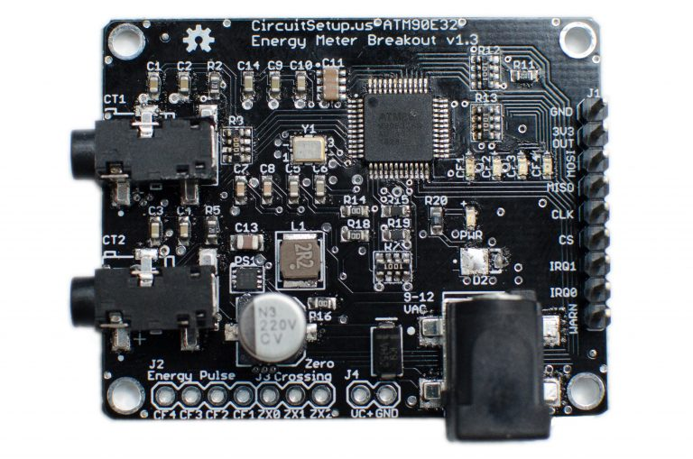
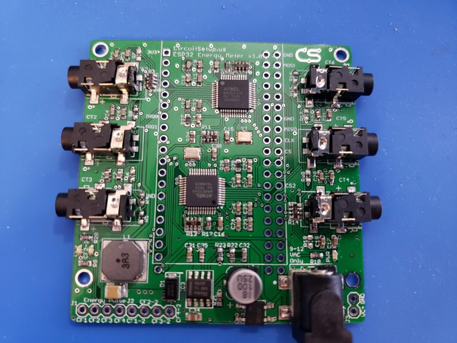

ATM90E32 Power Sensor
=====================

.. seo::
    :description: Instructions for setting up ATM90E32 energy metering sensors
    :image: atm90e32.png
    :keywords: ATM90E32, CircuitSetup, Split Single Phase Real Time Whole House Energy Meter, Expandable 6 Channel ESP32 Energy Meter Main Board

The ``atm90e32`` sensor platform allows you to use your ATM90E32 voltage/current and power sensors
(`datasheet <http://ww1.microchip.com/downloads/en/devicedoc/Atmel-46003-SE-M90E32AS-Datasheet.pdf>`__) with
ESPHome. This sensor is commonly found in CircuitSetup 2 and 6 channel energy meters.

Communication with the device is done via an :ref:`SPI bus <spi>`, so you need to have an ``spi:`` entry in your configuration
with both ``mosi_pin`` and ``miso_pin`` set.

The ATM90E32 IC can measure up to three AC voltages although typically only one
voltage measurement would be used for the mains electricity phase of a
household. Three current measurements are read via CT clamps.

The `CircuitSetup Split Single Phase Energy Meter <https://circuitsetup.us/index.php/product/split-single-phase-real-time-whole-house-energy-meter-v1-2/>`__ can read 2 current channels and 1 (expandable to 2) voltage channel.

    CircuitSetup Split Single Phase Real Time Whole House Energy Meter.

The `CircuitSetup 6-Channel Energy Monitor <https://circuitsetup.us/index.php/product/expandable-6-channel-esp32-energy-meter/>`__ can read 6 current channels and 2 voltage channels at a time, this board has two ATM90E32 ICs and requires two sensors to be configured in ESPHome.

    CircuitSetup Expandable 6 Channel ESP32 Energy Meter Main Board.

Configuration variables:
------------------------

- **cs_pin** (**Required**, :ref:`Pin Schema <config-pin_schema>`): The pin CS is connected to. For the 6 channel meter main board, this will always be 5 and 4. For the add-on boards a jumper can be selected for each CS pin, but default to 0 and 16.
- **line_frequency** (**Required**, string): The AC line frequency of the supply voltage. One of ``50Hz``, ``60Hz``.
- **phase_a** (*Optional*): The configuration options for the 1st phase.

  - **voltage** (*Optional*): Use the voltage value of this phase in V (RMS).
    All options from :ref:`Sensor <config-sensor>`.
  - **current** (*Optional*): Use the current value of this phase in amperes. All options from
    :ref:`Sensor <config-sensor>`.
  - **power** (*Optional*): Use the power value on this phase in watts. All options from
    :ref:`Sensor <config-sensor>`.
  - **reactive_power** (*Optional*): Use the reactive power value on this phase. All options from
    :ref:`Sensor <config-sensor>`.
  - **power_factor** (*Optional*): Use the power factor value on this phase. All options from
    :ref:`Sensor <config-sensor>`.
  - **gain_voltage** (*Optional*, int): Voltage gain to scale the low voltage AC power pack to household mains feed.
    Defaults to ``7305``.
  - **gain_ct** (*Optional*, int): CT clamp calibration for this phase.
    Defaults to ``27961``.
  - **forward_active_energy** (*Optional*): Use the forward active energy value on this phase in watt-hours.
    All options from :ref:`Sensor <config-sensor>`.
  - **reverse_active_energy** (*Optional*): Use the reverse active energy value on this phase in watt-hours.
    All options from :ref:`Sensor <config-sensor>`.

- **phase_b** (*Optional*): The configuration options for the 2nd phase. Same options as 1st phase.
- **phase_c** (*Optional*): The configuration options for the 3rd phase. Same options as 1st phase.
- **frequency** (*Optional*): Use the frequenycy value calculated by the meter. All options from
  :ref:`Sensor <config-sensor>`.
- **chip_temperature** (*Optional*): Use the chip temperature value. All options from
  :ref:`Sensor <config-sensor>`.
- **gain_pga** (*Optional*, string): The gain for the CT clamp, ``2X`` for 100A, ``4X`` for 100A - 200A. One of ``1X``, ``2X``, ``4X``.
  Defaults to ``2X`` which is suitable for the popular SCT-013-000 clamp.
- **current_phases** (*Optional*): The number of phases the meter has, ``2`` or, ``3``
  The 6 Channel Expandable Energy Meter should be set to ``3``, and the Split Single Phase meter should be set to ``2``. Defaults to ``3``.
- **update_interval** (*Optional*, :ref:`config-time`): The interval to check the sensor. Defaults to ``60s``.
- **spi_id** (*Optional*, :ref:`config-id`): Manually specify the ID of the :ref:`SPI Component <spi>` if you want
  to use multiple SPI buses.

Calibration
-----------

This sensor needs calibration to show correct values. The default gain configuration is set to use the `SCT-013-000 <https://amzn.to/2E0KVvo>`__
current transformers, and the `Jameco Reliapro 9v AC transformer <https://amzn.to/2XcWJjI>`__.
A load which uses a known amount of current can be used to calibrate. For for a more accurate calibration use a
`Kill-A-Watt <https://amzn.to/2TXT7jx>`__ meter or similar, mains voltages can fluctuate depending on grid load.

Voltage
^^^^^^^

Use the expected mains voltage for your region 110V/230V or plug in the Kill-A-Watt and select voltage. See what
value the ATM90E32 sensor reports for voltage. To adjust the sensor use the calculation:

``New gain_voltage = (your voltage reading / ESPHome voltage reading) * existing gain_voltage value``

Update **gain_voltage** for all phases in your ESPHome yaml, recompile and upload. Repeat as necessary.

Here are common voltage calibrations for the **Split Single Energy Meter**:
   For meter <= v1.3:
      - 42080 - 9v AC Transformer - Jameco 112336
      - 32428 - 12v AC Transformer - Jameco 167151
   For meter > v1.4:
      - 37106 - 9v AC Transformer - Jameco 157041
      - 38302 - 9v AC Transformer - Jameco 112336
      - 29462 - 12v AC Transformer - Jameco 167151
   For Meters >= v1.4 rev.3
      - 3920 - 9v AC Transformer - Jameco 157041

Here are common voltage calibrations for the **Expandable 6 Channel Energy Meter**:
   For meter <= v1.2:
      - 42080 - 9v AC Transformer - Jameco 112336
      - 32428 - 12v AC Transformer - Jameco 167151
   For meter > v1.3:
      - 7305 - 9v AC Transformer - Jameco 157041

Current
^^^^^^^

Switch on the current load and see what value the ATM90E32 sensor reports for
current on the selected phase. Using the known or measured current adjust the
sensor using calculation:

``New gain_ct = (your current reading / ESPHome current reading) * existing gain_ct value``

Update **gain_ct** for the phase in your ESPHome yaml, recompile and upload. Repeat as necessary.

It is possible that the two identical CT current sensors will have different
**gain_ct** numbers due to variances in manufacturing, although it will be
small. The current calibration can be done once and used on all sensors or
repeated for each one.

Here are common current calibration values for the **Split Single Phase Energy Meter** when **gain_pga** is set to ``2X``:
   - 20A/25mA SCT-006: 10170
   - 100A/50mA SCT-013-000: 25498
   - 120A/40mA SCT-016: 39473
   - Magnalab 100A: 46539

Here are common current calibrations for the **Expandable 6 Channel Energy Meter** when **gain_pga** is set to ``1X``:
   - 20A/25mA SCT-006: 11131
   - 30A/1V SCT-013-030: 8650
   - 50A/1V SCT-013-050: 15420
   - 80A/26.6mA SCT-010: 41996
   - 100A/50ma SCT-013-000: 27961
   - 120A/40mA: SCT-016: 41880
   
Data in the Home Assistant Energy Dashboard
^^^^^^^^^^^^^^^^^^^^^^^^^^^^^^^^^^^^^^^^^^^

To display data in the Home Assistant Energy Dashboard you must be using ESPHome v1.20.4 or higher, and have at least one 
``total_daily_energy`` platform configured in your ESPHome config. See config examples below.

Once the kWh platform is configured in ESPHome, you will be able to select it under **Configureation > Energy** in Home Assistant.

Active Energy
^^^^^^^^^^^^^

The ATM90E32 chip has a high-precision built-in ability to count the amount of consumed energy on a per-phase basis.
For each phase both the Forward and Reverse active energy is counted in watt-hours.
Forward Active Energy is used to count consumed energy, whereas Reverse Active Energy is used to count exported energy
(e.g. with solar pv installations).
The counters are reset every time a given active energy value is read from the ATM90E32 chip.

Current implementation targets users who retrieve the energy values with a regular interval and store them in
a time-series-database, e.g. InfluxDB.

**Example:**

.. code-block:: yaml

    sensor:
    #IC1 Main
      - platform: atm90e32
        cs_pin: 5
        phase_a:
          forward_active_energy:
            name: ${disp_name} ct1 FAWattHours
            id: ct1FAWattHours
            state_topic: ${disp_name}/ct1/forward_active_energy
          reverse_active_energy:
            name: ${disp_name} ct1 RAWattHours
            id: ct1RAWattHours
            state_topic: ${disp_name}/ct1/reverse_active_energy

Additional Examples
-------------------

.. code-block:: yaml

    # Example configuration entry for split single phase meter
    spi:
      clk_pin: 18
      miso_pin: 19
      mosi_pin: 23

    sensor:
      - platform: atm90e32
        cs_pin: 5
        phase_a:
          voltage:
            name: "EMON Line Voltage A"
          current:
            name: "EMON CT1 Current"
          power:
            name: "EMON Active Power CT1"
            id: ct1watts
          reactive_power:
            name: "EMON Reactive Power CT1"
          power_factor:
            name: "EMON Power Factor CT1"
          gain_voltage: 3920
          gain_ct: 39473
        phase_c:
          current:
            name: "EMON CT2 Current"
          power:
            name: "EMON Active Power CT2"
            id: ct2watts
          reactive_power:
            name: "EMON Reactive Power CT2"
          power_factor:
            name: "EMON Power Factor CT2"
          gain_voltage: 3920
          gain_ct: 39473
        frequency:
          name: "EMON Line Frequency"
        chip_temperature:
          name: "EMON Chip Temperature"
        line_frequency: 50Hz
        current_phases: 2
        gain_pga: 2X
        update_interval: 60s
    #Total Watts
        - platform: template
        name: EMON Total Watts
        id: totalWatts
        lambda: return id(ct1Watts).state + id(ct2Watts).state ;
        accuracy_decimals: 1
        unit_of_measurement: W
        icon: "mdi:flash-circle"
        update_interval:60s
    #Total kWh
        - platform: total_daily_energy
        name: EMON Total kWh
        power_id: totalWatts
        filters:
            - multiply: 0.001
        unit_of_measurement: kWh
    time:
        - platform: sntp
        id: sntp_time 
    
.. code-block:: yaml

    # Example CircuitSetup 6-channel entry
    spi:
      clk_pin: 18
      miso_pin: 19
      mosi_pin: 23
    sensor:
      - platform: atm90e32
        cs_pin: 5
        phase_a:
          voltage:
            name: "EMON Line Voltage A"
          current:
            name: "EMON CT1 Current"
          power:
            name: "EMON Active Power CT1"
            id: ct1watts
          gain_voltage: 7305
          gain_ct: 12577
        phase_b:
          current:
            name: "EMON CT2 Current"
          power:
            name: "EMON Active Power CT2"
            id: ct2watts
          gain_voltage: 7305
          gain_ct: 12577
        phase_c:
          current:
            name: "EMON CT3 Current"
          power:
            name: "EMON Active Power CT3"
            id: ct3watts
          gain_voltage: 7305
          gain_ct: 12577
        frequency:
          name: "EMON Line Frequency"
        line_frequency: 50Hz
        current_phases: 3
        gain_pga: 1X
        update_interval: 60s
      - platform: atm90e32
        cs_pin: 4
        phase_a:
          current:
            name: "EMON CT4 Current"
          power:
            name: "EMON Active Power CT4"
            id: ct4watts
          gain_voltage: 7305
          gain_ct: 12577
        phase_b:
          current:
            name: "EMON CT5 Current"
          power:
            name: "EMON Active Power CT5"
            id: ct5watts
          gain_voltage: 7305
          gain_ct: 12577
        phase_c:
          current:
            name: "EMON CT6 Current"
          power:
            name: "EMON Active Power CT6"
            id: ct6watts
          gain_voltage: 7305
          gain_ct: 12577
        line_frequency: 50Hz
        current_phases: 3
        gain_pga: 1X
        update_interval: 60s
    #Total Watts
        - platform: template
        name: EMON Total Watts
        id: totalWatts
        lambda: return id(ct1Watts).state + id(ct2Watts).state + id(ct3Watts).state + id(ct4Watts).state + id(ct5Watts).state + id(ct6Watts).state ;
        accuracy_decimals: 1
        unit_of_measurement: W
        icon: "mdi:flash-circle"
        update_interval:60s
    #For Energy Grid or Solar tracking in Home Assistant
    #Total kWh
        - platform: total_daily_energy
        name: EMON Total kWh
        power_id: totalWatts
        filters:
            - multiply: 0.001
        unit_of_measurement: kWh
    #For Individual device/circuit tracking in Home Assistant
    #CT1 kWh
        - platform: total_daily_energy
        name: EMON CT1 kWh
        power_id: ct1watts
        filters:
            - multiply: 0.001
        unit_of_measurement: kWh
    #CT2 kWh
        - platform: total_daily_energy
        name: EMON CT2 kWh
        power_id: ct2watts
        filters:
            - multiply: 0.001
        unit_of_measurement: kWh
    #CT3 kWh
        - platform: total_daily_energy
        name: EMON CT3 kWh
        power_id: ct3watts
        filters:
            - multiply: 0.001
        unit_of_measurement: kWh
    #CT4 kWh
        - platform: total_daily_energy
        name: EMON CT4 kWh
        power_id: ct4watts
        filters:
            - multiply: 0.001
        unit_of_measurement: kWh
    #CT5 kWh
        - platform: total_daily_energy
        name: EMON CT5 kWh
        power_id: ct5watts
        filters:
            - multiply: 0.001
        unit_of_measurement: kWh
    #CT6 kWh
        - platform: total_daily_energy
        name: EMON CT6 kWh
        power_id: ct6watts
        filters:
            - multiply: 0.001
        unit_of_measurement: kWh
    time:
        - platform: sntp
        id: sntp_time 
        
.. code-block:: yaml

    # Example CircuitSetup 6-channel without jumpers jp9-jp11 joined or < meter v1.4
    # power is calculated in a template

    substitutions:
      disp_name: 6C
      update_time: 10s
      current_cal: '27961'

    spi:
      clk_pin: 18
      miso_pin: 19
      mosi_pin: 23
    sensor:
      - platform: atm90e32
        cs_pin: 5
        phase_a:
          voltage:
            name: ${disp_name} Volts A
            id: ic1Volts
            accuracy_decimals: 1
          current:
            name: ${disp_name} CT1 Amps
            id: ct1Amps
          gain_voltage: 7305
          gain_ct: ${current_cal}
        phase_b:
          current:
            name: ${disp_name} CT2 Amps
            id: ct2Amps
          gain_ct: ${current_cal}
        phase_c:
          current:
            name: ${disp_name} CT3 Amps
            id: ct3Amps
          gain_ct: ${current_cal}
        frequency:
          name: ${disp_name} Freq A
        line_frequency: 60Hz
        current_phases: 3
        gain_pga: 1X
        update_interval: ${update_time}
      - platform: atm90e32
        cs_pin: 4
        phase_a:
          voltage:
            name: ${disp_name} Volts B
            id: ic2Volts
            accuracy_decimals: 1
          current:
            name: ${disp_name} CT4 Amps
            id: ct4Amps
          gain_voltage: 7305
          gain_ct: ${current_cal}
        phase_b:
          current:
            name: ${disp_name} CT5 Amps
            id: ct5Amps
          gain_ct: ${current_cal}
        phase_c:
          current:
            name: ${disp_name} CT6 Amps
            id: ct6Amps
          gain_ct: ${current_cal}
        frequency:
          name: ${disp_name} Freq B
        line_frequency: 60Hz
        current_phases: 3
        gain_pga: 1X
        update_interval: ${update_time}

    #Watts per channel
      - platform: template
        name: ${disp_name} CT1 Watts
        id: ct1Watts
        lambda: return id(ct1Amps).state * id(ic1Volts).state;
        accuracy_decimals: 0
        unit_of_measurement: W
        icon: "mdi:flash-circle"
        update_interval: ${update_time}
      - platform: template
        name: ${disp_name} CT2 Watts
        id: ct2Watts
        lambda: return id(ct2Amps).state * id(ic1Volts).state;
        accuracy_decimals: 0
        unit_of_measurement: W
        icon: "mdi:flash-circle"
        update_interval: ${update_time}
      - platform: template
        name: ${disp_name} CT3 Watts
        id: ct3Watts
        lambda: return id(ct3Amps).state * id(ic1Volts).state;
        accuracy_decimals: 0
        unit_of_measurement: W
        icon: "mdi:flash-circle"
        update_interval: ${update_time}
      - platform: template
        name: ${disp_name} CT4 Watts
        id: ct4Watts
        lambda: return id(ct4Amps).state * id(ic2Volts).state;
        accuracy_decimals: 0
        unit_of_measurement: W
        icon: "mdi:flash-circle"
        update_interval: ${update_time}
      - platform: template
        name: ${disp_name} CT5 Watts
        id: ct5Watts
        lambda: return id(ct5Amps).state * id(ic2Volts).state;
        accuracy_decimals: 0
        unit_of_measurement: W
        icon: "mdi:flash-circle"
        update_interval: ${update_time}
      - platform: template
        name: ${disp_name} CT6 Watts
        id: ct6Watts
        lambda: return id(ct6Amps).state * id(ic2Volts).state;
        accuracy_decimals: 0
        unit_of_measurement: W
        icon: "mdi:flash-circle"
        update_interval: ${update_time}
    #Total Amps
      - platform: template
        name: ${disp_name} Total Amps
        id: totalAmps
        lambda: return id(ct1Amps).state + id(ct2Amps).state + id(ct3Amps).state + id(ct4Amps).state + id(ct5Amps).state + id(ct6Amps).state ;
        accuracy_decimals: 2
        unit_of_measurement: A
        icon: "mdi:flash"
        update_interval: ${update_time}
    #Total Watts
      - platform: template
        name: ${disp_name} Total Watts
        id: totalWatts
        lambda: return id(totalAmps).state * id(ic1Volts).state;
        accuracy_decimals: 1
        unit_of_measurement: W
        icon: "mdi:flash-circle"
        update_interval: ${update_time}
    #kWh
      - platform: total_daily_energy
        name: ${disp_name} Total kWh
        power_id: totalWatts
        filters:
          - multiply: 0.001
        unit_of_measurement: kWh
    time:
        - platform: sntp
        id: sntp_time 

See Also
--------

- :doc:`/components/sensor/total_daily_energy`
- :ref:`sensor-filters`
- :apiref:`atm90e32/atm90e32.h`
- :ghedit:`Edit`
