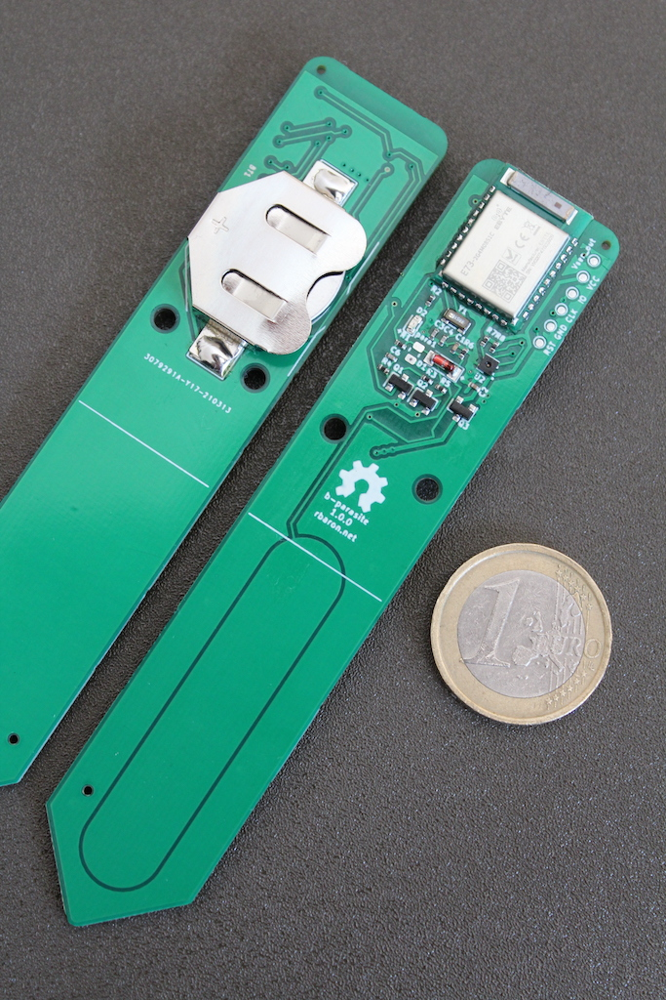

b-parasite
==========

.. seo::
    :description: Instructions for setting up the b-parasite soil moisture sensor in ESPHome.
    :image: b_parasite.jpg
    :keywords: b-parasite, parasite, BLE, Bluetooth, soil moisture

`b-parasite <https://github.com/rbaron/b-parasite>`__ is an open source soil moisture and ambient temperature/humidity/light sensor.

The ``b_parasite`` sensor platform tracks b-parasite's Bluetooth Low Energy (BLE) advertisement packets. These packets contain soil moisture, air temperature/humidity and battery voltage data. Some b-parasite versions have light sensors, in which case the ambient illuminance is also present in the BLE advertisement data.

.. code-block:: yaml

    # Example configuration.

    # Required.
    esp32_ble_tracker:

    sensor:
      - platform: b_parasite
        mac_address: F0:CA:F0:CA:01:01
        humidity:
          name: 'b-parasite Air Humidity'
        temperature:
          name: 'b-parasite Air Temperature'
        moisture:
          name: 'b-parasite Soil Moisture'
        battery_voltage:
          name: 'b-parasite Battery Voltage'
        illuminance:
          name: 'b-parasite Illuminance'

Configuration variables
-----------------------

- **mac_address** (**Required**): The MAC address of the device.
- **temperature** (*Optional*): Air temperature in Celsius.

  - **name** (**Required**): Sensor name.
  - All other options from :ref:`Sensor <config-sensor>`.
- **humidity** (*Optional*): Relative air humidity in %.

  - **name** (**Required**): Sensor name.
  - All other options from :ref:`Sensor <config-sensor>`.
- **moisture** (*Optional*): Soil moisture in %.

  - **name** (**Required**): Sensor name.
  - All other options from :ref:`Sensor <config-sensor>`.
- **battery_voltage** (*Optional*): Battery voltage in volts.

  - **name** (**Required**): Sensor name.
  - All other options from :ref:`Sensor <config-sensor>`.
- **illuminance** (*Optional*): Illuminance in lux.

  - **name** (**Required**): Sensor name.
  - All other options from :ref:`Sensor <config-sensor>`.

See Also
--------

- `b-parasite on GitHub <https://github.com/rbaron/b-parasite>`__
- :doc:`/components/esp32_ble_tracker`
- :doc:`absolute_humidity`
- :ghedit:`Edit`
