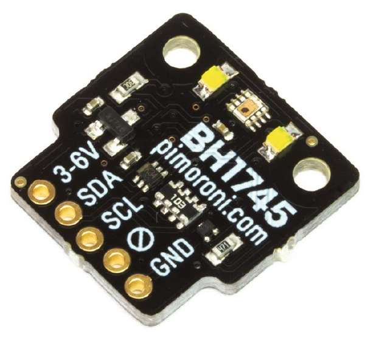

BH1745 RGB Colour Sensor
========================

.. seo::
    :description: Instructions for setting up BH1745 RGB color sensors.
    :image: bh1745.jpg
    :keywords: bh1745, bh1745nuc

The ``bh1745`` sensor platform allows you to use your BH1745 (BH1745NUC) RGB color sensors
(`datasheet <https://github.com/latonita/datasheets-storage/blob/main/sensors/BH1745NUC_ROHM_S_A0001988929_1-2561519.pdf>`__,
`Pimoroni`_), color temperature and illuminance sensors with ESPHome. The :ref:`I²C <i2c>` is
required to be set up in your configuration for this sensor to work.

    BH1745 RGB Colour Sensor

.. _Pimoroni: https://shop.pimoroni.com/products/bh1745-luminance-and-colour-sensor-breakout

.. code-block:: yaml

    # Example configuration entry
    sensor:
      - platform: bh1745
        id: bh1745_mysensor_id
        address: 0x38
        gain: 1X
        integration_time: 160ms
        update_interval: 60s

        # short variant of sensor definitions:
        red_channel: Red channel
        green_channel: Green channel
        blue_channel: Blue channel
        clear_channel: Clear channel
        illuminance: Illuminance
        # longer variant of sensor definition:
        color_temperature: 
          name: Color temperature

Configuration variables
------------------------

- **gain** (*Optional*):  The gain the device will use for the internal ADC. Valid values are 
  ``1x`` *(default)*, ``2x``, ``16x``. Higher values are better in low-light conditions.
- **integration_time** (*Optional*, :ref:`config-time`): The amount of time the light sensor is exposed. Valid values are
  ``160ms`` (default), ``320ms``, ``640ms``, ``1280ms``, ``2560ms``, ``5120ms``.
- **glass_attenuation_factor** (*Optional*): The attenuation factor of glass if it's behind some glass facia. 
  Default is ``1.0`` means ``100%`` transmissivity. ``2`` means ``50%`` transmissivity etc.
- **address** (*Optional*, int): Manually specify the I²C address of the sensor. Defaults to ``0x38``.
- **update_interval** (*Optional*, :ref:`config-time`): The interval to check the
  sensor. Defaults to ``60s``.
- All other options for I²C devices described at :ref:`I²C Bus <i2c>`. 

Sensors
.......
This component offers six sensors.
Each configured sensor is reported separately on each ``update_interval``. **name** (**Required**, string) is required for 
every sensor. All other options from :ref:`Sensor <config-sensor>`. 

However, if you don't need any other options, you can just use shorthands like this: ``ambient_light: Ambient light``.

- **red_channel** (*Optional*): Red color channel readings, counts.
- **green_channel** (*Optional*): Green color channel readings, counts.
- **blue_channel** (*Optional*): Blue color channel readings, counts.
- **clear_channel** (*Optional*): Clear (without a color filter) channel readings, counts. 
- **illuminance** (*Optional*): Calculated illuminance, lx.
- **color_temperature** (*Optional*): Calculated color temperature of the light, Kelvin.

Switch
------

Pimoroni sensor breakout board has onboard LED which are connected to `interrupt` pin of the sensor.
This component doesn't support interrupts, so LED can be easily controlled using the switch.

.. code-block:: yaml

    switch: 
      - platform: bh1745
        bh1745_id: bh1745_mysensor_id
        name: Onboard LED

See Also
--------

- :ref:`sensor-filters`
- :apiref:`bh1745/bh1745.h`
- :ghedit:`Edit`
