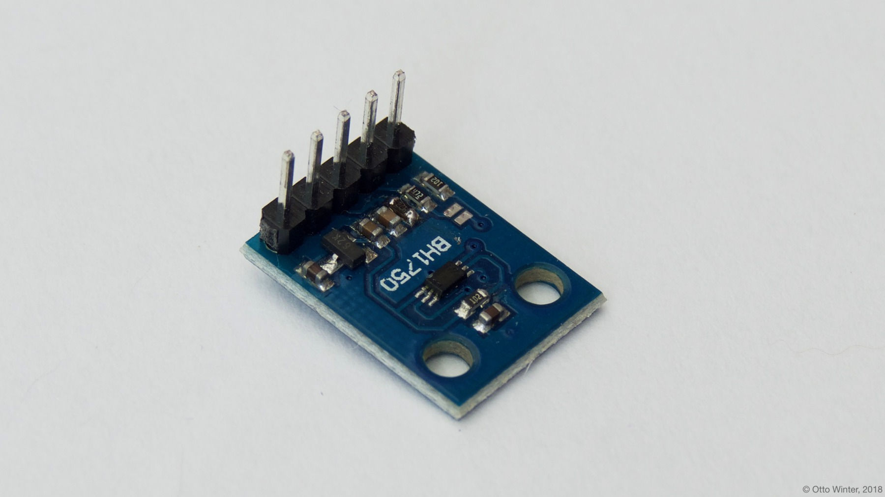

BH1750 Ambient Light Sensor
===========================

.. seo::
    :description: Instructions for setting up BH1750 ambient light sensors in ESPHome.
    :image: bh1750.jpg
    :keywords: BH1750

The ``bh1750`` sensor platform allows you to use your BH1750
(`datasheet <http://www.mouser.com/ds/2/348/bh1750fvi-e-186247.pdf>`__)
ambient light sensor with ESPHome. The :ref:`I²C bus <i2c>` is required to be set up in
your configuration for this sensor to work.

    BH1750 Ambient Light Sensor.

.. figure:: images/bh1750-ui.png
    :align: center
    :width: 80.0%

.. code-block:: yaml

    # Example configuration entry
    sensor:
      - platform: bh1750
        name: "BH1750 Illuminance"
        address: 0x23
        measurement_duration: 69
        update_interval: 60s

By default the **measurement_duration** is set to ``69`` which will result into measurements up
to 54612.5 lx for this sensor. For low-light situations consider to choose a higher
measurement_duration up to ``254`` which will result in a maximum measurement range up to 14835 lx.
For sunny scenes (for example outdoors with sunlight) use lower values down to ``31`` which will
give you the maximum measurement range up to 121556 lx.

Configuration variables:
------------------------

- **name** (**Required**, string): The name for the sensor.
- **address** (*Optional*, int): Manually specify the I²C address of the sensor.
  Defaults to ``0x23`` (address if address pin is pulled low). If the address pin is pulled high,
  the address is ``0x5C``.
- **measurement_duration** (*Optional*, int): Manually specify the measurement duration between ``31``
  and ``254``. Defaults to ``69``.
- **resolution** (*Optional*, string): The resolution of the sensor in lx. One of ``4.0``,
  ``1.0``, ``0.5``. Defaults to ``0.5`` (the maximum resolution).
- **update_interval** (*Optional*, :ref:`config-time`): The interval to check the
  sensor. Defaults to ``60s``.
- **id** (*Optional*, :ref:`config-id`): Manually specify the ID used for code
  generation.
- All other options from :ref:`Sensor <config-sensor>`.

See Also
--------

- :ref:`sensor-filters`
- :doc:`tsl2561`
- :ghsources:`esphome/components/bh1750`
- `BH1750 Library <https://github.com/claws/BH1750>`__ by `@claws <https://github.com/claws>`__
- :ghedit:`Edit`
