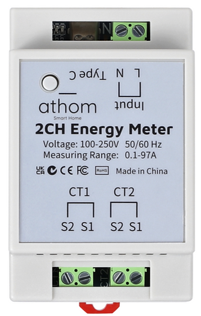
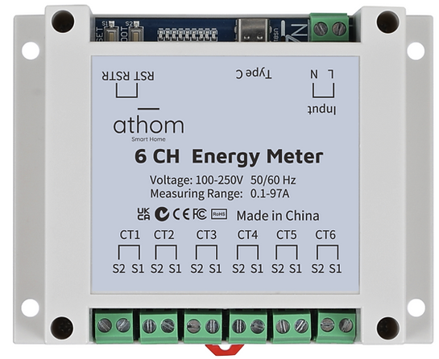

Belling BL0906 Energy Monitor
=============================

.. seo::
    :description: Instructions for setting up BL0906 energy monitor for the Athom Energy Meter
    :image: bl0906.png
    :keywords: bl0906, Athom EM2 Energy Meter, Athom EM6 Energy Meter, Athom Energy Meter, ESP32C3 Energy Meter Main Board, Split Single Phase Real Time Whole House Energy Meter

The ``bl0906`` sensor platform allows you to use your BL0906 voltage/current/power and energy
sensors with ESPHome. This sensor is commonly found in `Athom EM2 Energy Meter <https://www.athom.tech/blank-1/2-ch-energy-meter-made-for-esphome>`__ and `Athom EM6 Energy Meter <https://www.athom.tech/blank-1/6-ch-energy-meter-made-for-esphome>`__ 

.. note::

    The current ratio of the current CT clamp must be 2000:1

As the communication with the BL0906 done using UART, you need
to have an :ref:`UART bus <uart>` in your configuration with the ``tx_pin`` and ``rx_pin`` connected to the BL0906.
Additionally, you need to set the baud rate to 19200.

The `Athom EM2 Energy Meter <https://www.athom.tech/blank-1/2-ch-energy-meter-made-for-esphome>`__ can read 1 voltage channel and 2 Current channels.

    Athom Single Phase 2 channels Real Time Whole House Energy Meter.

The `Athom EM6 Energy Meter <https://www.athom.tech/blank-1/6-ch-energy-meter-made-for-esphome>`__ can read 1 voltage channel and 6 Current channels.

    Athom Single Phase 6 channels Real Time Whole House Energy Meter.

Configuration variables:
------------------------

- **frequency** (*Optional*): The AC line frequency of the supply voltage. All options from
  :ref:`Sensor <config-sensor>`.
- **temperature** (*Optional*): Chip internal temperature. All options from
  :ref:`Sensor <config-sensor>`.
- **voltage** (*Optional*): Use the voltage value of the sensor in V. All options from
  :ref:`Sensor <config-sensor>`.
- **channel_1** (*Optional*): Use channel 1.

  - **current** (*Optional*): The current value of the channel 1 in amperes. All options from
    :ref:`Sensor <config-sensor>`.
  - **power** (*Optional*): The Power value of the channel 1 in watts. All options from
    :ref:`Sensor <config-sensor>`.
  - **energy** (*Optional*): The energy value of the channel 1 in kWh. All options from
    :ref:`Sensor <config-sensor>`.
- **channel_2** (*Optional*): Use channel 2.

  - **current** (*Optional*): The current value of the channel 2 in amperes. All options from
    :ref:`Sensor <config-sensor>`.
  - **power** (*Optional*): The Power value of the channel 2 in watts. All options from
    :ref:`Sensor <config-sensor>`.
  - **energy** (*Optional*): The energy value of the channel 2 in kWh. All options from
    :ref:`Sensor <config-sensor>`.
- **channel_3** (*Optional*): Use channel 3.

  - **current** (*Optional*): The current value of the channel 3 in amperes. All options from
    :ref:`Sensor <config-sensor>`.
  - **power** (*Optional*): The Power value of the channel 3 in watts. All options from
    :ref:`Sensor <config-sensor>`.
  - **energy** (*Optional*): The energy value of the channel 3 in kWh. All options from
    :ref:`Sensor <config-sensor>`.
- **channel_4** (*Optional*): Use channel 4.

  - **current** (*Optional*): The current value of the channel 4 in amperes. All options from
    :ref:`Sensor <config-sensor>`.
  - **power** (*Optional*): The Power value of the channel 4 in watts. All options from
    :ref:`Sensor <config-sensor>`.
  - **energy** (*Optional*): The energy value of the channel 4 in kWh. All options from
    :ref:`Sensor <config-sensor>`.
- **channel_5** (*Optional*): Use channel 5.

  - **current** (*Optional*): The current value of the channel 5 in amperes. All options from
    :ref:`Sensor <config-sensor>`.
  - **power** (*Optional*): The Power value of the channel 5 in watts. All options from
    :ref:`Sensor <config-sensor>`.
  - **energy** (*Optional*): The energy value of the channel 5 in kWh. All options from
    :ref:`Sensor <config-sensor>`.
- **channel_6** (*Optional*): Use channel 6.

  - **current** (*Optional*): The current value of the channel 6 in amperes. All options from
    :ref:`Sensor <config-sensor>`.
  - **power** (*Optional*): The Power value of the channel 6 in watts. All options from
    :ref:`Sensor <config-sensor>`.
  - **energy** (*Optional*): The energy value of the channel 6 in kWh. All options from
    :ref:`Sensor <config-sensor>`. 
- **total_energy** (*Optional*): The total energy value of all channels in kWh. All options from
  :ref:`Sensor <config-sensor>`.
- **total_power** (*Optional*): The total power value of all channels in watts. All options from
  :ref:`Sensor <config-sensor>`.
- **update_interval** (*Optional*, :ref:`config-time`): The interval to check the
  sensor. Defaults to ``60s``.
- **uart_id** (*Optional*, :ref:`config-id`): Manually specify the ID of the :ref:`UART Component <uart>` if you want
  to use multiple UART buses.

Example configuration
---------------------

2 Channel
^^^^^^^^^^^^^^^^^^

.. code-block:: yaml

    # Example configuration entry
    sensor:
      - platform: bl0906
        frequency:
          name: 'Frequency'
        temperature:
          name: 'Temperature'
        voltage:
          name: 'Voltage'
        channel_1:
          current:
            name: 'Current_1'
          power:
            name: 'Power_1'
          energy:
            name: 'Energy_1'
        channel_2:
          current:
            name: 'Current_2'
          power:
            name: 'Power_2'
          energy:
            name: 'Energy_2'
        total_energy:
          name: 'Total_Energy'
        total_power:
          name: 'Total_Power'

6 Channel
^^^^^^^^^^^^^^^^^^

.. code-block:: yaml

    # Example configuration entry
    sensor:
      - platform: bl0906
        frequency:
          name: 'Frequency'
        temperature:
          name: 'Temperature'
        voltage:
          name: 'Voltage'
        channel_1:
          current:
            name: 'Current_1'
          power:
            name: 'Power_1'
          energy:
            name: 'Energy_1'
        channel_2:
          current:
            name: 'Current_2'
          power:
            name: 'Power_2'
          energy:
            name: 'Energy_2'
        channel_3:
          current:
            name: 'Current_3'
          power:
            name: 'Power_3'
          energy:
            name: 'Energy_3'
        channel_4:
          current:
            name: 'Current_4'
          power:
            name: 'Power_4'
          energy:
            name: 'Energy_4'
        channel_5:
          current:
            name: 'Current_5'
          power:
            name: 'Power_5'
          energy:
            name: 'Energy_5'
        channel_6:
          current:
            name: 'Current_6'
          power:
            name: 'Power_6'
          energy:
            name: 'Energy_6'
        total_energy:
          name: 'Total_Energy'
        total_power:
          name: 'Total_Power'

See Also
--------

- :ref:`sensor-filters`
- :doc:`cse7761`
- :doc:`bl0939`
- :doc:`bl0940`
- :apiref:`bl0906/bl0906.h`
- :ghedit:`Edit`
