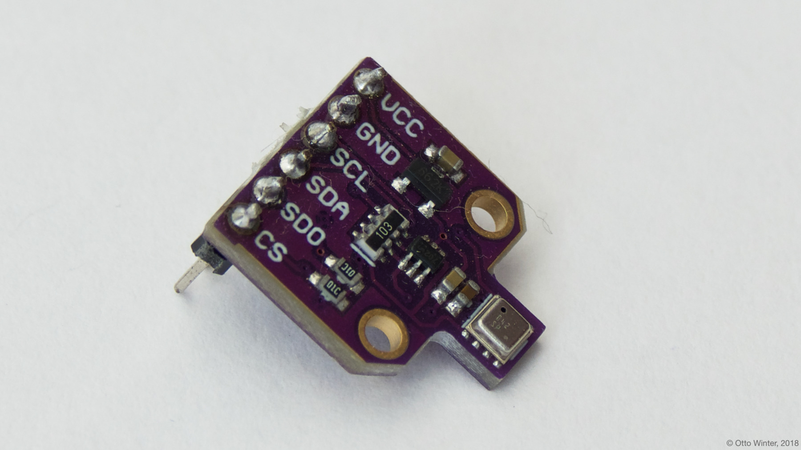

BME680 Temperature+Pressure+Humidity+Gas Sensor
===============================================

.. seo::
    :description: Instructions for setting up BME680 temperature, humidity, pressure and gas sensors.
    :image: bme680.jpg
    :keywords: BME680

The ``bme680`` sensor platform allows you to use your BME680
(`datasheet <https://cdn-shop.adafruit.com/product-files/3660/BME680.pdf>`__,
`Adafruit`_) temperature, pressure and humidity sensors with ESPHome. The :ref:`I²C <i2c>` is required to be set up in
your configuration for this sensor to work.

    BME680 Temperature, Pressure & Humidity Sensor.

.. _Adafruit: https://www.adafruit.com/product/3660

.. code-block:: yaml

    # Example configuration entry
    sensor:
      - platform: bme680
        temperature:
          name: "BME680 Temperature"
          oversampling: 16x
        pressure:
          name: "BME680 Pressure"
        humidity:
          name: "BME680 Humidity"
        gas_resistance:
          name: "BME680 Gas Resistance"
        address: 0x77
        update_interval: 60s

Configuration variables:
------------------------

- **temperature** (*Optional*): The information for the temperature sensor.

  - **name** (**Required**, string): The name for the temperature sensor.
  - **oversampling** (*Optional*): The oversampling parameter for the temperature sensor.
    See :ref:`bme680-oversampling`.
  - **id** (*Optional*, :ref:`config-id`): Set the ID of this sensor for use in lambdas.
  - All other options from :ref:`Sensor <config-sensor>`.

- **pressure** (*Optional*): The information for the pressure sensor.

  - **name** (**Required**, string): The name for the pressure sensor.
  - **oversampling** (*Optional*): The oversampling parameter for the temperature sensor.
    See :ref:`bme680-oversampling`.
  - **id** (*Optional*, :ref:`config-id`): Set the ID of this sensor for use in lambdas.
  - All other options from :ref:`Sensor <config-sensor>`.

- **humidity** (*Optional*): The information for the humidity sensor.

  - **name** (**Required**, string): The name for the humidity sensor.
  - **oversampling** (*Optional*): The oversampling parameter for the temperature sensor.
    See :ref:`bme680-oversampling`.
  - **id** (*Optional*, :ref:`config-id`): Set the ID of this sensor for use in lambdas.
  - All other options from :ref:`Sensor <config-sensor>`.

- **gas_resistance** (*Optional*): The information for the gas sensor.

  - **name** (**Required**, string): The name for the gas resistance sensor.
  - **id** (*Optional*, :ref:`config-id`): Set the ID of this sensor for use in lambdas.
  - All other options from :ref:`Sensor <config-sensor>`.

- **address** (*Optional*, int): Manually specify the I²C address of
  the sensor. Defaults to ``0x76``. Another address can be ``0x77``.
- **iir_filter** (*Optional*): Set up an Infinite Impulse Response filter to increase accuracy. One of
  ``OFF``, ``1x``, ``3x``, ``7x``, ``15x``, ``31x``, ``63x`` and ``127x``. Defaults to ``OFF``.
- **heater** (*Optional*): The settings for the internal heater for the gas sensor. Set this
  to disable the internal heater.

  - **temperature** (*Optional*, int): The target temperature of the heater between 200 and 400 °C.
    Defaults to ``320``.
  - **duration** (*Optional*, :ref:`config-time`): The duration the heater should be active. Maximum value is ``4032ms``.
    Defaults to ``150ms``.

- **update_interval** (*Optional*, :ref:`config-time`): The interval to check the
  sensor. Defaults to ``60s``.

.. figure:: images/bme680-ui.png
    :align: center
    :width: 80.0%

.. _bme680-oversampling:

Oversampling Options
--------------------

By default, the BME680 sensor measures each value 16 times when requesting a new value. You can, however,
configure this amount. Possible oversampling values:

-  ``NONE`` (value is skipped)
-  ``1x``
-  ``2x``
-  ``4x``
-  ``8x``
-  ``16x`` (default)

.. _bme680-advanced-configuration:

Advanced Configuration
----------------------

Add indoor air quality (IAQ) calculation and IAQ label, based on the values in the `BME680 BSEC component </components/sensor/bme680_bsec.html?highlight=bme680#index-for-air-quality-iaq-measurement>`__ index.

.. code-block:: yaml

    # Example configuration entry
    sensor:
      - platform: bme680
        temperature:
          name: "BME680 Temperature"
          oversampling: 16x
        pressure:
          name: "BME680 Pressure"
        humidity:
          id: "humidity"
          name: "BME680 Humidity"
        gas_resistance:
          id: "gas_resistance"
          name: "BME680 Gas Resistance"
        address: 0x77
        update_interval: 60s
      - platform: template
        name: "BME680 Indoor Air Quality"
        id: iaq
        icon: "mdi:gauge"
        # caulculation: comp_gas = log(R_gas[ohm]) + 0.04 log(Ohm)/%rh * hum[%rh]    
        lambda: |-
          return log(id(gas_resistance).state) + 0.04 *  id(humidity).state;
    text_sensor:
      - platform: template
        name: "BME680 IAQ Classification"
        icon: "mdi:checkbox-marked-circle-outline"
        lambda: |-
          if (int(id(iaq).state) <= 50) {
            return {"Excellent"};
          }
          else if (int(id(iaq).state) <= 100) {
            return {"Good"};
          }
          else if (int(id(iaq).state) <= 150) {
            return {"Lightly polluted"};
          }
          else if (int(id(iaq).state) <= 200) {
            return {"Moderately polluted"};
          }
          else if (int(id(iaq).state) <= 250) {
            return {"Heavily polluted"};
          }
          else if (int(id(iaq).state) <= 350) {
            return {"Severely polluted"};
          }
          else if (int(id(iaq).state) <= 500) {
            return {"Extremely polluted"};
          }
          else {
            return {"unknown"};
          }

See Also
--------

- :ref:`sensor-filters`
- :doc:`absolute_humidity`
- :doc:`bme280`
- :doc:`bmp085`
- :apiref:`bme680/bme680.h`
- `BME680 Sensor API <https://github.com/BoschSensortec/BME680_driver>`__ by `Bosch Sensortec <https://www.bosch-sensortec.com/>`__
- `Custom BME680 component with indoor air quality sensor <https://github.com/trvrnrth/esphome-bsec-bme680>`__
- :ghedit:`Edit`
