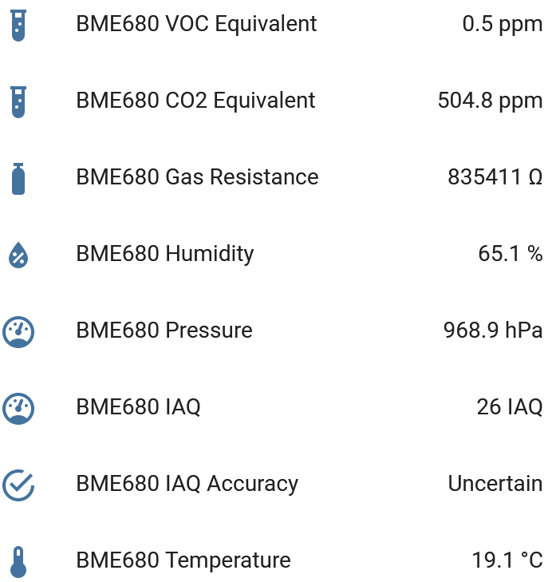

BME680 Temperature+Pressure+Humidity+Gas Sensor via BSEC
========================================================

.. seo::
    :description: Instructions for setting up BME680 temperature, humidity, pressure and gas sensors via BSEC.
    :image: bme680.jpg
    :keywords: BME680

Component/Hub
-------------

The ``bme680_bsec`` sensor platform allows you to use your BME680
(`datasheet <https://cdn-shop.adafruit.com/product-files/3660/BME680.pdf>`__,
`Adafruit`_) temperature, pressure and humidity and gas sensors with ESPHome via the Bosch Sensortec Environmental Cluster (BSEC)
software library. The use of Bosch's proprietary algorithms provides additional Indoor Air Quality (IAQ), CO2 equivalent and Breath
Volatile Organic Compounds (VOC) equivalent measurements.

.. note::

    The Bosch BSEC library is only available for use after accepting its software license agreement. By enabling this component,
    you are explicitly agreeing to the terms of the `BSEC license agreement`_. You must not distribute any compiled firmware
    binaries that include this component.

The :ref:`I²C <i2c>` is required to be set up in your configuration for this sensor to work.

.. figure:: images/bme680-full.jpg
    :align: center
    :width: 50.0%

    BME680 Temperature, Pressure, Humidity & Gas Sensor.

.. _BSEC license agreement: https://www.bosch-sensortec.com/media/boschsensortec/downloads/bsec/2017-07-17_clickthrough_license_terms_environmentalib_sw_clean.pdf

.. _Adafruit: https://www.adafruit.com/product/3660

.. code-block:: yaml

    # Minimal example configuration with common sensors
    i2c:

    bme680_bsec:

    sensor:
      - platform: bme680_bsec
        temperature:
          name: "BME680 Temperature"
        pressure:
          name: "BME680 Pressure"
        humidity:
          name: "BME680 Humidity"
        iaq:
          name: "BME680 IAQ"
        co2_equivalent:
          name: "BME680 CO2 Equivalent"
        breath_voc_equivalent:
          name: "BME680 Breath VOC Equivalent"

    text_sensor:
      - platform: bme680_bsec
        iaq_accuracy:
          name: "BME680 IAQ Accuracy"

Configuration variables:

- **address** (*Optional*, int): Manually specify the I²C address of the sensor. Defaults to ``0x76``. Another address can be ``0x77``.

- **temperature_offset** (*Optional*, float): Temperature offset if device is in enclosure and reads too high.
  Defaults to ``0``.

- **iaq_mode** (*Optional*, string): IAQ calculation mode. Default is ``static`` for static applications (e.g. fixed indoor devices).
  Can be ``mobile`` for mobile applications (e.g. carry-on devices).

- **sample_rate** (*Optional*, string): Sample rate. Default is ``lp`` for low power consumption, sampling every 3 seconds.
  Can be ``ulp`` for ultra low power, sampling every 5 minutes.
  This controls the sampling rate for gas-dependant sensors and will govern the interval at which the sensor heater is operated.
  By default this rate will also be used for temperature, pressure and humidity sensors but these can be overridden on a per-sensor level if required.

- **state_save_interval** (*Optional*, :ref:`config-time`): The minimum interval at which to save calibrated BSEC algorithm state to
  flash so that calibration doesn't have to start from zero on device restart. Defaults to ``6h``.

- **id** (*Optional*, :ref:`config-id`): Manually specify the ID used for code generation. Use this ID in the sensor section to refer to the correct BME680 if you have more than one device. This will also be used to refer to the calibrated BSEC algorithm state saved to flash.

Sensor
------

Configuration variables:

- **bme680_bsec_id** (*Optional*, :ref:`config-id`): Sets the ID of the bme680_bsec component to refer to. Useful when working with multiple devices.

- **temperature** (*Optional*): The information for the temperature sensor.

  - **name** (**Required**, string): The name for the temperature sensor.
  - **id** (*Optional*, :ref:`config-id`): Set the ID of this sensor for use in lambdas.
  - **sample_rate** (*Optional*, string): Optional sample rate override for this sensor. Can be ``lp`` for low power consumption, sampling every 3 seconds or ``ulp`` for ultra low power, sampling every 5 minutes.
  - All other options from :ref:`Sensor <config-sensor>`.

- **pressure** (*Optional*): The information for the pressure sensor.

  - **name** (**Required**, string): The name for the pressure sensor.
  - **id** (*Optional*, :ref:`config-id`): Set the ID of this sensor for use in lambdas.
  - **sample_rate** (*Optional*, string): Optional sample rate override for this sensor. Can be ``lp`` for low power consumption, sampling every 3 seconds or ``ulp`` for ultra low power, sampling every 5 minutes.
  - All other options from :ref:`Sensor <config-sensor>`.

- **humidity** (*Optional*): The information for the humidity sensor.

  - **name** (**Required**, string): The name for the humidity sensor.
  - **id** (*Optional*, :ref:`config-id`): Set the ID of this sensor for use in lambdas.
  - **sample_rate** (*Optional*, string): Optional sample rate override for this sensor. Can be ``lp`` for low power consumption, sampling every 3 seconds or ``ulp`` for ultra low power, sampling every 5 minutes.
  - All other options from :ref:`Sensor <config-sensor>`.

- **gas_resistance** (*Optional*): The information for the gas sensor.

  - **name** (**Required**, string): The name for the gas resistance sensor.
  - **id** (*Optional*, :ref:`config-id`): Set the ID of this sensor for use in lambdas.
  - All other options from :ref:`Sensor <config-sensor>`.

- **iaq** (*Optional*): The information for the IAQ sensor.

  - **name** (**Required**, string): The name for the IAQ sensor.
  - **id** (*Optional*, :ref:`config-id`): Set the ID of this sensor for use in lambdas.
  - All other options from :ref:`Sensor <config-sensor>`.

- **iaq_accuracy** (*Optional*): The information for the numeric IAQ accuracy sensor.

  - **name** (**Required**, string): The name for the IAQ accuracy sensor.
  - **id** (*Optional*, :ref:`config-id`): Set the ID of this sensor for use in lambdas.
  - All other options from :ref:`Sensor <config-sensor>`.

- **co2_equivalent** (*Optional*): The information for the CO2 equivalent sensor.

  - **name** (**Required**, string): The name for the CO2 equivalent sensor.
  - **id** (*Optional*, :ref:`config-id`): Set the ID of this sensor for use in lambdas.
  - All other options from :ref:`Sensor <config-sensor>`.

- **breath_voc_equivalent** (*Optional*): The information for the Breath VOC equivalent humidity sensor.

  - **name** (**Required**, string): The name for the Breath VOC equivalent sensor.
  - **id** (*Optional*, :ref:`config-id`): Set the ID of this sensor for use in lambdas.
  - All other options from :ref:`Sensor <config-sensor>`.

Text Sensor
-----------

Accuracy can be reported in text format.

Configuration variables:

- **bme680_bsec_id** (*Optional*, :ref:`config-id`): Sets the ID of the bme680_bsec component to refer to. Useful when working with multiple devices.

- **iaq_accuracy** (*Optional*): The information for the IAQ accuracy sensor. Shows: Stabilizing,
  Uncertain, Calibrating, Calibrated.

  - **name** (**Required**, string): The name for the IAQ accuracy sensor.
  - **id** (*Optional*, :ref:`config-id`): Set the ID of this sensor for use in lambdas.
  - All other options from :ref:`TextSensor <config-text_sensor>`.

Advanced configuration
----------------------

The following configuration shows all the available sensors and optional settings for the component. It also includes an example of filtering to guard against
outliers, limit the number of updates sent to home assistant and reduce storage requirements in other systems such as influxdb used to store historical data.

For each sensor all other options from :ref:`Sensor <config-sensor>` and :ref:`TextSensor <config-text_sensor>` are also available for filtering, automation and so on.

.. code-block:: yaml

    bme680_bsec:
        # id
        # -----------
        # Identifier for this component, useful when working with multiple devices.
        # Must be unique, and can be used in the sensor sections to refer to the correct device.
        # Default: auto-computed
        id: bme680_internal

        # i2c address
        # -----------
        # Common values are:
        # - 0x76
        # - 0x77
        # Default: 0x76
        address: 0x76

        # Temperature offset
        # ------------------
        # Useful if device is in enclosure and reads too high
        # Default: 0
        temperature_offset: 0

        # IAQ calculation mode
        # --------------------
        # Available options:
        # - static (for fixed position devices)
        # - mobile (for on person or other moveable devices)
        # Default: static
        iaq_mode: static

        # Sample rate
        # -----------
        # Available options:
        # - lp (low power - samples every 3 seconds)
        # - ulp (ultra low power - samples every 5 minutes)
        # Default: lp
        sample_rate: ulp

        # Interval at which to save BSEC state
        # ------------------------------------
        # Default: 6h
        state_save_interval: 6h

    sensor:
      - platform: bme680_bsec
        # ID of the bme680_bsec component to use for the next sensors.
        # Useful when working with multiple devices
        bme680_bsec_id: bme680_internal

        temperature:
          # Temperature in °C
          name: "BME680 Temperature"
          sample_rate: lp
          filters:
            - median
        pressure:
          # Pressure in hPa
          name: "BME680 Pressure"
          sample_rate: lp
          filters:
            - median
        humidity:
          # Relative humidity %
          name: "BME680 Humidity"
          sample_rate: lp
          filters:
            - median
        gas_resistance:
          # Gas resistance in Ω
          name: "BME680 Gas Resistance"
          filters:
            - median
        iaq:
          # Indoor air quality value
          name: "BME680 IAQ"
          filters:
            - median
        iaq_accuracy:
          # IAQ accuracy as a numeric value of 0, 1, 2, 3
          name: "BME680 Numeric IAQ Accuracy"
        co2_equivalent:
          # CO2 equivalent estimate in ppm
          name: "BME680 CO2 Equivalent"
          filters:
            - median
        breath_voc_equivalent:
          # Volatile organic compounds equivalent estimate in ppm
          name: "BME680 Breath VOC Equivalent"
          filters:
            - median

    text_sensor:
      - platform: bme680_bsec
        iaq_accuracy:
          # IAQ accuracy as a text value of Stabilizing, Uncertain, Calibrating, Calibrated
          name: "BME680 IAQ Accuracy"

Multiple sensors
----------------------

The following configuration shows how to set up multiple BME680 devices. They can be configured to use the same I²C bus or to use different busses, but remember that the BME680 can only be set to operate on I²C address ``0x76`` or ``0x77``. There is no limit on the number of BME680 devices that can be connected.

.. code-block:: yaml

    # I2C bus for the BME680 devices
    i2c:
      - id: "i2cbus_bme"
        sda: GPIO18
        scl: GPIO19
        scan: true

    # BME680 devices using BSEC library
    bme680_bsec:
      - id: bme680_internal
        i2c_id: "i2cbus_bme"
        address: 0x76
      - id: bme680_external
        i2c_id: "i2cbus_bme"
        address: 0x77

    sensor:
      # Sensors for the internal BME680 device
      - platform: bme680_bsec
        bme680_bsec_id: bme680_internal
        temperature:
          name: "IN_Temp"
        pressure:
          name: "IN_Press"
        humidity:
          name: "IN_RH"
        iaq:
          name: "IN_IAQ"
        co2_equivalent:
          name: "IN_CO2eq"
        breath_voc_equivalent:
          name: "IN_VOCeq"

      # Sensors for the external BME680 device
      - platform: bme680_bsec
        bme680_bsec_id: bme680_external
        temperature:
          name: "OUT_Temperatura"
        pressure:
          name: "OUT_Pressione"
        humidity:
          name: "OUT_RH"
        iaq:
          name: "OUT_IAQ"
        co2_equivalent:
          name: "OUT_CO2eq"
        breath_voc_equivalent:
          name: "OUT_VOCeq"

    text_sensor:
      # Text sensor for the internal BME680 device
      - platform: bme680_bsec
        bme680_bsec_id: bme680_internal
        iaq_accuracy:
          name: "IN_IAQaccuracy"

      # Text sensor for the external BME680 device
      - platform: bme680_bsec
        bme680_bsec_id: bme680_external
        iaq_accuracy:
          name: "OUT_IAQaccuracy"

Indoor Air Quality (IAQ) Measurement
------------------------------------

Indoor Air Quality measurements are expressed in the IAQ index scale with 25IAQ corresponding to typical good air and 250IAQ
indicating typical polluted air after calibration.

.. _bsec-calibration:

IAQ Accuracy and Calibration
----------------------------

The BSEC algorithm automatically gathers data in order to calibrate the IAQ measurements. The IAQ Accuracy sensor will give one
of the following values:

- ``Stabilizing``: The device has just started, and the sensor is stabilizing (this typically lasts 5 minutes)
- ``Uncertain``: The background history of BSEC is uncertain. This typically means the gas sensor data was too
  stable for BSEC to clearly define its reference.
- ``Calibrating``: BSEC found new calibration data and is currently calibrating.
- ``Calibrated``: BSEC calibrated successfully.

Every ``state_save_interval``, or as soon thereafter as full calibration is reached, the current algorithm state is saved to flash
so that the process does not have to start from zero on device restart.

See Also
--------

- :ref:`sensor-filters`
- :doc:`bme680`
- :apiref:`bme680_bsec/bme680_bsec.h`
- `BSEC Arduino Library <https://github.com/BoschSensortec/BSEC-Arduino-library>`__ by `Bosch Sensortec <https://www.bosch-sensortec.com/>`__
- `Bosch Sensortec Community <https://community.bosch-sensortec.com/>`__
- :ghedit:`Edit`
