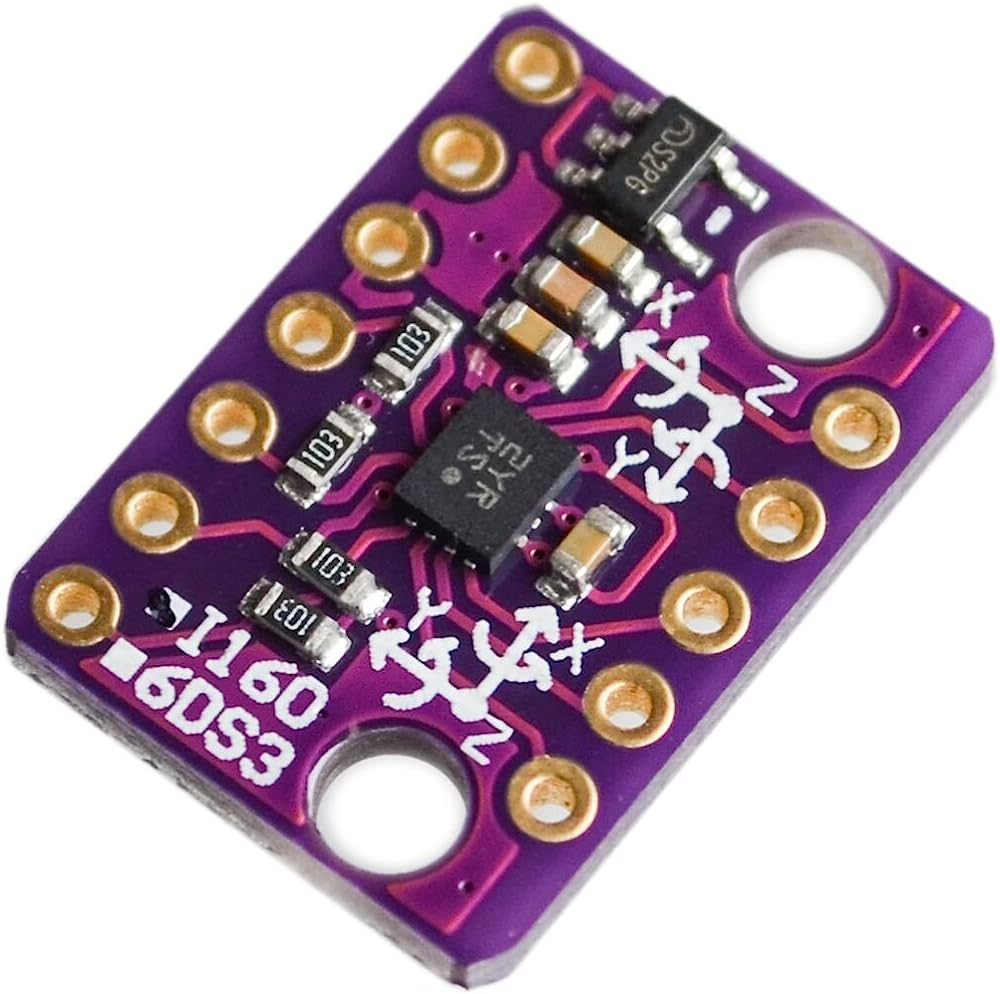
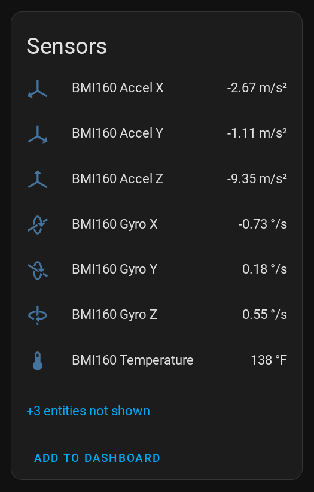

BMI160 Accelerometer/Gyroscope Sensor
======================================

.. seo::
    :description: Instructions for setting up BMI160 Accelerometer and Gyroscope sensors.
    :image: bmi160.jpg

The ``bmi160`` sensor platform allows you to use your BMI160 Accelerometer/Gyroscope
(`datasheet <https://www.bosch-sensortec.com/media/boschsensortec/downloads/datasheets/bst-bmi160-ds000.pdf>`__,
`SparkFun`_) sensors with
ESPHome. The :ref:`I²C Bus <i2c>` is
required to be set up in your configuration for this sensor to work.

This component only does some basic filtering and no calibration. Due to the complexity of
this sensor and the amount of possible configuration options, you should probably
create a custom component by copying and modifying the existing code if you want a specific
new feature. Supporting all possible use-cases would be quite hard.

    BMI160 Accelerometer/Gyroscope Sensor.

.. _SparkFun: https://www.sparkfun.com/products/18794

.. code-block:: yaml

    # Example configuration entry
    sensor:
      - platform: bmi160
        address: 0x68
        update_interval: 60s
        acceleration_x:
          name: "BMI160 Accel X"
        acceleration_y:
          name: "BMI160 Accel Y"
        acceleration_z:
          name: "BMI160 Accel z"
        gyroscope_x:
          name: "BMI160 Gyro X"
        gyroscope_y:
          name: "BMI160 Gyro Y"
        gyroscope_z:
          name: "BMI160 Gyro z"
        temperature:
          name: "BMI160 Temperature"

Configuration variables:
------------------------

- **address** (*Optional*, int): Manually specify the I²C address of the sensor. Defaults to ``0x68``, may also be ``0x69``.
- **acceleration_x** (*Optional*): Use the X-Axis of the Accelerometer. All options from
  :ref:`Sensor <config-sensor>`.
- **acceleration_y** (*Optional*): Use the Y-Axis of the Accelerometer. All options from
  :ref:`Sensor <config-sensor>`.
- **acceleration_z** (*Optional*): Use the Z-Axis of the Accelerometer. All options from
  :ref:`Sensor <config-sensor>`.
- **gyroscope_x** (*Optional*): Use the X-Axis of the Gyroscope. All options from
  :ref:`Sensor <config-sensor>`.
- **gyroscope_y** (*Optional*): Use the Y-Axis of the Gyroscope. All options from
  :ref:`Sensor <config-sensor>`.
- **gyroscope_z** (*Optional*): Use the Z-Axis of the Gyroscope. All options from
  :ref:`Sensor <config-sensor>`.
- **temperature** (*Optional*): Use the internal temperature of the sensor. All options from
  :ref:`Sensor <config-sensor>`.
- **update_interval** (*Optional*, :ref:`config-time`): The interval to check the sensor. Defaults to ``60s``.

- **id** (*Optional*, :ref:`config-id`): Manually specify the ID used for code generation.

See Also
--------

- :ref:`sensor-filters`
- :doc:`template`
- :doc:`ultrasonic`
- :apiref:`bmi160/bmi160.h`
- `i2cdevlib <https://github.com/jrowberg/i2cdevlib>`__ by `Jeff Rowberg <https://github.com/jrowberg>`__
- :ghedit:`Edit`
