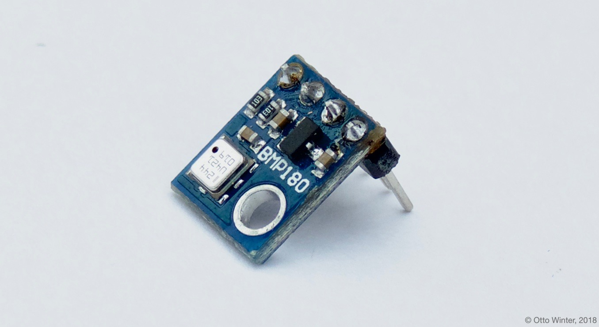

BMP085 Temperature+Pressure Sensor
==================================

.. seo::
    :description: Instructions for setting up BMP085 temperature and temperature sensors
    :image: bmp180.jpg
    :keywords: BMP085, BMP180

The BMP085 sensor platform allows you to use your BMP085
(`datasheet <https://www.sparkfun.com/datasheets/Components/General/BST-BMP085-DS000-05.pdf>`__,
`Adafruit <https://www.adafruit.com/product/391>`__) and BMP180
(`datasheet <https://cdn-shop.adafruit.com/datasheets/BST-BMP180-DS000-09.pdf>`__,
`Adafruit <https://www.adafruit.com/product/1603>`__) temperature and
pressure sensors with ESPHome. The :ref:`I²C <i2c>` is required to be set up in
your configuration for this sensor to work.

    BMP180 Temperature & Pressure Sensor.

.. figure:: images/temperature-pressure.png
    :align: center
    :width: 80.0%

.. code-block:: yaml

    # Example configuration entry
    sensor:
      - platform: bmp085
        temperature:
          name: "Outside Temperature"
        pressure:
          name: "Outside Pressure"
        update_interval: 60s

Configuration variables:
------------------------

- **temperature** (*Optional*): The information for the temperature sensor.

  - **name** (**Required**, string): The name for the temperature
    sensor.
  - **id** (*Optional*, :ref:`config-id`): Set the ID of this sensor for use in lambdas.
  - All other options from :ref:`Sensor <config-sensor>`.

- **pressure** (*Optional*): The information for the pressure sensor.

  - **name** (**Required**, string): The name for the pressure sensor.
  - **id** (*Optional*, :ref:`config-id`): Set the ID of this sensor for use in lambdas.
  - All other options from :ref:`Sensor <config-sensor>`.

-  **address** (*Optional*, int): Manually specify the I²C address of
   the sensor. Defaults to ``0x77``.
-  **update_interval** (*Optional*, :ref:`config-time`): The interval to check the
   sensor. Defaults to ``60s``.

See Also
--------

- :ref:`sensor-filters`
- :doc:`bme280`
- :doc:`bme680`
- :apiref:`bmp085/bmp085.h`
- `i2cdevlib <https://github.com/jrowberg/i2cdevlib>`__ by `Jeff Rowberg <https://github.com/jrowberg>`__
- :ghedit:`Edit`
